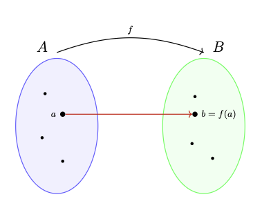
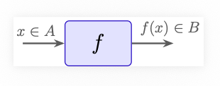
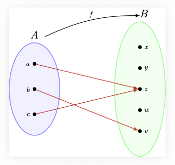
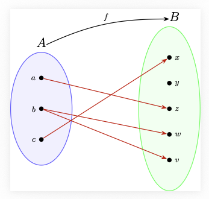

Todo el cálculo diferencial se desarrolla sobre el conjunto de los números reales $\mathbb{R}$. Las propiedades que definen este conjunto, son las que permiten definir formalmente el concepto de límite, que es la idea central para el desarrollo del cálculo diferencial.

## Los números naturales $\mathbb{N}$

La construcción de los números naturales $\mathbb{N}$ es el paso inicial en la construcción de los números reales. Los naturales son el conjunto que usamos para contar, que generalmente escribimos como $\mathbb{N}=\{1,2, \dots, n, \dots\}$. A pesar de que estamos muy acostumbrados a usar el conjunto de los números naturales, para tener una formalización matemática de este conjunto, tocó esperar hasta el siglo XIX, cuando en el año 1889, el matemático italiano Giuseppe Peano introdujo un conjunto de axiomas conocidos como los **Axiomas de Peano**. Existen otras construcciones de los números naturales, como por ejemplo la construcción a partir de la teoría de conjuntos, desarrollada por Ernst Zermelo y Abraham Fraenkel.

Antes de introducir los axiomas de Peano, definamos el concepto de función.

### Funciones

De manera informal, una función es una regla de asignación entre dos conjuntos, un conjunto de salida $A$ y un conjunto de llegada $B$, que a cada elemento del conjunto $A$ le asigna un único elemento del conjunto $B$.

Una manera de representar las funciones es mediante un diagrama de flechas, como muestra la siguiente figura:

Otra forma de representar una función, es como una caja negra, con una entrada y una salida, donde al introducir en la caja un elemento $x$ del conjunto $A$, se produce una única salida $f(x)$ del conjunto $B$, como se muestra en la siguiente figura:

#### Ejemplo de función

Consideremos un conjunto con tres elementos $A=\{a, b, c\}$ y un conjunto con cinco elementos $B=\{x,y,z,w,v\}$. La asignación $a \mapsto z$, $b \mapsto v$ y $c \mapsto z$ es un ejemplo de una funcióon $f$ representada gráficamente como:

#### Ejemplo de alguien que no es una función

Con los mismos conjuntos del ejemplo anterior, la figura

no representa una función, ya que al elemento $b$ no se le está asignando un único elemento del conjunto $B$, sino que se le están asignando dos elementos distintos, $v$ y $w$. 

#### Definición formal de función

Recordemos que si $A$ y $B$ son dos conjuntos, el producto cartesiano $A \times B$ se define como  $$A \times B = \{(a,b) : a \in A, b \in B\}.$$

De manera formal, una función de un conjunto $A$ a un conjunto $B$, es un subconjunto $F \subseteq A \times B$ tal que:

1. Para cada elemento $a \in A$, existe un elemento $b \in B$ tal que $(a,b) \in F$.

2. Si $(a,b) \in F$ y $(a,c) \in F$, entonces $b=c$.