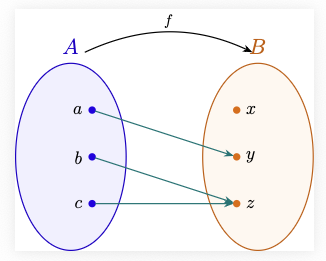
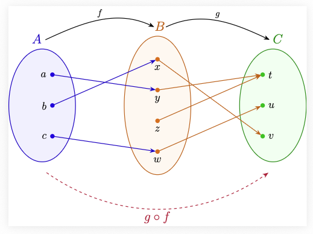

Todo el cálculo diferencial se desarrolla sobre el conjunto de los números reales $\mathbb{R}$. Las propiedades que definen este conjunto, son las que permiten definir formalmente el concepto de límite, que es la idea central para el desarrollo del cálculo diferencial.

## Los números naturales $\mathbb{N}$

La construcción de los números naturales $\mathbb{N}$ es el paso inicial en la construcción de los números reales. Los naturales son el conjunto que usamos para contar, que generalmente escribimos como $\mathbb{N}=\{1,2, \dots, n, \dots\}$. A pesar de que estamos muy acostumbrados a usar el conjunto de los números naturales, para tener una formalización matemática de este conjunto, tocó esperar hasta el siglo XIX, cuando en el año 1889, el matemático italiano Giuseppe Peano introdujo un conjunto de axiomas conocidos como los **Axiomas de Peano**. Existen otras construcciones de los números naturales, como por ejemplo la construcción a partir de la teoría de conjuntos, desarrollada por Ernst Zermelo y Abraham Fraenkel.

Antes de introducir los axiomas de Peano, definamos el concepto de función.

### Funciones

De manera informal, una función es una regla de asignación entre dos conjuntos, un conjunto de salida $A$ y un conjunto de llegada $B$, que a cada elemento del conjunto $A$ le asigna un único elemento del conjunto $B$.

Una manera de representar las funciones es mediante un diagrama de flechas, como muestra la siguiente figura:


Otra forma de representar una función, es como una caja negra, con una entrada y una salida, donde al introducir en la caja un elemento $x$ del conjunto $A$, se produce una única salida $f(x)$ del conjunto $B$, como se muestra en la siguiente figura:


#### Ejemplo de función

Consideremos un conjunto con tres elementos $A=\{a, b, c\}$ y un conjunto con cinco elementos $B=\{x,y,z,w,v\}$. La asignación $a \mapsto z$, $b \mapsto v$ y $c \mapsto z$ es un ejemplo de una función $f$ representada gráficamente como:


#### Ejemplo de alguien que no es una función

Con los mismos conjuntos del ejemplo anterior, la figura


no representa una función, ya que al elemento $b$ **no** se le está asignando un único elemento del conjunto $B$, sino que se le están asignando dos elementos distintos, $v$ y $w$. 

#### Definición formal de función

Recordemos que si $A$ y $B$ son dos conjuntos, el producto cartesiano $A \times B$ se define como  $$A \times B = \{(a,b) : a \in A, b \in B\}.$$

De manera formal, una función de un conjunto $A$ a un conjunto $B$, es un subconjunto $F \subseteq A \times B$ tal que:

1. Para cada elemento $a \in A$, existe un elemento $b \in B$ tal que $(a,b) \in F$. (Todo elemento de $A$ está relacionado con algún elemento de $B$).

2. Si $(a,b) \in F$ y $(a,c) \in F$, entonces $b=c$. (Los elementos de $A$ están relacionados con un único elemento de $B$).

Veamos que esta definición formal coincide con la noción informal anterior. Si $F \subseteq A \times B$ es una función, la condición $(a,b) \in F$ la vamos a escribir como $b=f(a)$, y a la función $F \subseteq A \times B$ la representaremos por $f: A \rightarrow B$. Con esta notación, 1) se convierte en: para todo $a \in A$ existe $b \in B$ tal que $b=f(a)$, es decir, a cada elemento de $A$ le corresponde un elemento de $B$, y la condición 2) se traduce en: si $f(a)=b$ y $f(a)=c$ entonces $b=c$, lo que garantiza que a cada elemento de $A$ le corresponde un único elemento de $B$.

#### Ejemplo interactivo de función

En el siguiente ejemplo interactivo, al decidir la asignación de flechas que a cada elemento del conjunto $A$ lo apareja con un único elemento del conjunto $B$, se está construyendo una función $f: A \rightarrow B$, que en la parte de abajo es representada de manera formal como un subconjunto de $A \times B$.

::: {#interactivo-funcion}
```{=html}
<div style="font-family: sans-serif; max-width: 500px; margin: 10px auto; padding: 20px; border: 1px solid #e2e8f0; border-radius: 8px; background: #fff; box-shadow: 0 4px 6px rgba(0,0,0,0.05);">
  <p style="text-align: center; font-size: 15px; color: #4a5568; margin-top: 0;">
    Haz clic en un círculo del <b>Conjunto A</b> y luego en uno del <b>Conjunto B</b> para trazar la flecha.
  </p>
  
  <div style="text-align: center; margin-bottom: 15px;">
    <button onclick="reiniciar()" style="padding: 6px 16px; cursor: pointer; border: 1px solid #cbd5e0; background: #edf2f7; border-radius: 6px; font-weight: bold; color: #4a5568;">↻ Borrar flechas</button>
  </div>

  <!-- Lienzo donde se dibuja el gráfico -->
  <svg id="lienzo-funcion" width="100%" height="320" viewBox="0 0 400 320" style="background: #f8fafc; border-radius: 6px; border: 1px solid #edf2f7;"></svg>

  <!-- Contenedor para mostrar el conjunto de parejas ordenadas -->
  <div id="texto-conjunto" style="text-align: center; font-size: 18px; font-family: 'Courier New', monospace; font-weight: bold; margin-top: 15px; padding: 10px; background: #edf2f7; border-radius: 6px; color: #2d3748;">
    f = { }
  </div>
</div>

<script>
const elementosA = ['a', 'b', 'c', 'd'];
const elementosB = ['x', 'y', 'z', 'w'];
const yA = { a: 50, b: 120, c: 190, d: 260 };
const yB = { x: 50, y: 120, z: 190, w: 260 };

let selA = null;
let selB = null;
let funcion = {};

function dibujarSVG() {
  const svg = document.getElementById('lienzo-funcion');
  if (!svg) return;

  let html = `
    <defs>
      <marker id="punta-flecha" viewBox="0 0 10 10" refX="28" refY="5" markerWidth="6" markerHeight="6" orient="auto">
        <path d="M 0 0 L 10 5 L 0 10 z" fill="#2b6cb0"/>
      </marker>
    </defs>
    <text x="100" y="20" text-anchor="middle" font-weight="bold" fill="#2d3748">Conjunto A</text>
    <text x="300" y="20" text-anchor="middle" font-weight="bold" fill="#2d3748">Conjunto B</text>
  `;

  // Trazar flechas
  for (const [a, b] of Object.entries(funcion)) {
    html += `<line x1="100" y1="${yA[a]}" x2="300" y2="${yB[b]}" stroke="#2b6cb0" stroke-width="2.5" marker-end="url(#punta-flecha)"/>`;
  }

  // Círculos del Conjunto A
  elementosA.forEach(nodo => {
    const seleccionado = (selA === nodo);
    const relleno = seleccionado ? "#bee3f8" : "#ebf8ff";
    const grosor = seleccionado ? "3" : "2";
    html += `<circle cx="100" cy="${yA[nodo]}" r="18" fill="${relleno}" stroke="#3182ce" stroke-width="${grosor}" style="cursor: pointer; transition: 0.2s;" onclick="clicEnA('${nodo}')"/>`;
    html += `<text x="100" y="${yA[nodo]+5}" text-anchor="middle" font-weight="bold" fill="#2b6cb0" style="pointer-events: none;">${nodo}</text>`;
  });

  // Círculos del Conjunto B
  elementosB.forEach(nodo => {
    const seleccionado = (selB === nodo);
    const relleno = seleccionado ? "#fbd38d" : "#feebc8";
    const grosor = seleccionado ? "3" : "2";
    html += `<circle cx="300" cy="${yB[nodo]}" r="18" fill="${relleno}" stroke="#dd6b20" stroke-width="${grosor}" style="cursor: pointer; transition: 0.2s;" onclick="clicEnB('${nodo}')"/>`;
    html += `<text x="300" y="${yB[nodo]+5}" text-anchor="middle" font-weight="bold" fill="#c05621" style="pointer-events: none;">${nodo}</text>`;
  });

  svg.innerHTML = html;
  actualizarTextoConjunto();
}

// Función para construir y mostrar el conjunto en notación matemática
function actualizarTextoConjunto() {
  const contenedor = document.getElementById('texto-conjunto');
  if (!contenedor) return;

  const parejas = [];
  elementosA.forEach(a => {
    if (funcion[a]) {
      parejas.push(`(${a}, ${funcion[a]})`);
    }
  });

  if (parejas.length === 0) {
    contenedor.innerHTML = 'f = { }';
  } else {
    contenedor.innerHTML = `f = { ${parejas.join(', ')} }`;
  }
}

window.clicEnA = function(nodo) {
  selA = (selA === nodo) ? null : nodo;
  comprobarEmparejamiento();
  dibujarSVG();
};

window.clicEnB = function(nodo) {
  selB = (selB === nodo) ? null : nodo;
  comprobarEmparejamiento();
  dibujarSVG();
};

function comprobarEmparejamiento() {
  if (selA !== null && selB !== null) {
    funcion[selA] = selB;
    selA = null;
    selB = null;
  }
}

window.reiniciar = function() {
  funcion = {};
  selA = null;
  selB = null;
  dibujarSVG();
};

document.addEventListener("DOMContentLoaded", dibujarSVG);
dibujarSVG();
</script>
```
Ejemplo interactivo de función. 
:::

#### Notación para las funciones

De ahora en adelante, denotaremos a una función $F \subseteq A \times B$ como $f: A \rightarrow B$ donde para cada $a \in A$ denotaremos por $f(a)$ al único elemento del conjunto $B$ tal que $(a,f(a)) \in F$.
El conjunto $A$ recibe el nombre de conjunto de salida o dominio de la función $f$, y el conjunto $B$ recibe el nombre de conjunto de llegada o codominio de la función $f$.


#### Otros ejemplos de funciones

1) Supongamos que $A \subseteq B$ es un subconjunto. Definimos la función **inclusión** $i: A \rightarrow B$, como la función que a cada elemento $a \in A$ le asigna el mismo elemento $a \in B$, es decir, $i(a)=a$ para todo $a \in A$.
Si vemos esta función como un subconjunto de $A \times B$, tenemos que el subconjunto correspondiente es $\{(a,a): a \in A\} \subseteq A \times B$, que claramente satisface las dos condiciones de la definición formal de función.

2) Supongamos que tenemos dos conjuntos $A$ y $B$. Definimos las funciones proyecciones $\pi_{1}: A \times B \rightarrow A$ y $\pi_{2}: A \times B \rightarrow B$ como $\pi_{1}(a,b)=a$ y $\pi_{2}(a,b)=b$ para todo $(a,b) \in A \times B$. Los respectivos conjuntos correspondientes a estas funciones son $$\{((a,b),a): (a,b) \in A \times B\} \subseteq (A \times B) \times A$$ y $$\{((a,b),b): (a,b) \in A \times B\} \subseteq (A \times B) \times B,$$ que satisfacen las dos condiciones de la definición formal de función.

El siguiente diagrama ilustra una forma de representar las funciones proyecciones.

::: #funciones-proyeccion
```{=html}
<div style="text-align: center; margin: 20px 0;">
  <svg width="480" height="380" viewBox="0 0 480 380" style="background: #ffffff; border: 1px solid #e2e8f0; border-radius: 8px;">
    <defs>
      <marker id="flecha-proj" viewBox="0 0 10 10" refX="6" refY="5" markerWidth="5" markerHeight="5" orient="auto-start-reverse">
        <path d="M 0 0 L 10 5 L 0 10 z" fill="#e53e3e"/>
      </marker>
    </defs>

    <!-- Ejes principales sin flechas de x e y -->
    <line x1="60" y1="320" x2="440" y2="320" stroke="#cbd5e0" stroke-width="2"/>
    <line x1="60" y1="320" x2="60" y2="40" stroke="#cbd5e0" stroke-width="2"/>

    <!-- Segmento del Conjunto A y su etiqueta -->
    <line x1="130" y1="320" x2="370" y2="320" stroke="#3182ce" stroke-width="5"/>
    <text x="300" y="365" font-weight="bold" font-family="serif" font-size="20" fill="#3182ce" text-anchor="middle">A</text>

    <!-- Segmento del Conjunto B y su etiqueta -->
    <line x1="60" y1="260" x2="60" y2="100" stroke="#dd6b20" stroke-width="5"/>
    <text x="25" y="250" font-weight="bold" font-family="serif" font-size="20" fill="#dd6b20" text-anchor="middle">B</text>

    <!-- Rectángulo A x B -->
    <rect x="130" y="100" width="240" height="160" fill="#ebf8ff" fill-opacity="0.6" stroke="#3182ce" stroke-width="2" stroke-dasharray="4 4"/>
    <text x="400" y="125" font-family="serif" font-style="italic" font-size="16" fill="#2b6cb0">A × B</text>

    <!-- Líneas de Proyección -->
    <line x1="240" y1="180" x2="240" y2="320" stroke="#e53e3e" stroke-width="2" stroke-dasharray="5 3"/>
    <line x1="240" y1="180" x2="60" y2="180" stroke="#e53e3e" stroke-width="2" stroke-dasharray="5 3"/>

    <!-- Indicadores de Proyección -->
    <path d="M 240 220 L 240 235" stroke="#e53e3e" stroke-width="2" marker-end="url(#flecha-proj)"/>
    <text x="250" y="235" font-family="serif" font-size="16" fill="#e53e3e" font-weight="bold">π₁</text>

    <path d="M 160 180 L 145 180" stroke="#e53e3e" stroke-width="2" marker-end="url(#flecha-proj)"/>
    <text x="150" y="170" font-family="serif" font-size="16" fill="#e53e3e" font-weight="bold">π₂</text>

    <!-- Punto (a,b) -->
    <circle cx="240" cy="180" r="5" fill="#2b6cb0"/>
    <text x="250" y="175" font-family="serif" font-size="16" font-weight="bold" fill="#2d3748">(a, b)</text>

    <!-- Puntos proyectados a y b -->
    <circle cx="240" cy="320" r="5" fill="#e53e3e"/>
    <text x="240" y="340" font-family="serif" font-size="16" font-style="italic" font-weight="bold" fill="#e53e3e" text-anchor="middle">a</text>

    <circle cx="60" cy="180" r="5" fill="#e53e3e"/>
    <text x="48" y="185" font-family="serif" font-size="16" font-style="italic" font-weight="bold" fill="#e53e3e" text-anchor="end">b</text>
  </svg>
</div>
```
Funciones proyecciones
:::

#### ¿Cuándo dos funciones son iguales?

Formalmente, dos funciones de $A$ a $B$ son iguales, si definen el mismo subconjunto de $A \times B$. Con nuestra nueva notación, dos funciones $f: A \rightarrow B$ y $g: C \rightarrow D$ son iguales, si $A=C$, $B=D$ y $f(a)=g(a)$ para todo $a \in A$.

#### Pregunta

En [ejemplo interactivo de función](#interactivo-funcion), ¿cuántas funciones distintas se pueden construir?  

#### Funciones sobreyectivas e inyectivas

Observe que en la definición de función $f:A \rightarrow B$, se permite que elementos del conjunto $B$ no estén relacionados con ningún elemento del conjunto $A$, es decir, puede existir un elemento $b \in B$ para el cual no existe ningún $a \in A$ tal que $b=f(a)$, o de manera equivalente, tal que $(a,b) \notin F \subseteq A \times B$. 

Por ejemplo, en la función


los elementos $x,y,w \in B$ no están relacionados con ningún elemento del conjunto $A$, es decir, no existen elementos en $A$ que se relacionen con $x$, $y$ o $w$.

**Función sobreyectiva:** Una función $f: A \rightarrow B$ es sobreyectiva si todos los elementos de $B$ quedan relacionados con elementos de $A$, es decir, si para cada $b \in B$ existe un $a \in A$ tal que $f(a) = b$.

Por ejemplo, la función


es sobreyectiva, ya que todos los elementos del conjunto $B$ están relacionados con algún elemento del conjunto $A$.

#### Pregunta

¿Es posible construir una función sobreyectiva $f: \{a,b,c\} \rightarrow \{x,y,z,w\}$?

Esta pregunta es equivalente al siguiente problema: 

::: {#interactivo-principio-del-palomar}
```{=html}
<div style="font-family: system-ui, -apple-system, sans-serif; max-width: 650px; margin: 20px auto; padding: 25px; border: 1px solid #e2e8f0; border-radius: 12px; background: #ffffff; box-shadow: 0 10px 15px -3px rgba(0,0,0,0.1);">

  <h3 style="text-align: center; color: #1e293b; margin-top: 0; margin-bottom: 6px;">Intente introducir las letras x,y,z,w en las cajas, sin colocar mas de una letra en cada caja</h3>
  <p style="text-align: center; color: #64748b; font-size: 14px; margin-bottom: 20px;">
    <b>Arrastra</b> cada letra a una caja. Cada letra solo puede usarse <b>una sola vez</b> (se deshabilita al ser asignada, pero reaparece si la borras).
  </p>

  <!-- Paleta de Letras -->
  <div style="background: #f1f5f9; border: 1px solid #cbd5e1; border-radius: 10px; padding: 15px; text-align: center; margin-bottom: 20px;">
    <span style="font-size: 13px; font-weight: bold; color: #475569; display: block; margin-bottom: 10px; text-transform: uppercase; letter-spacing: 0.5px;">
      Paleta de Letras Disponibles
    </span>
    
    <div style="display: flex; justify-content: center; gap: 15px;">
      <div id="paleta-x" draggable="true" ondragstart="drag(event, 'x')" style="width: 44px; height: 44px; line-height: 44px; background: #0284c7; color: white; border-radius: 8px; font-weight: bold; font-size: 20px; cursor: grab; user-select: none; transition: all 0.2s ease; box-shadow: 0 2px 4px rgba(0,0,0,0.15);">x</div>
      <div id="paleta-y" draggable="true" ondragstart="drag(event, 'y')" style="width: 44px; height: 44px; line-height: 44px; background: #0284c7; color: white; border-radius: 8px; font-weight: bold; font-size: 20px; cursor: grab; user-select: none; transition: all 0.2s ease; box-shadow: 0 2px 4px rgba(0,0,0,0.15);">y</div>
      <div id="paleta-z" draggable="true" ondragstart="drag(event, 'z')" style="width: 44px; height: 44px; line-height: 44px; background: #0284c7; color: white; border-radius: 8px; font-weight: bold; font-size: 20px; cursor: grab; user-select: none; transition: all 0.2s ease; box-shadow: 0 2px 4px rgba(0,0,0,0.15);">z</div>
      <div id="paleta-w" draggable="true" ondragstart="drag(event, 'w')" style="width: 44px; height: 44px; line-height: 44px; background: #0284c7; color: white; border-radius: 8px; font-weight: bold; font-size: 20px; cursor: grab; user-select: none; transition: all 0.2s ease; box-shadow: 0 2px 4px rgba(0,0,0,0.15);">w</div>
    </div>
  </div>

  <!-- Botón de vaciado global -->
  <div style="text-align: center; margin-bottom: 20px;">
    <button onclick="vaciarTodo()" style="padding: 6px 14px; background: #ffffff; border: 1px solid #cbd5e1; border-radius: 6px; color: #475569; font-weight: bold; cursor: pointer; font-size: 13px;">
      ↻ Restablecer todas las letras
    </button>
  </div>

  <!-- Cajas Receptoras -->
  <div style="display: grid; grid-template-columns: repeat(3, 1fr); gap: 15px; margin-bottom: 25px;">
    
    <!-- Caja a -->
    <div ondragover="allowDrop(event)" ondragenter="dragHighlight(this)" ondragleave="dragUnhighlight(this)" ondrop="drop(event, 'a', this)"
         style="border: 2px dashed #3b82f6; border-radius: 10px; background: #eff6ff; padding: 12px; text-align: center; display: flex; flex-direction: column; justify-content: space-between; transition: 0.2s;">
      <div style="font-weight: 800; font-size: 18px; color: #1d4ed8; margin-bottom: 8px; pointer-events: none;">CAJA a</div>
      
      <div id="box-a" style="min-height: 70px; padding: 6px; background: #ffffff; border: 1px solid #cbd5e1; border-radius: 6px; display: flex; flex-wrap: wrap; gap: 4px; align-items: center; justify-content: center; margin-bottom: 10px; pointer-events: none;">
        <span style="color: #94a3b8; font-size: 13px; font-style: italic;">Soltar aquí</span>
      </div>

      <button onclick="vaciarCaja('a')" style="padding: 4px; background: #fee2e2; color: #dc2626; border: 1px solid #fca5a5; border-radius: 4px; font-size: 12px; font-weight: bold; cursor: pointer;">Borrar a</button>
    </div>

    <!-- Caja b -->
    <div ondragover="allowDrop(event)" ondragenter="dragHighlight(this)" ondragleave="dragUnhighlight(this)" ondrop="drop(event, 'b', this)"
         style="border: 2px dashed #3b82f6; border-radius: 10px; background: #eff6ff; padding: 12px; text-align: center; display: flex; flex-direction: column; justify-content: space-between; transition: 0.2s;">
      <div style="font-weight: 800; font-size: 18px; color: #1d4ed8; margin-bottom: 8px; pointer-events: none;">CAJA b</div>
      
      <div id="box-b" style="min-height: 70px; padding: 6px; background: #ffffff; border: 1px solid #cbd5e1; border-radius: 6px; display: flex; flex-wrap: wrap; gap: 4px; align-items: center; justify-content: center; margin-bottom: 10px; pointer-events: none;">
        <span style="color: #94a3b8; font-size: 13px; font-style: italic;">Soltar aquí</span>
      </div>

      <button onclick="vaciarCaja('b')" style="padding: 4px; background: #fee2e2; color: #dc2626; border: 1px solid #fca5a5; border-radius: 4px; font-size: 12px; font-weight: bold; cursor: pointer;">Borrar b</button>
    </div>

    <!-- Caja c -->
    <div ondragover="allowDrop(event)" ondragenter="dragHighlight(this)" ondragleave="dragUnhighlight(this)" ondrop="drop(event, 'c', this)"
         style="border: 2px dashed #3b82f6; border-radius: 10px; background: #eff6ff; padding: 12px; text-align: center; display: flex; flex-direction: column; justify-content: space-between; transition: 0.2s;">
      <div style="font-weight: 800; font-size: 18px; color: #1d4ed8; margin-bottom: 8px; pointer-events: none;">CAJA c</div>
      
      <div id="box-c" style="min-height: 70px; padding: 6px; background: #ffffff; border: 1px solid #cbd5e1; border-radius: 6px; display: flex; flex-wrap: wrap; gap: 4px; align-items: center; justify-content: center; margin-bottom: 10px; pointer-events: none;">
        <span style="color: #94a3b8; font-size: 13px; font-style: italic;">Soltar aquí</span>
      </div>

      <button onclick="vaciarCaja('c')" style="padding: 4px; background: #fee2e2; color: #dc2626; border: 1px solid #fca5a5; border-radius: 4px; font-size: 12px; font-weight: bold; cursor: pointer;">Borrar c</button>
    </div>

  </div>

  <!-- Estado / Notación Matemática -->
  <div style="background: #f8fafc; border: 1px solid #e2e8f0; border-radius: 8px; padding: 15px; text-align: center;">
    <div style="font-size: 12px; font-weight: bold; text-transform: uppercase; letter-spacing: 0.5px; color: #64748b; margin-bottom: 6px;">Representación del Contenido</div>
    <div id="resumen-conjuntos" style="font-family: 'Courier New', monospace; font-size: 16px; font-weight: bold; color: #0f172a;">
      a ↦ ∅, &nbsp; b ↦ ∅, &nbsp; c ↦ ∅
    </div>
  </div>

</div>

<script>
const estadoCajas = { a: [], b: [], c: [] };
const todasLasLetras = ['x', 'y', 'z', 'w'];

// Determina qué letras ya han sido usadas en alguna caja
function obtenerUsadas() {
  const usadas = new Set();
  Object.values(estadoCajas).forEach(lista => lista.forEach(item => usadas.add(item)));
  return usadas;
}

// Eventos de arrastre
function drag(ev, letra) {
  const usadas = obtenerUsadas();
  if (usadas.has(letra)) {
    ev.preventDefault();
    return;
  }
  ev.dataTransfer.setData("text/plain", letra);
}

function allowDrop(ev) {
  ev.preventDefault();
}

function dragHighlight(elem) {
  elem.style.background = "#dbeafe";
  elem.style.borderColor = "#2563eb";
}

function dragUnhighlight(elem) {
  elem.style.background = "#eff6ff";
  elem.style.borderColor = "#3b82f6";
}

function drop(ev, caja, elem) {
  ev.preventDefault();
  dragUnhighlight(elem);
  const letra = ev.dataTransfer.getData("text/plain");
  const usadas = obtenerUsadas();

  // Permite insertar la letra solo si existe y aún no se ha usado
  if (letra && !usadas.has(letra)) {
    estadoCajas[caja].push(letra);
    render();
  }
}

// Eliminación y vaciado
function eliminarElemento(caja, index) {
  estadoCajas[caja].splice(index, 1);
  render();
}

function vaciarCaja(caja) {
  estadoCajas[caja] = [];
  render();
}

function vaciarTodo() {
  estadoCajas.a = [];
  estadoCajas.b = [];
  estadoCajas.c = [];
  render();
}

// Renderizado de interfaz
function render() {
  const usadas = obtenerUsadas();

  // 1. Actualiza el estado visual de la paleta
  todasLasLetras.forEach(letra => {
    const elemPaleta = document.getElementById(`paleta-${letra}`);
    if (elemPaleta) {
      if (usadas.has(letra)) {
        elemPaleta.setAttribute("draggable", "false");
        elemPaleta.style.opacity = "0.25";
        elemPaleta.style.cursor = "not-allowed";
        elemPaleta.style.filter = "grayscale(100%)";
        elemPaleta.style.boxShadow = "none";
        elemPaleta.title = "Esta letra ya fue asignada";
      } else {
        elemPaleta.setAttribute("draggable", "true");
        elemPaleta.style.opacity = "1";
        elemPaleta.style.cursor = "grab";
        elemPaleta.style.filter = "none";
        elemPaleta.style.boxShadow = "0 2px 4px rgba(0,0,0,0.15)";
        elemPaleta.title = "Arrastra esta letra a una caja";
      }
    }
  });

  // 2. Actualiza el contenido visual de las cajas
  ['a', 'b', 'c'].forEach(caja => {
    const container = document.getElementById(`box-${caja}`);
    if (!container) return;
    
    const items = estadoCajas[caja];
    
    if (items.length === 0) {
      container.innerHTML = `<span style="color: #94a3b8; font-size: 13px; font-style: italic;">Soltar aquí</span>`;
    } else {
      let html = '';
      items.forEach((item, idx) => {
        html += `
          <span onclick="eliminarElemento('${caja}', ${idx})" 
                title="Haz clic para quitar y devolver a la paleta"
                style="background: #0284c7; color: white; padding: 3px 8px; border-radius: 12px; font-weight: bold; font-size: 14px; cursor: pointer; display: inline-flex; align-items: center; gap: 4px; pointer-events: auto;">
            ${item} <small style="font-size: 10px; opacity: 0.8;">✕</small>
          </span>`;
      });
      container.innerHTML = html;
    }
  });

  // 3. Notación matemática en tiempo real
  const resumenElem = document.getElementById('resumen-conjuntos');
  if (resumenElem) {
    const texto = ['a', 'b', 'c'].map(c => {
      const elems = estadoCajas[c];
      const strContent = elems.length > 0 ? `{ ${elems.join(', ')} }` : '∅';
      return `${c} ↦ ${strContent}`;
    }).join(', &nbsp; ');
    resumenElem.innerHTML = texto;
  }
}

document.addEventListener("DOMContentLoaded", render);
render();
</script>
```
Principio del palomar
:::

El problema anterior es un ejemplo del **Principio del Palomar**, que establece que si hay más palomas que palomares y se quieren guardar todas las palomas en los palomares, obligatoriamente en algún palomar se tendrán que ubicar por lo menos dos palomas.

#### Ejemplos de funciones sobreyectivas

1) Si $A$ es un conjunto, definimos la función identidad $\textrm{id}_{A}: A \rightarrow A$ que a cada elemento $a \in A$ le asigna el mismo elemento $a \in A$, es decir, $\textrm{id}_{A}(a)=a$. Esta función como subconjunto de $A \times A$ corresponde a $F=\{(a,a)~ :~ a \in A\}$.
Esta función es claramente sobreyectiva, ya que todo elemento del conjunto de llegada $a \in A$ está relacionado con el mismo elemento $a \in A$ del conjunto de salida.

2) Si $A$ y $B$ son conjuntos, las funciones proyecciones $\pi_{1}: A \times B \rightarrow A$ y $\pi_{2}: A \times B \rightarrow B$ definidas como $\pi_{1}(a,b)=a$ y $\pi_{2}(a,b)=b$ para todo $(a,b) \in A \times B$, son sobreyectivas.
Como se puede ver en el siguiente gráfico, un elemento $a \in A$ está relacionado con todos los elementos de la linea roja vertical continua por medio de la función $\pi_{1}$, y un elemento $b \in B$ está relacionado con todos los elementos de la linea azul horizontal continua por medio de la función $\pi_{2}$.

:::{#sobreyectividad-proyecciones}
```{=html}
<div style="text-align: center; margin: 20px 0;">
  <svg width="480" height="380" viewBox="0 0 480 380" style="background: #ffffff; border: 1px solid #e2e8f0; border-radius: 8px;">
    <defs>
      <marker id="flecha-proj" viewBox="0 0 10 10" refX="6" refY="5" markerWidth="5" markerHeight="5" orient="auto-start-reverse">
        <path d="M 0 0 L 10 5 L 0 10 z" fill="#e53e3e"/>
      </marker>
    </defs>

    <!-- Ejes principales -->
    <line x1="60" y1="320" x2="440" y2="320" stroke="#cbd5e0" stroke-width="2"/>
    <line x1="60" y1="320" x2="60" y2="40" stroke="#cbd5e0" stroke-width="2"/>

    <!-- Segmento del Conjunto A y su etiqueta -->
    <line x1="130" y1="320" x2="370" y2="320" stroke="#3182ce" stroke-width="5"/>
    <text x="250" y="365" font-weight="bold" font-family="serif" font-size="20" fill="#3182ce" text-anchor="middle">A</text>

    <!-- Segmento del Conjunto B y su etiqueta -->
    <line x1="60" y1="260" x2="60" y2="100" stroke="#dd6b20" stroke-width="5"/>
    <text x="25" y="185" font-weight="bold" font-family="serif" font-size="20" fill="#dd6b20" text-anchor="middle">B</text>

    <!-- Rectángulo A x B -->
    <rect x="130" y="100" width="240" height="160" fill="#ebf8ff" fill-opacity="0.6" stroke="#3182ce" stroke-width="2" stroke-dasharray="4 4"/>
    <text x="330" y="125" font-family="serif" font-style="italic" font-size="16" fill="#2b6cb0">A × B</text>

    <!-- LÍNEA VERTICAL ROJA CONTINUA (Restringida al recuadro A x B) -->
    <line x1="240" y1="100" x2="240" y2="260" stroke="#e53e3e" stroke-width="2"/>

    <!-- LÍNEA HORIZONTAL AZUL CONTINUA (Restringida al recuadro A x B) -->
    <line x1="130" y1="180" x2="370" y2="180" stroke="#2b6cb0" stroke-width="2"/>

    <!-- Líneas punteadas de proyección desde A x B hacia los ejes -->
    <line x1="240" y1="260" x2="240" y2="320" stroke="#e53e3e" stroke-width="1.5" stroke-dasharray="4 3"/>
    <line x1="130" y1="180" x2="60" y2="180" stroke="#2b6cb0" stroke-width="1.5" stroke-dasharray="4 3"/>

    

    
    <!-- Punto (a,b) -->
    <circle cx="240" cy="180" r="6" fill="#2d3748"/>
    <text x="250" y="170" font-family="serif" font-size="16" font-weight="bold" fill="#2d3748">(a, b)</text>

    <!-- Punto proyectado a en el eje X -->
    <circle cx="240" cy="320" r="5" fill="#e53e3e"/>
    <text x="240" y="340" font-family="serif" font-size="16" font-style="italic" font-weight="bold" fill="#e53e3e" text-anchor="middle">a</text>

    <!-- Punto proyectado b en el eje Y -->
    <circle cx="60" cy="180" r="5" fill="#2b6cb0"/>
    <text x="48" y="185" font-family="serif" font-size="16" font-style="italic" font-weight="bold" fill="#2b6cb0" text-anchor="end">b</text>
  </svg>
</div>
```
Sobreyectividad de las funciones proyecciones
:::

#### Funciones inyectivas

En la definición de función $f:A \rightarrow B$, sabemos que cada elemento de $A$ tiene que estar conectado con un único elemento de $B$, pero en la definición de función se permite que dos elementos distintos del conjunto $A$ estén relacionados con el mismo elemento del conjunto $B$, es decir, puede existir un elemento $b \in B$ para el cual existen dos elementos distintos $a_{1}, a_{2} \in A$ tal que $b=f(a_{1})=f(a_{2})$, o de manera equivalente, tal que $(a_{1},b), (a_{2},b) \in F \subseteq A \times B$.

Por ejemplo, en la función del siguiente gráfico, 



los elementos $b$ y $c$ se relacionan con el mismo elemento $z \in B$, es decir, $f(b)=z=f(c)$.

Uno función es **inyectiva** si no ocurre lo anterior, es decir:

**Función inyectiva:** Decimos que una función $f: A \rightarrow B$ es inyectiva si para cada elemento $b \in B$ existe a lo sumo un elemento $a \in A$ tal que $f(a) = b$, es decir, no existen dos elementos distintos de $A$ que se relacionen con el mismo elemento de $B$. De manera equivalente, $f(a_1) = f(a_2)$ implica $a_1 = a_2$ (la única forma que de hayan dos flechas llegando un mismo elemento, es que sean la misma flecha). 

Del gráfico [Sobreyectividad de las funciones proyecciones](#sobreyectividad-proyecciones), podemos ver que las funciones $\pi_{1}: A \times B \rightarrow A$ y $\pi_{2}: A \times B \rightarrow B$ no son inyectivas, ya que dado $a \in A$ todos los elementos de la línea roja vertical continua se relacionan con el mismo elemento $a \in A$, y dado $b \in B$ todos los elementos de la línea azul horizontal continua se relacionan con el mismo elemento $b \in B$.

#### Ejemplos de funciones inyectivas

1) Si $A$ es un conjunto, la función identidad id$\textrm{id}_{A}: A \rightarrow A$ que a cada elemento $a \in A$ le asigna el mismo elemento $a \in A$, es decir, $\textrm{id}_{A}(a)=a$, es una función inyectiva.

2) Si $A$ y $B$ son conjunto y fijamos un elemento $b_{0} \in B$, entonces la función constante $f: A \rightarrow A \times B$ definida como $f(a)=(a,b_{0})$ para todo $a \in A$, es inyectiva, ya que si $f(a_1)=f(a_2)$, entonces $(a_1,b_{0})=(a_2,b_{0})$, lo que implica $a_1=a_2$.

#### Ejemplo interactivo de función sobreyectiva

:::{#construyendo-funcion-sobreyectiva}
```{=html}
<div id="app-sobreyectiva-v3" style="font-family: system-ui, -apple-system, sans-serif; max-width: 520px; margin: 10px auto; padding: 20px; border: 1px solid #e2e8f0; border-radius: 8px; background: #fff; box-shadow: 0 4px 6px rgba(0,0,0,0.05);">
  <p style="text-align: center; font-size: 15px; color: #4a5568; margin-top: 0;">
    Haz clic en un elemento del <b>Conjunto A</b> y luego en uno del <b>Conjunto B</b> para asignar la función, de tal manera que quede sobreyectiva.
  </p>
  
  <div style="text-align: center; margin-bottom: 15px;">
    <button id="btn-reiniciar-sob3" style="padding: 6px 16px; cursor: pointer; border: 1px solid #cbd5e0; background: #edf2f7; border-radius: 6px; font-weight: bold; color: #4a5568;">↻ Borrar flechas</button>
  </div>

  <div style="width: 100%; min-height: 340px; position: relative;">
    <svg id="lienzo-sobreyectiva-v3" width="100%" height="340" viewBox="0 0 400 340" style="background: #f8fafc; border-radius: 6px; border: 1px solid #edf2f7; display: block; touch-action: manipulation;"></svg>
  </div>

  <div id="texto-conjunto-v3" style="text-align: center; font-size: 16px; font-family: 'Courier New', monospace; font-weight: bold; margin-top: 15px; padding: 10px; background: #edf2f7; border-radius: 6px; color: #2d3748;">
    f = { }
  </div>

  <div id="panel-sobreyectiva-v3" style="margin-top: 10px; padding: 12px; border-radius: 6px; text-align: center; font-weight: bold; font-size: 14px; background: #fef3c7; color: #92400e; border: 1px solid #fde68a;">
    Asigna flechas desde los 4 elementos del Conjunto A.
  </div>
</div>

<script>
(function() {
  function iniciarModulo() {
    const root = document.getElementById('app-sobreyectiva-v3');
    if (!root) return;

    const svg = root.querySelector('#lienzo-sobreyectiva-v3');
    const txtConjunto = root.querySelector('#texto-conjunto-v3');
    const panelSob = root.querySelector('#panel-sobreyectiva-v3');
    const btnReiniciar = root.querySelector('#btn-reiniciar-sob3');

    if (!svg) return;

    const elemA = ['a', 'b', 'c', 'd'];
    const elemB = ['x', 'y', 'z'];
    const yA = { a: 70, b: 135, c: 200, d: 265 };
    const yB = { x: 95, y: 167, z: 239 };

    let selA = null;
    let selB = null;
    let funcion = {};

    function render() {
      let html = `
        <defs>
          <marker id="punta-flecha-v3" viewBox="0 0 10 10" refX="28" refY="5" markerWidth="6" markerHeight="6" orient="auto">
            <path d="M 0 0 L 10 5 L 0 10 z" fill="#2b6cb0"/>
          </marker>
        </defs>

        <!-- Conjunto A (4 elementos) -->
        <ellipse cx="100" cy="167" rx="55" ry="125" fill="#ebf8ff" stroke="#3182ce" stroke-width="2" stroke-dasharray="5 4"/>
        <text x="100" y="25" text-anchor="middle" font-weight="bold" font-size="16" fill="#2b6cb0">Conjunto A</text>

        <!-- Conjunto B (3 elementos) -->
        <ellipse cx="300" cy="167" rx="55" ry="110" fill="#fffaf0" stroke="#dd6b20" stroke-width="2" stroke-dasharray="5 4"/>
        <text x="300" y="25" text-anchor="middle" font-weight="bold" font-size="16" fill="#c05621">Conjunto B</text>
      `;

      // Trazado de flechas
      for (const [a, b] of Object.entries(funcion)) {
        if (b) {
          html += `<line x1="100" y1="${yA[a]}" x2="300" y2="${yB[b]}" stroke="#2b6cb0" stroke-width="2.5" marker-end="url(#punta-flecha-v3)"/>`;
        }
      }

      // Nodos A
      elemA.forEach(nodo => {
        const esSel = (selA === nodo);
        const fill = esSel ? "#bee3f8" : "#ffffff";
        const strokeW = esSel ? "3" : "2";
        html += `<g data-grupo="A" data-nodo="${nodo}" style="cursor: pointer;">
          <circle cx="100" cy="${yA[nodo]}" r="18" fill="${fill}" stroke="#3182ce" stroke-width="${strokeW}"/>
          <text x="100" y="${yA[nodo]+5}" text-anchor="middle" font-weight="bold" fill="#2b6cb0" style="pointer-events: none;">${nodo}</text>
        </g>`;
      });

      // Nodos B
      elemB.forEach(nodo => {
        const esSel = (selB === nodo);
        const fill = esSel ? "#fbd38d" : "#ffffff";
        const strokeW = esSel ? "3" : "2";
        html += `<g data-grupo="B" data-nodo="${nodo}" style="cursor: pointer;">
          <circle cx="300" cy="${yB[nodo]}" r="18" fill="${fill}" stroke="#dd6b20" stroke-width="${strokeW}"/>
          <text x="300" y="${yB[nodo]+5}" text-anchor="middle" font-weight="bold" fill="#c05621" style="pointer-events: none;">${nodo}</text>
        </g>`;
      });

      svg.innerHTML = html;
      actualizarEstado();
    }

    function actualizarEstado() {
      const parejas = [];
      elemA.forEach(a => {
        if (funcion[a]) parejas.push(`(${a}, ${funcion[a]})`);
      });

      txtConjunto.innerHTML = parejas.length ? `f = { ${parejas.join(', ')} }` : 'f = { }';

      const asignados = Object.keys(funcion).length;
      if (asignados < elemA.length) {
        panelSob.style.cssText = "margin-top: 10px; padding: 12px; border-radius: 6px; text-align: center; font-weight: bold; font-size: 14px; background: #fef3c7; color: #92400e; border: 1px solid #fde68a;";
        panelSob.innerHTML = `⚠️ Función incompleta: asigna los ${elemA.length - asignados} elemento(s) faltantes de A.`;
        return;
      }

      const imagenes = new Set(Object.values(funcion));
      if (imagenes.size === elemB.length) {
        panelSob.style.cssText = "margin-top: 10px; padding: 12px; border-radius: 6px; text-align: center; font-weight: bold; font-size: 14px; background: #dcfce7; color: #166534; border: 1px solid #86efac;";
        panelSob.innerHTML = "✅ ES SOBREYECTIVA: Todo elemento del Conjunto B posee al menos una preimagen (Im(f) = B).";
      } else {
        const noAlcanzados = elemB.filter(b => !imagenes.has(b));
        panelSob.style.cssText = "margin-top: 10px; padding: 12px; border-radius: 6px; text-align: center; font-weight: bold; font-size: 14px; background: #fee2e2; color: #991b1b; border: 1px solid #fca5a5;";
        panelSob.innerHTML = `❌ NO ES SOBREYECTIVA: Quedaron sin recibir flecha: { ${noAlcanzados.join(', ')} }.`;
      }
    }

    // Delegación de eventos
    svg.addEventListener('click', (e) => {
      const targetGroup = e.target.closest('[data-grupo]');
      if (!targetGroup) return;

      const grupo = targetGroup.getAttribute('data-grupo');
      const nodo = targetGroup.getAttribute('data-nodo');

      if (grupo === 'A') {
        selA = (selA === nodo) ? null : nodo;
      } else if (grupo === 'B') {
        selB = (selB === nodo) ? null : nodo;
      }

      if (selA && selB) {
        funcion[selA] = selB;
        selA = null;
        selB = null;
      }

      render();
    });

    btnReiniciar.addEventListener('click', () => {
      funcion = {};
      selA = null;
      selB = null;
      render();
    });

    render();
  }

  if (document.readyState === 'complete' || document.readyState === 'interactive') {
    setTimeout(iniciarModulo, 10);
  } else {
    document.addEventListener('DOMContentLoaded', iniciarModulo);
  }
})();
</script>
```
Construyendo una función sobreyectiva
:::

#### Pregunta

¿Cuántas funciones sobreyectivas distintas se pueden construir en [Construyendo una función sobreyectiva](#construyendo-funcion-sobreyectiva) ?

**Ayuda:** Encuentre cuántas funciones que no sean sobreyectivas se pueden construir y réstelas del total de funciones posibles.

**Imagen de una función:** Dada una función $f:A \rightarrow B$ definimos su imagen que denotaremos $\textrm{im}(f) \subseteq B$ como el conjunto de todos los elementos de $B$ que están relacionados con algún elemento de $A$, es decir, $\textrm{im}(f)=\{b \in B~ :~ \textrm{existe}~ a \in A~ \textrm{con}~ f(a)=b\}$.

Una función $f: A \rightarrow B$ es sobreyectiva si y solo si $\textrm{im}(f)=B$.

#### Ejemplo interactivo de función inyectiva

:::{#construyendo-funcion-inyectiva}
```{=html}
<div id="app-inyectiva-v1" style="font-family: system-ui, -apple-system, sans-serif; max-width: 520px; margin: 10px auto; padding: 20px; border: 1px solid #e2e8f0; border-radius: 8px; background: #fff; box-shadow: 0 4px 6px rgba(0,0,0,0.05);">
  <p style="text-align: center; font-size: 15px; color: #4a5568; margin-top: 0;">
    Haz clic en un elemento del <b>Conjunto A</b> y luego en uno del <b>Conjunto B</b> para definir la función, de tal manera que sea inyectiva.
  </p>
  
  <div style="text-align: center; margin-bottom: 15px;">
    <button id="btn-reiniciar-iny1" style="padding: 6px 16px; cursor: pointer; border: 1px solid #cbd5e0; background: #edf2f7; border-radius: 6px; font-weight: bold; color: #4a5568;">↻ Borrar flechas</button>
  </div>

  <div style="width: 100%; min-height: 340px; position: relative;">
    <svg id="lienzo-inyectiva-v1" width="100%" height="340" viewBox="0 0 400 340" style="background: #f8fafc; border-radius: 6px; border: 1px solid #edf2f7; display: block; touch-action: manipulation;"></svg>
  </div>

  <div id="texto-conjunto-iny1" style="text-align: center; font-size: 16px; font-family: 'Courier New', monospace; font-weight: bold; margin-top: 15px; padding: 10px; background: #edf2f7; border-radius: 6px; color: #2d3748;">
    f = { }
  </div>

  <div id="panel-inyectiva-v1" style="margin-top: 10px; padding: 12px; border-radius: 6px; text-align: center; font-weight: bold; font-size: 14px; background: #fef3c7; color: #92400e; border: 1px solid #fde68a;">
    Asigna flechas desde los 3 elementos del Conjunto A.
  </div>
</div>

<script>
(function() {
  function iniciarModulo() {
    const root = document.getElementById('app-inyectiva-v1');
    if (!root) return;

    const svg = root.querySelector('#lienzo-inyectiva-v1');
    const txtConjunto = root.querySelector('#texto-conjunto-iny1');
    const panelIny = root.querySelector('#panel-inyectiva-v1');
    const btnReiniciar = root.querySelector('#btn-reiniciar-iny1');

    if (!svg) return;

    const elemA = ['a', 'b', 'c'];
    const elemB = ['x', 'y', 'z', 'w'];
    const yA = { a: 95, b: 167, c: 239 };
    const yB = { x: 70, y: 135, z: 200, w: 265 };

    let selA = null;
    let selB = null;
    let funcion = {};

    function render() {
      let html = `
        <defs>
          <marker id="punta-flecha-iny1" viewBox="0 0 10 10" refX="28" refY="5" markerWidth="6" markerHeight="6" orient="auto">
            <path d="M 0 0 L 10 5 L 0 10 z" fill="#2b6cb0"/>
          </marker>
        </defs>

        <!-- Conjunto A (3 elementos) -->
        <ellipse cx="100" cy="167" rx="55" ry="110" fill="#ebf8ff" stroke="#3182ce" stroke-width="2" stroke-dasharray="5 4"/>
        <text x="100" y="25" text-anchor="middle" font-weight="bold" font-size="16" fill="#2b6cb0">Conjunto A</text>

        <!-- Conjunto B (4 elementos) -->
        <ellipse cx="300" cy="167" rx="55" ry="125" fill="#fffaf0" stroke="#dd6b20" stroke-width="2" stroke-dasharray="5 4"/>
        <text x="300" y="25" text-anchor="middle" font-weight="bold" font-size="16" fill="#c05621">Conjunto B</text>
      `;

      // Trazado de flechas
      for (const [a, b] of Object.entries(funcion)) {
        if (b) {
          html += `<line x1="100" y1="${yA[a]}" x2="300" y2="${yB[b]}" stroke="#2b6cb0" stroke-width="2.5" marker-end="url(#punta-flecha-iny1)"/>`;
        }
      }

      // Nodos A
      elemA.forEach(nodo => {
        const esSel = (selA === nodo);
        const fill = esSel ? "#bee3f8" : "#ffffff";
        const strokeW = esSel ? "3" : "2";
        html += `<g data-grupo="A" data-nodo="${nodo}" style="cursor: pointer;">
          <circle cx="100" cy="${yA[nodo]}" r="18" fill="${fill}" stroke="#3182ce" stroke-width="${strokeW}"/>
          <text x="100" y="${yA[nodo]+5}" text-anchor="middle" font-weight="bold" fill="#2b6cb0" style="pointer-events: none;">${nodo}</text>
        </g>`;
      });

      // Nodos B
      elemB.forEach(nodo => {
        const esSel = (selB === nodo);
        const fill = esSel ? "#fbd38d" : "#ffffff";
        const strokeW = esSel ? "3" : "2";
        html += `<g data-grupo="B" data-nodo="${nodo}" style="cursor: pointer;">
          <circle cx="300" cy="${yB[nodo]}" r="18" fill="${fill}" stroke="#dd6b20" stroke-width="${strokeW}"/>
          <text x="300" y="${yB[nodo]+5}" text-anchor="middle" font-weight="bold" fill="#c05621" style="pointer-events: none;">${nodo}</text>
        </g>`;
      });

      svg.innerHTML = html;
      actualizarEstado();
    }

    function actualizarEstado() {
      const parejas = [];
      elemA.forEach(a => {
        if (funcion[a]) parejas.push(`(${a}, ${funcion[a]})`);
      });

      txtConjunto.innerHTML = parejas.length ? `f = { ${parejas.join(', ')} }` : 'f = { }';

      const asignados = Object.keys(funcion).length;
      if (asignados < elemA.length) {
        panelIny.style.cssText = "margin-top: 10px; padding: 12px; border-radius: 6px; text-align: center; font-weight: bold; font-size: 14px; background: #fef3c7; color: #92400e; border: 1px solid #fde68a;";
        panelIny.innerHTML = `⚠️ Función incompleta: asigna los ${elemA.length - asignados} elemento(s) faltantes de A.`;
        return;
      }

      const valoresB = Object.values(funcion);
      const imagenesUnicas = new Set(valoresB);

      if (imagenesUnicas.size === elemA.length) {
        panelIny.style.cssText = "margin-top: 10px; padding: 12px; border-radius: 6px; text-align: center; font-weight: bold; font-size: 14px; background: #dcfce7; color: #166534; border: 1px solid #86efac;";
        panelIny.innerHTML = "✅ ES INYECTIVA: Cada elemento de A tiene una imagen distinta en B (ningún elemento de B recibe más de una flecha).";
      } else {
        const conteo = {};
        valoresB.forEach(val => conteo[val] = (conteo[val] || 0) + 1);
        const repetidos = Object.keys(conteo).filter(k => conteo[k] > 1);

        panelIny.style.cssText = "margin-top: 10px; padding: 12px; border-radius: 6px; text-align: center; font-weight: bold; font-size: 14px; background: #fee2e2; color: #991b1b; border: 1px solid #fca5a5;";
        panelIny.innerHTML = `❌ NO ES INYECTIVA: El elemento { ${repetidos.join(', ')} } de B recibe más de una flecha (imágenes duplicadas).`;
      }
    }

    // Delegación de eventos
    svg.addEventListener('click', (e) => {
      const targetGroup = e.target.closest('[data-grupo]');
      if (!targetGroup) return;

      const grupo = targetGroup.getAttribute('data-grupo');
      const nodo = targetGroup.getAttribute('data-nodo');

      if (grupo === 'A') {
        selA = (selA === nodo) ? null : nodo;
      } else if (grupo === 'B') {
        selB = (selB === nodo) ? null : nodo;
      }

      if (selA && selB) {
        funcion[selA] = selB;
        selA = null;
        selB = null;
      }

      render();
    });

    btnReiniciar.addEventListener('click', () => {
      funcion = {};
      selA = null;
      selB = null;
      render();
    });

    render();
  }

  if (document.readyState === 'complete' || document.readyState === 'interactive') {
    setTimeout(iniciarModulo, 10);
  } else {
    document.addEventListener('DOMContentLoaded', iniciarModulo);
  }
})();
</script>
```
Construyendo una función inyectiva
:::

#### Pregunta

¿Cuántas funciones inyectivas distintas se pueden construir en [Construyendo una función inyectiva](#construyendo-funcion-inyectiva)?

#### Funciones biyectivas

Una función $f: A \rightarrow B$ es **biyectiva** si es inyectiva y sobreyectiva.

Por ejemplo la función identidad $\textrm{id}_{A}: A \rightarrow A$ es biyectiva, ya que es inyectiva y sobreyectiva.

#### Pregunta

¿Es posible construir una función biyectiva en [Construyendo una función sobreyectiva](#construyendo-funcion-sobreyectiva) o en [Construyendo una función inyectiva](#construyendo-funcion-inyectiva)? 

#### Ejemplo interactivo de función biyectiva

:::{#construyendo-funcion-biyectiva}
```{=html}
<div id="app-biyectiva-v1" style="font-family: system-ui, -apple-system, sans-serif; max-width: 520px; margin: 10px auto; padding: 20px; border: 1px solid #e2e8f0; border-radius: 8px; background: #fff; box-shadow: 0 4px 6px rgba(0,0,0,0.05);">
  <p style="text-align: center; font-size: 15px; color: #4a5568; margin-top: 0;">
    Haz clic en un elemento del <b>Conjunto A</b> y luego en uno del <b>Conjunto B</b> para definir la función, de tal manera que sea biyectiva
  </p>
  
  <div style="text-align: center; margin-bottom: 15px;">
    <button id="btn-reiniciar-biy1" style="padding: 6px 16px; cursor: pointer; border: 1px solid #cbd5e0; background: #edf2f7; border-radius: 6px; font-weight: bold; color: #4a5568;">↻ Borrar flechas</button>
  </div>

  <div style="width: 100%; min-height: 340px; position: relative;">
    <svg id="lienzo-biyectiva-v1" width="100%" height="340" viewBox="0 0 400 340" style="background: #f8fafc; border-radius: 6px; border: 1px solid #edf2f7; display: block; touch-action: manipulation;"></svg>
  </div>

  <div id="texto-conjunto-biy1" style="text-align: center; font-size: 16px; font-family: 'Courier New', monospace; font-weight: bold; margin-top: 15px; padding: 10px; background: #edf2f7; border-radius: 6px; color: #2d3748;">
    f = { }
  </div>

  <div id="panel-biyectiva-v1" style="margin-top: 10px; padding: 12px; border-radius: 6px; text-align: center; font-weight: bold; font-size: 14px; background: #fef3c7; color: #92400e; border: 1px solid #fde68a;">
    Asigna flechas desde los 4 elementos del Conjunto A.
  </div>
</div>

<script>
(function() {
  function iniciarModulo() {
    const root = document.getElementById('app-biyectiva-v1');
    if (!root) return;

    const svg = root.querySelector('#lienzo-biyectiva-v1');
    const txtConjunto = root.querySelector('#texto-conjunto-biy1');
    const panelBiy = root.querySelector('#panel-biyectiva-v1');
    const btnReiniciar = root.querySelector('#btn-reiniciar-biy1');

    if (!svg) return;

    const elemA = ['a', 'b', 'c', 'd'];
    const elemB = ['x', 'y', 'z', 'w'];
    const yA = { a: 70, b: 135, c: 200, d: 265 };
    const yB = { x: 70, y: 135, z: 200, w: 265 };

    let selA = null;
    let selB = null;
    let funcion = {};

    function render() {
      let html = `
        <defs>
          <marker id="punta-flecha-biy1" viewBox="0 0 10 10" refX="28" refY="5" markerWidth="6" markerHeight="6" orient="auto">
            <path d="M 0 0 L 10 5 L 0 10 z" fill="#2b6cb0"/>
          </marker>
        </defs>

        <!-- Conjunto A (4 elementos) -->
        <ellipse cx="100" cy="167" rx="55" ry="125" fill="#ebf8ff" stroke="#3182ce" stroke-width="2" stroke-dasharray="5 4"/>
        <text x="100" y="25" text-anchor="middle" font-weight="bold" font-size="16" fill="#2b6cb0">Conjunto A</text>

        <!-- Conjunto B (4 elementos) -->
        <ellipse cx="300" cy="167" rx="55" ry="125" fill="#fffaf0" stroke="#dd6b20" stroke-width="2" stroke-dasharray="5 4"/>
        <text x="300" y="25" text-anchor="middle" font-weight="bold" font-size="16" fill="#c05621">Conjunto B</text>
      `;

      // Trazado de flechas
      for (const [a, b] of Object.entries(funcion)) {
        if (b) {
          html += `<line x1="100" y1="${yA[a]}" x2="300" y2="${yB[b]}" stroke="#2b6cb0" stroke-width="2.5" marker-end="url(#punta-flecha-biy1)"/>`;
        }
      }

      // Nodos A
      elemA.forEach(nodo => {
        const esSel = (selA === nodo);
        const fill = esSel ? "#bee3f8" : "#ffffff";
        const strokeW = esSel ? "3" : "2";
        html += `<g data-grupo="A" data-nodo="${nodo}" style="cursor: pointer;">
          <circle cx="100" cy="${yA[nodo]}" r="18" fill="${fill}" stroke="#3182ce" stroke-width="${strokeW}"/>
          <text x="100" y="${yA[nodo]+5}" text-anchor="middle" font-weight="bold" fill="#2b6cb0" style="pointer-events: none;">${nodo}</text>
        </g>`;
      });

      // Nodos B
      elemB.forEach(nodo => {
        const esSel = (selB === nodo);
        const fill = esSel ? "#fbd38d" : "#ffffff";
        const strokeW = esSel ? "3" : "2";
        html += `<g data-grupo="B" data-nodo="${nodo}" style="cursor: pointer;">
          <circle cx="300" cy="${yB[nodo]}" r="18" fill="${fill}" stroke="#dd6b20" stroke-width="${strokeW}"/>
          <text x="300" y="${yB[nodo]+5}" text-anchor="middle" font-weight="bold" fill="#c05621" style="pointer-events: none;">${nodo}</text>
        </g>`;
      });

      svg.innerHTML = html;
      actualizarEstado();
    }

    function actualizarEstado() {
      const parejas = [];
      elemA.forEach(a => {
        if (funcion[a]) parejas.push(`(${a}, ${funcion[a]})`);
      });

      txtConjunto.innerHTML = parejas.length ? `f = { ${parejas.join(', ')} }` : 'f = { }';

      const asignados = Object.keys(funcion).length;
      if (asignados < elemA.length) {
        panelBiy.style.cssText = "margin-top: 10px; padding: 12px; border-radius: 6px; text-align: center; font-weight: bold; font-size: 14px; background: #fef3c7; color: #92400e; border: 1px solid #fde68a;";
        panelBiy.innerHTML = `⚠️ Función incompleta: asigna los ${elemA.length - asignados} elemento(s) faltantes de A.`;
        return;
      }

      const imagenes = new Set(Object.values(funcion));

      if (imagenes.size === elemB.length) {
        panelBiy.style.cssText = "margin-top: 10px; padding: 12px; border-radius: 6px; text-align: center; font-weight: bold; font-size: 14px; background: #dcfce7; color: #166534; border: 1px solid #86efac;";
        panelBiy.innerHTML = "✅ ES BIYECTIVA: Es inyectiva y sobreyectiva a la vez (correspondencia uno a uno perfecta).";
      } else {
        const noAlcanzados = elemB.filter(b => !imagenes.has(b));
        panelBiy.style.cssText = "margin-top: 10px; padding: 12px; border-radius: 6px; text-align: center; font-weight: bold; font-size: 14px; background: #fee2e2; color: #991b1b; border: 1px solid #fca5a5;";
        panelBiy.innerHTML = `❌ NO ES BIYECTIVA: Hay elementos de B repetidos o sin cubrir (faltaron: { ${noAlcanzados.join(', ')} }).`;
      }
    }

    // Delegación de eventos
    svg.addEventListener('click', (e) => {
      const targetGroup = e.target.closest('[data-grupo]');
      if (!targetGroup) return;

      const grupo = targetGroup.getAttribute('data-grupo');
      const nodo = targetGroup.getAttribute('data-nodo');

      if (grupo === 'A') {
        selA = (selA === nodo) ? null : nodo;
      } else if (grupo === 'B') {
        selB = (selB === nodo) ? null : nodo;
      }

      if (selA && selB) {
        funcion[selA] = selB;
        selA = null;
        selB = null;
      }

      render();
    });

    btnReiniciar.addEventListener('click', () => {
      funcion = {};
      selA = null;
      selB = null;
      render();
    });

    render();
  }

  if (document.readyState === 'complete' || document.readyState === 'interactive') {
    setTimeout(iniciarModulo, 10);
  } else {
    document.addEventListener('DOMContentLoaded', iniciarModulo);
  }
})();
</script>
```
Construyendo una función biyectiva
:::

#### Pregunta

¿Cuántas funciones biyectivas distintas se pueden construir en [Construyendo una función biyectiva](#construyendo-funcion-biyectiva)?

#### Composición de funciones

En algunos casos, bajo ciertas condiciones, es posible construir una función a partir de dos funciones dadas. Si tenemos por ejemplo una función $f: A \rightarrow B$ y $g: B \rightarrow C$, a un elemento $a \in A$ le corresponde un único elemento $f(a) \in B$ por ser $f$ una función, pero como $g$ también es función, a este elemento $f(a) \in B$ le corresponde un único elemento $g(f(a)) \in C$. Lo anterior nos permite asignarle a cada elemento $a \in A$ un único elemento $g(f(a)) \in C$. Lo anterior es la definción de la compuesta o composición de dos funciones.

**Composición de funciones:** Dadas dos funciones $f:A \rightarrow B$ y $g:B \rightarrow C$, definimos la compuesta de $g$ con $f$ que denotaremos por $g \circ f: A \rightarrow C$, como $g \circ f(a)=g(f(a))$.

Por ejemplo, en el gráfico 

 

se muestran las funciones $f$ y $g$. Al hacer la composición de $g$ con $f$ obtenemos la función $g \circ f$, que envía: $\begin{equation*}\begin{aligned} a \mapsto g(f(a))=g(y)=t\\
b \mapsto g(f(b))=g(x)=v \\
c \mapsto g(f(c))=g(w)=u.  \end{aligned}\end{equation*}$

#### Ejemplo interactivo de composición de funciones 

```{=html}
<div id="app-composicion-aleatoria" style="font-family: system-ui, -apple-system, sans-serif; max-width: 880px; margin: 15px auto; padding: 22px; border: 1px solid #e2e8f0; border-radius: 12px; background: #ffffff; box-shadow: 0 4px 6px rgba(0,0,0,0.05);">

  <h3 style="text-align: center; color: #1e293b; margin-top: 0; margin-bottom: 6px;">Composición de Funciones Aleatorias: $g \circ f$</h3>
  <p style="text-align: center; font-size: 14px; color: #64748b; margin-bottom: 18px;">
    Dadas las funciones aleatorias $f: A \to B$ y $g: B \to C$, determina cómo queda definida la función compuesta $(g \circ f)(x) = g(f(x))$.
  </p>

  <!-- Botón Generador -->
  <div style="text-align: center; margin-bottom: 20px;">
    <button id="btn-generar-aleatorias" style="padding: 8px 18px; cursor: pointer; border: 1px solid #2563eb; background: #3b82f6; color: white; border-radius: 6px; font-weight: bold; font-size: 14px; box-shadow: 0 2px 4px rgba(37,99,235,0.2);">
      🎲 Generar Nuevas Funciones f y g
    </button>
  </div>

  <!-- DIAGRAMA DE LAS FUNCIONES GENERADAS f y g -->
  <div style="background: #f8fafc; border: 1px solid #edf2f7; border-radius: 10px; padding: 15px; margin-bottom: 25px; text-align: center;">
    <div style="font-weight: bold; color: #334155; margin-bottom: 10px; font-size: 15px;">
      1. Funciones Dadas: $f: A \to B$ y $g: B \to C$
    </div>
    
    <div style="position: relative; width: 100%; min-height: 270px; overflow-x: auto;">
      <svg id="svg-funciones-dadas" width="100%" height="270" viewBox="0 0 620 270" style="display: block; margin: 0 auto;"></svg>
    </div>

    <!-- Muestra analítica de f y g -->
    <div style="display: flex; gap: 12px; justify-content: center; flex-wrap: wrap; margin-top: 10px;">
      <div id="txt-f-dada" style="font-family: 'Courier New', monospace; font-size: 13px; font-weight: bold; padding: 6px 12px; background: #eff6ff; border: 1px solid #bfdbfe; border-radius: 6px; color: #1e40af;">
        f = { }
      </div>
      <div id="txt-g-dada" style="font-family: 'Courier New', monospace; font-size: 13px; font-weight: bold; padding: 6px 12px; background: #fff7ed; border: 1px solid #fed7aa; border-radius: 6px; color: #9a3412;">
        g = { }
      </div>
    </div>
  </div>

  <!-- DIAGRAMA INTERACTIVO PARA LA COMPUESTA g o f -->
  <div style="background: #f8fafc; border: 1px solid #edf2f7; border-radius: 10px; padding: 18px; text-align: center;">
    <div style="font-weight: bold; color: #6b21a8; margin-bottom: 6px; font-size: 16px;">
      2. Construye la Función Compuesta $g \circ f: A \to C$
    </div>
    <p style="font-size: 13px; color: #64748b; margin-top: 0; margin-bottom: 12px;">
      <b>Paso 1:</b> Clic en un elemento de <b>A</b> &nbsp;|&nbsp; <b>Paso 2:</b> Clic en su imagen final en <b>C</b>.
    </p>

    <!-- Indicador de acción -->
    <div id="guia-usuario" style="font-size: 13px; font-weight: bold; padding: 6px 12px; border-radius: 6px; background: #f1f5f9; color: #475569; margin: 0 auto 15px auto; max-width: 450px;">
      Selecciona un elemento del Conjunto A (a, b o c).
    </div>

    <div style="position: relative; width: 100%; min-height: 270px;">
      <svg id="svg-compuesta-interactiva" width="100%" height="270" viewBox="0 0 420 270" style="display: block; margin: 0 auto; touch-action: manipulation;"></svg>
    </div>

    <!-- Expresión matemática del usuario -->
    <div id="txt-g-of-user" style="font-family: 'Courier New', monospace; font-size: 15px; font-weight: bold; margin-top: 12px; padding: 8px; background: #ffffff; border: 1px solid #cbd5e1; border-radius: 6px; color: #0f172a; display: inline-block; min-width: 250px;">
      g ∘ f = { }
    </div>

    <!-- Panel de verificación de respuesta -->
    <div id="panel-verificacion" style="margin-top: 12px; padding: 10px; border-radius: 6px; font-weight: bold; font-size: 14px; background: #fef3c7; color: #92400e; border: 1px solid #fde68a;">
      ⚠️ Completa las imágenes para los 3 elementos de A.
    </div>
  </div>

</div>

<script>
(function() {
  function iniciarModuloComposicion() {
    const root = document.getElementById('app-composicion-aleatoria');
    if (!root) return;

    const svgDadas = root.querySelector('#svg-funciones-dadas');
    const svgCompuesta = root.querySelector('#svg-compuesta-interactiva');
    const txtFdada = root.querySelector('#txt-f-dada');
    const txtGdada = root.querySelector('#txt-g-dada');
    const txtGofUser = root.querySelector('#txt-g-of-user');
    const panelVerif = root.querySelector('#panel-verificacion');
    const guiaUser = root.querySelector('#guia-usuario');
    const btnGenerar = root.querySelector('#btn-generar-aleatorias');

    if (!svgDadas || !svgCompuesta) return;

    const elemA = ['a', 'b', 'c'];
    const elemB = ['x', 'y', 'z', 'w'];
    const elemC = ['t', 'u', 'v'];

    // Coordenadas Y de los elementos
    const yA = { a: 65, b: 135, c: 205 };
    const yB = { x: 50, y: 105, z: 165, w: 220 };
    const yC = { t: 65, u: 135, v: 205 };

    let f = {};
    let g = {};
    let userGof = {};
    let selA = null;

    function generarAleatorias() {
      f = {};
      elemA.forEach(a => {
        f[a] = elemB[Math.floor(Math.random() * elemB.length)];
      });

      g = {};
      elemB.forEach(b => {
        g[b] = elemC[Math.floor(Math.random() * elemC.length)];
      });

      userGof = {};
      selA = null;
      renderTodo();
    }

    // Dibujar Diagrama A -> B -> C
    function renderDadas() {
      let html = `
        <defs>
          <marker id="arrow-f" viewBox="0 0 10 10" refX="26" refY="5" markerWidth="5" markerHeight="5" orient="auto">
            <path d="M 0 0 L 10 5 L 0 10 z" fill="#2563eb"/>
          </marker>
          <marker id="arrow-g" viewBox="0 0 10 10" refX="26" refY="5" markerWidth="5" markerHeight="5" orient="auto">
            <path d="M 0 0 L 10 5 L 0 10 z" fill="#ea580c"/>
          </marker>
        </defs>

        <!-- Óvalo A -->
        <ellipse cx="90" cy="135" rx="48" ry="95" fill="#ebf8ff" stroke="#3182ce" stroke-width="2" stroke-dasharray="5 4"/>
        <text x="90" y="24" text-anchor="middle" font-weight="bold" font-size="15" fill="#2b6cb0">Conjunto A</text>

        <!-- Óvalo B -->
        <ellipse cx="310" cy="135" rx="48" ry="110" fill="#fffaf0" stroke="#dd6b20" stroke-width="2" stroke-dasharray="5 4"/>
        <text x="310" y="20" text-anchor="middle" font-weight="bold" font-size="15" fill="#c05621">Conjunto B</text>

        <!-- Óvalo C -->
        <ellipse cx="530" cy="135" rx="48" ry="95" fill="#f0fdf4" stroke="#16a34a" stroke-width="2" stroke-dasharray="5 4"/>
        <text x="530" y="24" text-anchor="middle" font-weight="bold" font-size="15" fill="#15803d">Conjunto C</text>
      `;

      // Flechas f: A -> B
      for (const [a, b] of Object.entries(f)) {
        html += `<line x1="90" y1="${yA[a]}" x2="310" y2="${yB[b]}" stroke="#2563eb" stroke-width="2" marker-end="url(#arrow-f)"/>`;
      }

      // Flechas g: B -> C
      for (const [b, c] of Object.entries(g)) {
        html += `<line x1="310" y1="${yB[b]}" x2="530" y2="${yC[c]}" stroke="#ea580c" stroke-width="2" marker-end="url(#arrow-g)"/>`;
      }

      // Nodos A
      elemA.forEach(nodo => {
        html += `<g>
          <circle cx="90" cy="${yA[nodo]}" r="16" fill="#ffffff" stroke="#3182ce" stroke-width="2"/>
          <text x="90" y="${yA[nodo]+5}" text-anchor="middle" font-weight="bold" font-size="14" fill="#1e40af">${nodo}</text>
        </g>`;
      });

      // Nodos B
      elemB.forEach(nodo => {
        html += `<g>
          <circle cx="310" cy="${yB[nodo]}" r="16" fill="#ffffff" stroke="#dd6b20" stroke-width="2"/>
          <text x="310" y="${yB[nodo]+5}" text-anchor="middle" font-weight="bold" font-size="14" fill="#92400e">${nodo}</text>
        </g>`;
      });

      // Nodos C
      elemC.forEach(nodo => {
        html += `<g>
          <circle cx="530" cy="${yC[nodo]}" r="16" fill="#ffffff" stroke="#16a34a" stroke-width="2"/>
          <text x="530" y="${yC[nodo]+5}" text-anchor="middle" font-weight="bold" font-size="14" fill="#14532d">${nodo}</text>
        </g>`;
      });

      svgDadas.innerHTML = html;

      // Actualizar texto f y g
      const strF = elemA.map(a => `(${a}, ${f[a]})`).join(', ');
      const strG = elemB.map(b => `(${b}, ${g[b]})`).join(', ');
      txtFdada.innerHTML = `f = { ${strF} }`;
      txtGdada.innerHTML = `g = { ${strG} }`;
    }

    // Dibujar Diagrama Interactivo A -> C
    function renderCompuesta() {
      let html = `
        <defs>
          <marker id="arrow-gof" viewBox="0 0 10 10" refX="28" refY="5" markerWidth="6" markerHeight="6" orient="auto">
            <path d="M 0 0 L 10 5 L 0 10 z" fill="#9333ea"/>
          </marker>
        </defs>

        <!-- Óvalo A -->
        <ellipse cx="100" cy="135" rx="55" ry="95" fill="#ebf8ff" stroke="#3182ce" stroke-width="2" stroke-dasharray="5 4"/>
        <text x="100" y="24" text-anchor="middle" font-weight="bold" font-size="15" fill="#2b6cb0">Conjunto A</text>

        <!-- Óvalo C -->
        <ellipse cx="320" cy="135" rx="55" ry="95" fill="#f0fdf4" stroke="#16a34a" stroke-width="2" stroke-dasharray="5 4"/>
        <text x="320" y="24" text-anchor="middle" font-weight="bold" font-size="15" fill="#15803d">Conjunto C</text>
      `;

      // Flechas g o f (Usuario)
      for (const [a, c] of Object.entries(userGof)) {
        if (c) {
          html += `<line x1="100" y1="${yA[a]}" x2="320" y2="${yC[c]}" stroke="#9333ea" stroke-width="2.5" marker-end="url(#arrow-gof)"/>`;
        }
      }

      // Nodos A
      elemA.forEach(nodo => {
        const esSel = (selA === nodo);
        const fill = esSel ? "#c084fc" : (userGof[nodo] ? "#f3e8ff" : "#ffffff");
        const strokeColor = esSel ? "#6b21a8" : "#9333ea";
        const strokeW = esSel ? "3.5" : "2";

        html += `<g data-grupo="A" data-nodo="${nodo}" style="cursor: pointer;">
          <circle cx="100" cy="${yA[nodo]}" r="25" fill="transparent"/>
          <circle cx="100" cy="${yA[nodo]}" r="18" fill="${fill}" stroke="${strokeColor}" stroke-width="${strokeW}"/>
          <text x="100" y="${yA[nodo]+5}" text-anchor="middle" font-weight="bold" font-size="15" fill="#581c87" style="pointer-events: none;">${nodo}</text>
        </g>`;
      });

      // Nodos C
      elemC.forEach(nodo => {
        html += `<g data-grupo="C" data-nodo="${nodo}" style="cursor: pointer;">
          <circle cx="320" cy="${yC[nodo]}" r="25" fill="transparent"/>
          <circle cx="320" cy="${yC[nodo]}" r="18" fill="#ffffff" stroke="#16a34a" stroke-width="2"/>
          <text x="320" y="${yC[nodo]+5}" text-anchor="middle" font-weight="bold" font-size="15" fill="#14532d" style="pointer-events: none;">${nodo}</text>
        </g>`;
      });

      svgCompuesta.innerHTML = html;
      evaluarRespuesta();
    }

    function evaluarRespuesta() {
      // Guía de uso
      if (selA) {
        guiaUser.style.background = "#f3e8ff";
        guiaUser.style.color = "#6b21a8";
        guiaUser.innerHTML = `👉 Seleccionaste <b>'${selA}'</b>. Ahora haz clic en su imagen en C (t, u o v).`;
      } else {
        guiaUser.style.background = "#f1f5f9";
        guiaUser.style.color = "#475569";
        guiaUser.innerHTML = `Haz clic en un elemento del Conjunto A (a, b o c) para asignar o cambiar su imagen.`;
      }

      // Notación del conjunto
      const parejas = [];
      elemA.forEach(a => {
        if (userGof[a]) parejas.push(`(${a}, ${userGof[a]})`);
      });
      txtGofUser.innerHTML = parejas.length ? `g ∘ f = { ${parejas.join(', ')} }` : 'g ∘ f = { }';

      const asignados = Object.keys(userGof).length;
      if (asignados < elemA.length) {
        panelVerif.style.cssText = "margin-top: 12px; padding: 10px; border-radius: 6px; font-weight: bold; font-size: 14px; background: #fef3c7; color: #92400e; border: 1px solid #fde68a;";
        panelVerif.innerHTML = `⚠️ Asignación incompleta: faltan ${elemA.length - asignados} elemento(s) de A.`;
        return;
      }

      // Verificación matemática: (g o f)(a) = g(f(a))
      let esCorrecto = true;
      const detalles = [];

      elemA.forEach(a => {
        const imagenF = f[a];
        const imagenGofCorrecta = g[imagenF];
        const imagenUser = userGof[a];

        if (imagenUser !== imagenGofCorrecta) {
          esCorrecto = false;
        }
        detalles.push(`(${a} ↦ ${imagenF} ↦ ${imagenGofCorrecta})`);
      });

      if (esCorrecto) {
        panelVerif.style.cssText = "margin-top: 12px; padding: 10px; border-radius: 6px; font-weight: bold; font-size: 14px; background: #dcfce7; color: #166534; border: 1px solid #86efac;";
        panelVerif.innerHTML = `✅ ¡CORRECTO! Has definido $(g \\circ f)$ adecuadamente.`;
      } else {
        panelVerif.style.cssText = "margin-top: 12px; padding: 10px; border-radius: 6px; font-weight: bold; font-size: 13px; background: #fee2e2; color: #991b1b; border: 1px solid #fca5a5;";
        panelVerif.innerHTML = `❌ INCORRECTO. Recuerda rastrear las flechas: $a \\xrightarrow{f} f(a) \\xrightarrow{g} g(f(a))$.`;
      }
    }

    function renderTodo() {
      renderDadas();
      renderCompuesta();
    }

    // Delegación de eventos en el SVG interactivo
    svgCompuesta.addEventListener('click', (e) => {
      const targetGroup = e.target.closest('[data-grupo]');
      if (!targetGroup) return;

      const grupo = targetGroup.getAttribute('data-grupo');
      const nodo = targetGroup.getAttribute('data-nodo');

      if (grupo === 'A') {
        selA = (selA === nodo) ? null : nodo;
      } else if (grupo === 'C') {
        if (selA) {
          userGof[selA] = nodo;
          selA = null;
        } else {
          guiaUser.style.background = "#fee2e2";
          guiaUser.style.color = "#991b1b";
          guiaUser.innerHTML = `⚠️ Primero debes hacer clic en un elemento de A (a, b o c).`;
          return;
        }
      }

      renderCompuesta();
    });

    btnGenerar.addEventListener('click', generarAleatorias);

    generarAleatorias();
  }

  if (document.readyState === 'complete' || document.readyState === 'interactive') {
    setTimeout(iniciarModuloComposicion, 50);
  } else {
    document.addEventListener('DOMContentLoaded', iniciarModuloComposicion);
  }
})();
</script>
```

Una propiedad importante de las funciones inyectivas, es que si $f: A \rightarrow B$ es inyectiva, al reversar las flechas se obtiene una función $f^{-1}: \textrm{im}(f) \rightarrow A$.


```{=html}
<div id="app-inyectiva-reversa-v2" style="font-family: system-ui, -apple-system, sans-serif; max-width: 860px; margin: 15px auto; padding: 20px; border: 1px solid #e2e8f0; border-radius: 10px; background: #ffffff; box-shadow: 0 4px 6px rgba(0,0,0,0.05);">
  
  <h4 style="text-align: center; color: #1e293b; margin-top: 0; margin-bottom: 6px;">Función Inyectiva e Inversión de Flechas</h4>
  <p style="text-align: center; font-size: 14px; color: #64748b; margin-bottom: 15px;">
    <b>Paso 1:</b> Haz clic en un elemento del <b>Conjunto A</b>. <br>
    <b>Paso 2:</b> Haz clic en un elemento del <b>Conjunto B</b> para asignarle su imagen.
  </p>

  <!-- Botones de Control -->
  <div style="text-align: center; margin-bottom: 15px; display: flex; justify-content: center; gap: 10px;">
    <button id="btn-ejemplo-iny" style="padding: 6px 14px; cursor: pointer; border: 1px solid #3b82f6; background: #eff6ff; border-radius: 6px; font-weight: bold; color: #1d4ed8; font-size: 13px;">
      ⚡ Cargar ejemplo inyectivo
    </button>
    <button id="btn-limpiar-iny" style="padding: 6px 14px; cursor: pointer; border: 1px solid #cbd5e1; background: #f8fafc; border-radius: 6px; font-weight: bold; color: #475569; font-size: 13px;">
      ↻ Vaciar asignaciones
    </button>
  </div>

  <!-- Indicador visual del paso actual -->
  <div id="guia-pasos" style="text-align: center; font-size: 13px; font-weight: bold; padding: 8px; border-radius: 6px; background: #f1f5f9; color: #334155; margin-bottom: 15px;">
    Haz clic en un elemento del Conjunto A ($a, b, c$) para comenzar.
  </div>

  <div style="display: flex; flex-wrap: wrap; gap: 20px; justify-content: center;">
    
    <!-- GRÁFICO 1: Función Directa f: A -> B -->
    <div style="flex: 1; min-width: 360px; max-width: 400px; background: #f8fafc; border: 1px solid #edf2f7; border-radius: 8px; padding: 12px; text-align: center;">
      <div style="font-weight: bold; color: #2b6cb0; margin-bottom: 8px; font-size: 15px;">1. Función Directa $f: A \to B$</div>
      
      <div style="position: relative; width: 100%; min-height: 320px;">
        <svg id="svg-directa-v2" width="100%" height="320" viewBox="0 0 400 320" style="display: block; touch-action: manipulation;"></svg>
      </div>
      
      <div id="txt-directa-v2" style="font-family: 'Courier New', monospace; font-size: 14px; font-weight: bold; margin-top: 10px; padding: 8px; background: #ffffff; border: 1px solid #e2e8f0; border-radius: 6px; color: #0f172a;">
        f = { }
      </div>
      <div id="panel-directa-v2" style="margin-top: 8px; padding: 8px; border-radius: 6px; font-weight: bold; font-size: 13px; background: #fef3c7; color: #92400e; border: 1px solid #fde68a;">
        ⚠️ Asigna la imagen de los 3 elementos de A.
      </div>
    </div>

    <!-- GRÁFICO 2: Inversa f^-1: Im(f) -> A (Filtrado sin B no asignados) -->
    <div style="flex: 1; min-width: 360px; max-width: 400px; background: #f8fafc; border: 1px solid #edf2f7; border-radius: 8px; padding: 12px; text-align: center;">
      <div style="font-weight: bold; color: #c05621; margin-bottom: 8px; font-size: 15px;">2. Inversa $f^{-1}: \text{Im}(f) \to A$</div>
      
      <div style="position: relative; width: 100%; min-height: 320px;">
        <svg id="svg-reversa-v2" width="100%" height="320" viewBox="0 0 400 320" style="display: block;"></svg>
      </div>
      
      <div id="txt-reversa-v2" style="font-family: 'Courier New', monospace; font-size: 14px; font-weight: bold; margin-top: 10px; padding: 8px; background: #ffffff; border: 1px solid #e2e8f0; border-radius: 6px; color: #0f172a;">
        f⁻¹ = (no definida)
      </div>
      <div id="panel-reversa-v2" style="margin-top: 8px; padding: 8px; border-radius: 6px; font-weight: bold; font-size: 13px; background: #fee2e2; color: #991b1b; border: 1px solid #fca5a5;">
        ❌ Requiere una función inyectiva completa.
      </div>
    </div>

  </div>
</div>

<script>
(function() {
  function inicializarModuloInyectivo() {
    const root = document.getElementById('app-inyectiva-reversa-v2');
    if (!root) return;

    const svgDirecta = root.querySelector('#svg-directa-v2');
    const svgReversa = root.querySelector('#svg-reversa-v2');
    const txtDirecta = root.querySelector('#txt-directa-v2');
    const txtReversa = root.querySelector('#txt-reversa-v2');
    const panelDirecta = root.querySelector('#panel-directa-v2');
    const panelReversa = root.querySelector('#panel-reversa-v2');
    const guiaPasos = root.querySelector('#guia-pasos');
    const btnEjemplo = root.querySelector('#btn-ejemplo-iny');
    const btnLimpiar = root.querySelector('#btn-limpiar-iny');

    if (!svgDirecta || !svgReversa) return;

    const elemA = ['a', 'b', 'c'];
    const elemB = ['x', 'y', 'z', 'w'];
    const yA = { a: 95, b: 167, c: 239 };
    const yB = { x: 70, y: 135, z: 200, w: 265 };

    let selA = null;
    let funcion = { a: 'x', b: 'z', c: 'w' }; // Asignación inyectiva inicial

    function renderDirecta() {
      let html = `
        <defs>
          <marker id="flecha-dir-v2" viewBox="0 0 10 10" refX="28" refY="5" markerWidth="6" markerHeight="6" orient="auto">
            <path d="M 0 0 L 10 5 L 0 10 z" fill="#2563eb"/>
          </marker>
        </defs>

        <!-- Ovalo A -->
        <ellipse cx="100" cy="167" rx="55" ry="110" fill="#ebf8ff" stroke="#3182ce" stroke-width="2" stroke-dasharray="5 4"/>
        <text x="100" y="25" text-anchor="middle" font-weight="bold" font-size="15" fill="#2b6cb0">Conjunto A</text>

        <!-- Ovalo B -->
        <ellipse cx="300" cy="167" rx="55" ry="125" fill="#fffaf0" stroke="#dd6b20" stroke-width="2" stroke-dasharray="5 4"/>
        <text x="300" y="25" text-anchor="middle" font-weight="bold" font-size="15" fill="#c05621">Conjunto B</text>
      `;

      // Flechas dibujadas
      for (const [a, b] of Object.entries(funcion)) {
        if (b) {
          html += `<line x1="100" y1="${yA[a]}" x2="300" y2="${yB[b]}" stroke="#2563eb" stroke-width="2.5" marker-end="url(#flecha-dir-v2)"/>`;
        }
      }

      // Nodos A con zona táctil ampliada
      elemA.forEach(nodo => {
        const esSel = (selA === nodo);
        const fill = esSel ? "#93c5fd" : (funcion[nodo] ? "#dbeafe" : "#ffffff");
        const strokeColor = esSel ? "#1d4ed8" : "#3b82f6";
        const strokeW = esSel ? "3.5" : "2";

        html += `<g data-grupo="A" data-nodo="${nodo}" style="cursor: pointer;">
          <circle cx="100" cy="${yA[nodo]}" r="26" fill="transparent" />
          <circle cx="100" cy="${yA[nodo]}" r="18" fill="${fill}" stroke="${strokeColor}" stroke-width="${strokeW}"/>
          <text x="100" y="${yA[nodo]+5}" text-anchor="middle" font-weight="bold" font-size="15" fill="#1e40af" style="pointer-events: none;">${nodo}</text>
        </g>`;
      });

      // Nodos B con zona táctil ampliada
      elemB.forEach(nodo => {
        html += `<g data-grupo="B" data-nodo="${nodo}" style="cursor: pointer;">
          <circle cx="300" cy="${yB[nodo]}" r="26" fill="transparent" />
          <circle cx="300" cy="${yB[nodo]}" r="18" fill="#ffffff" stroke="#d97706" stroke-width="2"/>
          <text x="300" y="${yB[nodo]+5}" text-anchor="middle" font-weight="bold" font-size="15" fill="#92400e" style="pointer-events: none;">${nodo}</text>
        </g>`;
      });

      svgDirecta.innerHTML = html;
    }

    function renderReversa(esInyectiva, imF) {
      if (!esInyectiva || Object.keys(funcion).length < elemA.length) {
        svgReversa.innerHTML = `
          <rect width="100%" height="100%" fill="#f8fafc"/>
          <text x="200" y="145" text-anchor="middle" fill="#94a3b8" font-size="14" font-weight="bold">
            No es posible generar $f^{-1}$
          </text>
          <text x="200" y="170" text-anchor="middle" fill="#cbd5e1" font-size="12">
            La función debe asignar todos los elementos de A
          </text>
          <text x="200" y="188" text-anchor="middle" fill="#cbd5e1" font-size="12">
            y ser estricta en la inyectividad.
          </text>
        `;
        txtReversa.innerHTML = "f⁻¹ = (no definida)";
        panelReversa.style.cssText = "margin-top: 8px; padding: 8px; border-radius: 6px; font-weight: bold; font-size: 13px; background: #fee2e2; color: #991b1b; border: 1px solid #fca5a5;";
        panelReversa.innerHTML = "❌ Requiere una función inyectiva completa.";
        return;
      }

      // Filtrar B para mantener solo Im(f)
      const bFiltrado = elemB.filter(elem => imF.includes(elem));
      const yB_Filtrado = {
        [bFiltrado[0]]: 95,
        [bFiltrado[1]]: 167,
        [bFiltrado[2]]: 239
      };

      let html = `
        <defs>
          <marker id="flecha-rev-v2" viewBox="0 0 10 10" refX="28" refY="5" markerWidth="6" markerHeight="6" orient="auto">
            <path d="M 0 0 L 10 5 L 0 10 z" fill="#c05621"/>
          </marker>
        </defs>

        <!-- Conjunto Im(f) con solo los 3 elementos correspondientes -->
        <ellipse cx="100" cy="167" rx="55" ry="110" fill="#fffaf0" stroke="#dd6b20" stroke-width="2" stroke-dasharray="5 4"/>
        <text x="100" y="25" text-anchor="middle" font-weight="bold" font-size="15" fill="#c05621">Im(f) ⊂ B</text>

        <!-- Conjunto A -->
        <ellipse cx="300" cy="167" rx="55" ry="110" fill="#ebf8ff" stroke="#3182ce" stroke-width="2" stroke-dasharray="5 4"/>
        <text x="300" y="25" text-anchor="middle" font-weight="bold" font-size="15" fill="#2b6cb0">Conjunto A</text>
      `;

      const parejasInv = [];
      for (const [a, b] of Object.entries(funcion)) {
        parejasInv.push(`(${b}, ${a})`);
        html += `<line x1="100" y1="${yB_Filtrado[b]}" x2="300" y2="${yA[a]}" stroke="#c05621" stroke-width="2.5" marker-end="url(#flecha-rev-v2)"/>`;
      }

      // Nodos en Im(f)
      bFiltrado.forEach(nodo => {
        html += `<g>
          <circle cx="100" cy="${yB_Filtrado[nodo]}" r="18" fill="#ffffff" stroke="#dd6b20" stroke-width="2"/>
          <text x="100" y="${yB_Filtrado[nodo]+5}" text-anchor="middle" font-weight="bold" font-size="15" fill="#92400e">${nodo}</text>
        </g>`;
      });

      // Nodos en A
      elemA.forEach(nodo => {
        html += `<g>
          <circle cx="300" cy="${yA[nodo]}" r="18" fill="#ffffff" stroke="#3182ce" stroke-width="2"/>
          <text x="300" y="${yA[nodo]+5}" text-anchor="middle" font-weight="bold" font-size="15" fill="#1e40af">${nodo}</text>
        </g>`;
      });

      svgReversa.innerHTML = html;
      txtReversa.innerHTML = `f⁻¹ = { ${parejasInv.join(', ')} }`;
      panelReversa.style.cssText = "margin-top: 8px; padding: 8px; border-radius: 6px; font-weight: bold; font-size: 13px; background: #dcfce7; color: #166534; border: 1px solid #86efac;";
      panelReversa.innerHTML = "✅ Inversa construida filtrando elementos no asignados de B.";
    }

    function actualizar() {
      renderDirecta();

      // Guía de usuario
      if (selA) {
        guiaPasos.style.background = "#dbeafe";
        guiaPasos.style.color = "#1e40af";
        guiaPasos.innerHTML = `👉 Seleccionado el elemento <b>'${selA}'</b>. Ahora haz clic en una letra de B (x, y, z, w).`;
      } else {
        guiaPasos.style.background = "#f1f5f9";
        guiaPasos.style.color = "#334155";
        guiaPasos.innerHTML = `Haz clic en un elemento del Conjunto A (a, b, c) para cambiar su asignación.`;
      }

      const parejasDir = [];
      elemA.forEach(a => {
        if (funcion[a]) parejasDir.push(`(${a}, ${funcion[a]})`);
      });

      txtDirecta.innerHTML = parejasDir.length ? `f = { ${parejasDir.join(', ')} }` : 'f = { }';

      const asignados = Object.keys(funcion).length;
      if (asignados < elemA.length) {
        panelDirecta.style.cssText = "margin-top: 8px; padding: 8px; border-radius: 6px; font-weight: bold; font-size: 13px; background: #fef3c7; color: #92400e; border: 1px solid #fde68a;";
        panelDirecta.innerHTML = `⚠️ Asigna los ${elemA.length - asignados} elemento(s) faltantes de A.`;
        renderReversa(false, []);
        return;
      }

      const valoresB = Object.values(funcion);
      const imF = Array.from(new Set(valoresB));
      const esInyectiva = (imF.length === elemA.length);

      if (esInyectiva) {
        const ommitB = elemB.filter(b => !imF.includes(b));
        panelDirecta.style.cssText = "margin-top: 8px; padding: 8px; border-radius: 6px; font-weight: bold; font-size: 13px; background: #dcfce7; color: #166534; border: 1px solid #86efac;";
        panelDirecta.innerHTML = `✅ ES INYECTIVA (Sin asignación en B: { ${ommitB.join(', ')} })`;
      } else {
        const conteo = {};
        valoresB.forEach(b => conteo[b] = (conteo[b] || 0) + 1);
        const repetidos = Object.keys(conteo).filter(b => conteo[b] > 1);

        panelDirecta.style.cssText = "margin-top: 8px; padding: 8px; border-radius: 6px; font-weight: bold; font-size: 13px; background: #fee2e2; color: #991b1b; border: 1px solid #fca5a5;";
        panelDirecta.innerHTML = `❌ NO ES INYECTIVA (Punto colisionado en B: { ${repetidos.join(', ')} })`;
      }

      renderReversa(esInyectiva, imF);
    }

    // Delegación de clics en el módulo
    root.addEventListener('click', (e) => {
      const targetGroup = e.target.closest('[data-grupo]');
      if (!targetGroup) return;

      const grupo = targetGroup.getAttribute('data-grupo');
      const nodo = targetGroup.getAttribute('data-nodo');

      if (grupo === 'A') {
        selA = (selA === nodo) ? null : nodo;
      } else if (grupo === 'B') {
        if (selA) {
          funcion[selA] = nodo;
          selA = null;
        } else {
          guiaPasos.style.background = "#fee2e2";
          guiaPasos.style.color = "#991b1b";
          guiaPasos.innerHTML = `⚠️ Primero debes hacer clic en un elemento de A (a, b o c).`;
          return;
        }
      }

      actualizar();
    });

    btnEjemplo.addEventListener('click', () => {
      funcion = { a: 'x', b: 'z', c: 'w' };
      selA = null;
      actualizar();
    });

    btnLimpiar.addEventListener('click', () => {
      funcion = {};
      selA = null;
      actualizar();
    });

    actualizar();
  }

  if (document.readyState === 'complete' || document.readyState === 'interactive') {
    setTimeout(inicializarModuloInyectivo, 50);
  } else {
    document.addEventListener('DOMContentLoaded', inicializarModuloInyectivo);
  }
})();
</script>
```