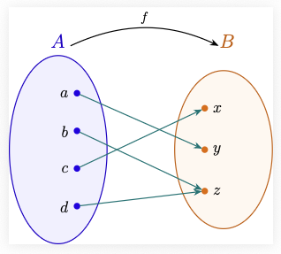

Todo el cálculo diferencial se desarrolla sobre el conjunto de los números reales $\mathbb{R}$. Las propiedades que definen este conjunto, son las que permiten definir formalmente el concepto de límite, que es la idea central para el desarrollo del cálculo diferencial.

## Los números naturales $\mathbb{N}$

La construcción de los números naturales $\mathbb{N}$ es el paso inicial en la construcción de los números reales. Los naturales son el conjunto que usamos para contar, que generalmente escribimos como $\mathbb{N}=\{1,2, \dots, n, \dots\}$. A pesar de que estamos muy acostumbrados a usar el conjunto de los números naturales, para tener una formalización matemática de este conjunto, tocó esperar hasta el siglo XIX, cuando en el año 1889, el matemático italiano Giuseppe Peano introdujo un conjunto de axiomas conocidos como los **Axiomas de Peano**. Existen otras construcciones de los números naturales, como por ejemplo la construcción a partir de la teoría de conjuntos, desarrollada por Ernst Zermelo y Abraham Fraenkel.

Antes de introducir los axiomas de Peano, definamos el concepto de función.

### Funciones

De manera informal, una función es una regla de asignación entre dos conjuntos, un conjunto de salida $A$ y un conjunto de llegada $B$, que a cada elemento del conjunto $A$ le asigna un único elemento del conjunto $B$.

Una manera de representar las funciones es mediante un diagrama de flechas, como muestra la siguiente figura:


Otra forma de representar una función, es como una caja negra, con una entrada y una salida, donde al introducir en la caja un elemento $x$ del conjunto $A$, se produce una única salida $f(x)$ del conjunto $B$, como se muestra en la siguiente figura:


#### Ejemplo de función

Consideremos un conjunto con tres elementos $A=\{a, b, c\}$ y un conjunto con cinco elementos $B=\{x,y,z,w,v\}$. La asignación $a \mapsto z$, $b \mapsto v$ y $c \mapsto z$ es un ejemplo de una función $f$ representada gráficamente como:


#### Ejemplo de alguien que no es una función

Con los mismos conjuntos del ejemplo anterior, la figura


no representa una función, ya que al elemento $b$ **no** se le está asignando un único elemento del conjunto $B$, sino que se le están asignando dos elementos distintos, $v$ y $w$. 

#### Definición formal de función

Recordemos que si $A$ y $B$ son dos conjuntos, el producto cartesiano $A \times B$ se define como  $$A \times B = \{(a,b) : a \in A, b \in B\}.$$

De manera formal, una función de un conjunto $A$ a un conjunto $B$, es un subconjunto $F \subseteq A \times B$ tal que:

1. Para cada elemento $a \in A$, existe un elemento $b \in B$ tal que $(a,b) \in F$. (Todo elemento de $A$ está relacionado con algún elemento de $B$).

2. Si $(a,b) \in F$ y $(a,c) \in F$, entonces $b=c$. (Los elementos de $A$ están relacionados con un único elemento de $B$).

Veamos que esta definición formal coincide con la noción informal anterior. Si $F \subseteq A \times B$ es una función, la condición $(a,b) \in F$ la vamos a escribir como $b=f(a)$, y a la función $F \subseteq A \times B$ la representaremos por $f: A \rightarrow B$. Con esta notación, 1) se convierte en: para todo $a \in A$ existe $b \in B$ tal que $b=f(a)$, es decir, a cada elemento de $A$ le corresponde un elemento de $B$, y la condición 2) se traduce en: si $f(a)=b$ y $f(a)=c$ entonces $b=c$, lo que garantiza que a cada elemento de $A$ le corresponde un único elemento de $B$.

#### Ejemplo interactivo de función

En el siguiente ejemplo interactivo, al decidir la asignación de flechas que a cada elemento del conjunto $A$ lo apareja con un único elemento del conjunto $B$, se está construyendo una función $f: A \rightarrow B$, que en la parte de abajo es representada de manera formal como un subconjunto de $A \times B$.

::: {#interactivo-funcion}
```{=html}
<div style="font-family: sans-serif; max-width: 500px; margin: 10px auto; padding: 20px; border: 1px solid #e2e8f0; border-radius: 8px; background: #fff; box-shadow: 0 4px 6px rgba(0,0,0,0.05);">
  <p style="text-align: center; font-size: 15px; color: #4a5568; margin-top: 0;">
    Haz clic en un círculo del <b>Conjunto A</b> y luego en uno del <b>Conjunto B</b> para trazar la flecha.
  </p>
  
  <div style="text-align: center; margin-bottom: 15px;">
    <button onclick="reiniciar()" style="padding: 6px 16px; cursor: pointer; border: 1px solid #cbd5e0; background: #edf2f7; border-radius: 6px; font-weight: bold; color: #4a5568;">↻ Borrar flechas</button>
  </div>

  <!-- Lienzo donde se dibuja el gráfico -->
  <svg id="lienzo-funcion" width="100%" height="320" viewBox="0 0 400 320" style="background: #f8fafc; border-radius: 6px; border: 1px solid #edf2f7;"></svg>

  <!-- Contenedor para mostrar el conjunto de parejas ordenadas -->
  <div id="texto-conjunto" style="text-align: center; font-size: 18px; font-family: 'Courier New', monospace; font-weight: bold; margin-top: 15px; padding: 10px; background: #edf2f7; border-radius: 6px; color: #2d3748;">
    f = { }
  </div>
</div>

<script>
const elementosA = ['a', 'b', 'c', 'd'];
const elementosB = ['x', 'y', 'z', 'w'];
const yA = { a: 50, b: 120, c: 190, d: 260 };
const yB = { x: 50, y: 120, z: 190, w: 260 };

let selA = null;
let selB = null;
let funcion = {};

function dibujarSVG() {
  const svg = document.getElementById('lienzo-funcion');
  if (!svg) return;

  let html = `
    <defs>
      <marker id="punta-flecha" viewBox="0 0 10 10" refX="28" refY="5" markerWidth="6" markerHeight="6" orient="auto">
        <path d="M 0 0 L 10 5 L 0 10 z" fill="#2b6cb0"/>
      </marker>
    </defs>
    <text x="100" y="20" text-anchor="middle" font-weight="bold" fill="#2d3748">Conjunto A</text>
    <text x="300" y="20" text-anchor="middle" font-weight="bold" fill="#2d3748">Conjunto B</text>
  `;

  // Trazar flechas
  for (const [a, b] of Object.entries(funcion)) {
    html += `<line x1="100" y1="${yA[a]}" x2="300" y2="${yB[b]}" stroke="#2b6cb0" stroke-width="2.5" marker-end="url(#punta-flecha)"/>`;
  }

  // Círculos del Conjunto A
  elementosA.forEach(nodo => {
    const seleccionado = (selA === nodo);
    const relleno = seleccionado ? "#bee3f8" : "#ebf8ff";
    const grosor = seleccionado ? "3" : "2";
    html += `<circle cx="100" cy="${yA[nodo]}" r="18" fill="${relleno}" stroke="#3182ce" stroke-width="${grosor}" style="cursor: pointer; transition: 0.2s;" onclick="clicEnA('${nodo}')"/>`;
    html += `<text x="100" y="${yA[nodo]+5}" text-anchor="middle" font-weight="bold" fill="#2b6cb0" style="pointer-events: none;">${nodo}</text>`;
  });

  // Círculos del Conjunto B
  elementosB.forEach(nodo => {
    const seleccionado = (selB === nodo);
    const relleno = seleccionado ? "#fbd38d" : "#feebc8";
    const grosor = seleccionado ? "3" : "2";
    html += `<circle cx="300" cy="${yB[nodo]}" r="18" fill="${relleno}" stroke="#dd6b20" stroke-width="${grosor}" style="cursor: pointer; transition: 0.2s;" onclick="clicEnB('${nodo}')"/>`;
    html += `<text x="300" y="${yB[nodo]+5}" text-anchor="middle" font-weight="bold" fill="#c05621" style="pointer-events: none;">${nodo}</text>`;
  });

  svg.innerHTML = html;
  actualizarTextoConjunto();
}

// Función para construir y mostrar el conjunto en notación matemática
function actualizarTextoConjunto() {
  const contenedor = document.getElementById('texto-conjunto');
  if (!contenedor) return;

  const parejas = [];
  elementosA.forEach(a => {
    if (funcion[a]) {
      parejas.push(`(${a}, ${funcion[a]})`);
    }
  });

  if (parejas.length === 0) {
    contenedor.innerHTML = 'f = { }';
  } else {
    contenedor.innerHTML = `f = { ${parejas.join(', ')} }`;
  }
}

window.clicEnA = function(nodo) {
  selA = (selA === nodo) ? null : nodo;
  comprobarEmparejamiento();
  dibujarSVG();
};

window.clicEnB = function(nodo) {
  selB = (selB === nodo) ? null : nodo;
  comprobarEmparejamiento();
  dibujarSVG();
};

function comprobarEmparejamiento() {
  if (selA !== null && selB !== null) {
    funcion[selA] = selB;
    selA = null;
    selB = null;
  }
}

window.reiniciar = function() {
  funcion = {};
  selA = null;
  selB = null;
  dibujarSVG();
};

document.addEventListener("DOMContentLoaded", dibujarSVG);
dibujarSVG();
</script>
```
Ejemplo interactivo de función. 
:::

#### Notación para las funciones

De ahora en adelante, denotaremos a una función $F \subseteq A \times B$ como $f: A \rightarrow B$ donde para cada $a \in A$ denotaremos por $f(a)$ al único elemento del conjunto $B$ tal que $(a,f(a)) \in F$.
El conjunto $A$ recibe el nombre de conjunto de salida o dominio de la función $f$, y el conjunto $B$ recibe el nombre de conjunto de llegada o codominio de la función $f$.


#### Otros ejemplos de funciones

1) Supongamos que $A \subseteq B$ es un subconjunto. Definimos la función **inclusión** $i: A \rightarrow B$, como la función que a cada elemento $a \in A$ le asigna el mismo elemento $a \in B$, es decir, $i(a)=a$ para todo $a \in A$.
Si vemos esta función como un subconjunto de $A \times B$, tenemos que el subconjunto correspondiente es $\{(a,a): a \in A\} \subseteq A \times B$, que claramente satisface las dos condiciones de la definición formal de función.

2) Supongamos que tenemos dos conjuntos $A$ y $B$. Definimos las funciones proyecciones $\pi_{1}: A \times B \rightarrow A$ y $\pi_{2}: A \times B \rightarrow B$ como $\pi_{1}(a,b)=a$ y $\pi_{2}(a,b)=b$ para todo $(a,b) \in A \times B$. Los respectivos conjuntos correspondientes a estas funciones son $$\{((a,b),a): (a,b) \in A \times B\} \subseteq (A \times B) \times A$$ y $$\{((a,b),b): (a,b) \in A \times B\} \subseteq (A \times B) \times B,$$ que satisfacen las dos condiciones de la definición formal de función.

El siguiente diagrama ilustra una forma de representar las funciones proyecciones.

::: #funciones-proyeccion
```{=html}
<div style="text-align: center; margin: 20px 0;">
  <svg width="480" height="380" viewBox="0 0 480 380" style="background: #ffffff; border: 1px solid #e2e8f0; border-radius: 8px;">
    <defs>
      <marker id="flecha-proj" viewBox="0 0 10 10" refX="6" refY="5" markerWidth="5" markerHeight="5" orient="auto-start-reverse">
        <path d="M 0 0 L 10 5 L 0 10 z" fill="#e53e3e"/>
      </marker>
    </defs>

    <!-- Ejes principales sin flechas de x e y -->
    <line x1="60" y1="320" x2="440" y2="320" stroke="#cbd5e0" stroke-width="2"/>
    <line x1="60" y1="320" x2="60" y2="40" stroke="#cbd5e0" stroke-width="2"/>

    <!-- Segmento del Conjunto A y su etiqueta -->
    <line x1="130" y1="320" x2="370" y2="320" stroke="#3182ce" stroke-width="5"/>
    <text x="300" y="365" font-weight="bold" font-family="serif" font-size="20" fill="#3182ce" text-anchor="middle">A</text>

    <!-- Segmento del Conjunto B y su etiqueta -->
    <line x1="60" y1="260" x2="60" y2="100" stroke="#dd6b20" stroke-width="5"/>
    <text x="25" y="250" font-weight="bold" font-family="serif" font-size="20" fill="#dd6b20" text-anchor="middle">B</text>

    <!-- Rectángulo A x B -->
    <rect x="130" y="100" width="240" height="160" fill="#ebf8ff" fill-opacity="0.6" stroke="#3182ce" stroke-width="2" stroke-dasharray="4 4"/>
    <text x="400" y="125" font-family="serif" font-style="italic" font-size="16" fill="#2b6cb0">A × B</text>

    <!-- Líneas de Proyección -->
    <line x1="240" y1="180" x2="240" y2="320" stroke="#e53e3e" stroke-width="2" stroke-dasharray="5 3"/>
    <line x1="240" y1="180" x2="60" y2="180" stroke="#e53e3e" stroke-width="2" stroke-dasharray="5 3"/>

    <!-- Indicadores de Proyección -->
    <path d="M 240 220 L 240 235" stroke="#e53e3e" stroke-width="2" marker-end="url(#flecha-proj)"/>
    <text x="250" y="235" font-family="serif" font-size="16" fill="#e53e3e" font-weight="bold">π₁</text>

    <path d="M 160 180 L 145 180" stroke="#e53e3e" stroke-width="2" marker-end="url(#flecha-proj)"/>
    <text x="150" y="170" font-family="serif" font-size="16" fill="#e53e3e" font-weight="bold">π₂</text>

    <!-- Punto (a,b) -->
    <circle cx="240" cy="180" r="5" fill="#2b6cb0"/>
    <text x="250" y="175" font-family="serif" font-size="16" font-weight="bold" fill="#2d3748">(a, b)</text>

    <!-- Puntos proyectados a y b -->
    <circle cx="240" cy="320" r="5" fill="#e53e3e"/>
    <text x="240" y="340" font-family="serif" font-size="16" font-style="italic" font-weight="bold" fill="#e53e3e" text-anchor="middle">a</text>

    <circle cx="60" cy="180" r="5" fill="#e53e3e"/>
    <text x="48" y="185" font-family="serif" font-size="16" font-style="italic" font-weight="bold" fill="#e53e3e" text-anchor="end">b</text>
  </svg>
</div>
```
![Figura 5.]Funciones proyecciones
:::

#### ¿Cuándo dos funciones son iguales?

Formalmente, dos funciones de $A$ a $B$ son iguales, si definen el mismo subconjunto de $A \times B$. Con nuestra nueva notación, dos funciones $f: A \rightarrow B$ y $g: C \rightarrow D$ son iguales, si $A=C$, $B=D$ y $f(a)=g(a)$ para todo $a \in A$.

#### Pregunta

En [ejemplo interactivo de función](#interactivo-funcion), ¿cuántas funciones distintas se pueden construir?  

#### Funciones sobreyectivas e inyectivas

Observe que en la definición de función $f:A \rightarrow B$, se permite que elementos del conjunto $B$ no estén relacionados con ningún elemento del conjunto $A$, es decir, puede existir un elemento $b \in B$ para el cual no existe ningún $a \in A$ tal que $b=f(a)$, o de manera equivalente, tal que $(a,b) \notin F \subseteq A \times B$. 

Por ejemplo, en la función


los elementos $x,y,w \in B$ no están relacionados con ningún elemento del conjunto $A$, es decir, no existen elementos en $A$ que se relacionen con $x$, $y$ o $w$.

**Función sobreyectiva:** Una función $f: A \rightarrow B$ es sobreyectiva si todos los elementos de $B$ quedan relacionados con elementos de $A$, es decir, si para cada $b \in B$ existe un $a \in A$ tal que $f(a) = b$.

Por ejemplo, la función



es sobreyectiva, ya que todos los elementos del conjunto $B$ están relacionados con algún elemento del conjunto $A$.

#### Pregunta

¿Es posible construir una función sobreyectiva $f: \{a,b,c\} \rightarrow \{x,y,z,w\}$?

Esta pregunta es equivalente al siguiente problema: 

::: {#interactivo-principio-del-palomar}
```{=html}
<div style="font-family: system-ui, -apple-system, sans-serif; max-width: 650px; margin: 20px auto; padding: 25px; border: 1px solid #e2e8f0; border-radius: 12px; background: #ffffff; box-shadow: 0 10px 15px -3px rgba(0,0,0,0.1);">

  <h3 style="text-align: center; color: #1e293b; margin-top: 0; margin-bottom: 6px;">Asignación con Elementos de Uso Único</h3>
  <p style="text-align: center; color: #64748b; font-size: 14px; margin-bottom: 20px;">
    <b>Arrastra</b> cada letra a una caja. Cada letra solo puede usarse <b>una sola vez</b> (se deshabilita al ser asignada, pero reaparece si la borras).
  </p>

  <!-- Paleta de Letras -->
  <div style="background: #f1f5f9; border: 1px solid #cbd5e1; border-radius: 10px; padding: 15px; text-align: center; margin-bottom: 20px;">
    <span style="font-size: 13px; font-weight: bold; color: #475569; display: block; margin-bottom: 10px; text-transform: uppercase; letter-spacing: 0.5px;">
      Paleta de Letras Disponibles
    </span>
    
    <div style="display: flex; justify-content: center; gap: 15px;">
      <div id="paleta-x" draggable="true" ondragstart="drag(event, 'x')" style="width: 44px; height: 44px; line-height: 44px; background: #0284c7; color: white; border-radius: 8px; font-weight: bold; font-size: 20px; cursor: grab; user-select: none; transition: all 0.2s ease; box-shadow: 0 2px 4px rgba(0,0,0,0.15);">x</div>
      <div id="paleta-y" draggable="true" ondragstart="drag(event, 'y')" style="width: 44px; height: 44px; line-height: 44px; background: #0284c7; color: white; border-radius: 8px; font-weight: bold; font-size: 20px; cursor: grab; user-select: none; transition: all 0.2s ease; box-shadow: 0 2px 4px rgba(0,0,0,0.15);">y</div>
      <div id="paleta-z" draggable="true" ondragstart="drag(event, 'z')" style="width: 44px; height: 44px; line-height: 44px; background: #0284c7; color: white; border-radius: 8px; font-weight: bold; font-size: 20px; cursor: grab; user-select: none; transition: all 0.2s ease; box-shadow: 0 2px 4px rgba(0,0,0,0.15);">z</div>
      <div id="paleta-w" draggable="true" ondragstart="drag(event, 'w')" style="width: 44px; height: 44px; line-height: 44px; background: #0284c7; color: white; border-radius: 8px; font-weight: bold; font-size: 20px; cursor: grab; user-select: none; transition: all 0.2s ease; box-shadow: 0 2px 4px rgba(0,0,0,0.15);">w</div>
    </div>
  </div>

  <!-- Botón de vaciado global -->
  <div style="text-align: center; margin-bottom: 20px;">
    <button onclick="vaciarTodo()" style="padding: 6px 14px; background: #ffffff; border: 1px solid #cbd5e1; border-radius: 6px; color: #475569; font-weight: bold; cursor: pointer; font-size: 13px;">
      ↻ Restablecer todas las letras
    </button>
  </div>

  <!-- Cajas Receptoras -->
  <div style="display: grid; grid-template-columns: repeat(3, 1fr); gap: 15px; margin-bottom: 25px;">
    
    <!-- Caja a -->
    <div ondragover="allowDrop(event)" ondragenter="dragHighlight(this)" ondragleave="dragUnhighlight(this)" ondrop="drop(event, 'a', this)"
         style="border: 2px dashed #3b82f6; border-radius: 10px; background: #eff6ff; padding: 12px; text-align: center; display: flex; flex-direction: column; justify-content: space-between; transition: 0.2s;">
      <div style="font-weight: 800; font-size: 18px; color: #1d4ed8; margin-bottom: 8px; pointer-events: none;">CAJA a</div>
      
      <div id="box-a" style="min-height: 70px; padding: 6px; background: #ffffff; border: 1px solid #cbd5e1; border-radius: 6px; display: flex; flex-wrap: wrap; gap: 4px; align-items: center; justify-content: center; margin-bottom: 10px; pointer-events: none;">
        <span style="color: #94a3b8; font-size: 13px; font-style: italic;">Soltar aquí</span>
      </div>

      <button onclick="vaciarCaja('a')" style="padding: 4px; background: #fee2e2; color: #dc2626; border: 1px solid #fca5a5; border-radius: 4px; font-size: 12px; font-weight: bold; cursor: pointer;">Borrar a</button>
    </div>

    <!-- Caja b -->
    <div ondragover="allowDrop(event)" ondragenter="dragHighlight(this)" ondragleave="dragUnhighlight(this)" ondrop="drop(event, 'b', this)"
         style="border: 2px dashed #3b82f6; border-radius: 10px; background: #eff6ff; padding: 12px; text-align: center; display: flex; flex-direction: column; justify-content: space-between; transition: 0.2s;">
      <div style="font-weight: 800; font-size: 18px; color: #1d4ed8; margin-bottom: 8px; pointer-events: none;">CAJA b</div>
      
      <div id="box-b" style="min-height: 70px; padding: 6px; background: #ffffff; border: 1px solid #cbd5e1; border-radius: 6px; display: flex; flex-wrap: wrap; gap: 4px; align-items: center; justify-content: center; margin-bottom: 10px; pointer-events: none;">
        <span style="color: #94a3b8; font-size: 13px; font-style: italic;">Soltar aquí</span>
      </div>

      <button onclick="vaciarCaja('b')" style="padding: 4px; background: #fee2e2; color: #dc2626; border: 1px solid #fca5a5; border-radius: 4px; font-size: 12px; font-weight: bold; cursor: pointer;">Borrar b</button>
    </div>

    <!-- Caja c -->
    <div ondragover="allowDrop(event)" ondragenter="dragHighlight(this)" ondragleave="dragUnhighlight(this)" ondrop="drop(event, 'c', this)"
         style="border: 2px dashed #3b82f6; border-radius: 10px; background: #eff6ff; padding: 12px; text-align: center; display: flex; flex-direction: column; justify-content: space-between; transition: 0.2s;">
      <div style="font-weight: 800; font-size: 18px; color: #1d4ed8; margin-bottom: 8px; pointer-events: none;">CAJA c</div>
      
      <div id="box-c" style="min-height: 70px; padding: 6px; background: #ffffff; border: 1px solid #cbd5e1; border-radius: 6px; display: flex; flex-wrap: wrap; gap: 4px; align-items: center; justify-content: center; margin-bottom: 10px; pointer-events: none;">
        <span style="color: #94a3b8; font-size: 13px; font-style: italic;">Soltar aquí</span>
      </div>

      <button onclick="vaciarCaja('c')" style="padding: 4px; background: #fee2e2; color: #dc2626; border: 1px solid #fca5a5; border-radius: 4px; font-size: 12px; font-weight: bold; cursor: pointer;">Borrar c</button>
    </div>

  </div>

  <!-- Estado / Notación Matemática -->
  <div style="background: #f8fafc; border: 1px solid #e2e8f0; border-radius: 8px; padding: 15px; text-align: center;">
    <div style="font-size: 12px; font-weight: bold; text-transform: uppercase; letter-spacing: 0.5px; color: #64748b; margin-bottom: 6px;">Representación del Contenido</div>
    <div id="resumen-conjuntos" style="font-family: 'Courier New', monospace; font-size: 16px; font-weight: bold; color: #0f172a;">
      a ↦ ∅, &nbsp; b ↦ ∅, &nbsp; c ↦ ∅
    </div>
  </div>

</div>

<script>
const estadoCajas = { a: [], b: [], c: [] };
const todasLasLetras = ['x', 'y', 'z', 'w'];

// Determina qué letras ya han sido usadas en alguna caja
function obtenerUsadas() {
  const usadas = new Set();
  Object.values(estadoCajas).forEach(lista => lista.forEach(item => usadas.add(item)));
  return usadas;
}

// Eventos de arrastre
function drag(ev, letra) {
  const usadas = obtenerUsadas();
  if (usadas.has(letra)) {
    ev.preventDefault();
    return;
  }
  ev.dataTransfer.setData("text/plain", letra);
}

function allowDrop(ev) {
  ev.preventDefault();
}

function dragHighlight(elem) {
  elem.style.background = "#dbeafe";
  elem.style.borderColor = "#2563eb";
}

function dragUnhighlight(elem) {
  elem.style.background = "#eff6ff";
  elem.style.borderColor = "#3b82f6";
}

function drop(ev, caja, elem) {
  ev.preventDefault();
  dragUnhighlight(elem);
  const letra = ev.dataTransfer.getData("text/plain");
  const usadas = obtenerUsadas();

  // Permite insertar la letra solo si existe y aún no se ha usado
  if (letra && !usadas.has(letra)) {
    estadoCajas[caja].push(letra);
    render();
  }
}

// Eliminación y vaciado
function eliminarElemento(caja, index) {
  estadoCajas[caja].splice(index, 1);
  render();
}

function vaciarCaja(caja) {
  estadoCajas[caja] = [];
  render();
}

function vaciarTodo() {
  estadoCajas.a = [];
  estadoCajas.b = [];
  estadoCajas.c = [];
  render();
}

// Renderizado de interfaz
function render() {
  const usadas = obtenerUsadas();

  // 1. Actualiza el estado visual de la paleta
  todasLasLetras.forEach(letra => {
    const elemPaleta = document.getElementById(`paleta-${letra}`);
    if (elemPaleta) {
      if (usadas.has(letra)) {
        elemPaleta.setAttribute("draggable", "false");
        elemPaleta.style.opacity = "0.25";
        elemPaleta.style.cursor = "not-allowed";
        elemPaleta.style.filter = "grayscale(100%)";
        elemPaleta.style.boxShadow = "none";
        elemPaleta.title = "Esta letra ya fue asignada";
      } else {
        elemPaleta.setAttribute("draggable", "true");
        elemPaleta.style.opacity = "1";
        elemPaleta.style.cursor = "grab";
        elemPaleta.style.filter = "none";
        elemPaleta.style.boxShadow = "0 2px 4px rgba(0,0,0,0.15)";
        elemPaleta.title = "Arrastra esta letra a una caja";
      }
    }
  });

  // 2. Actualiza el contenido visual de las cajas
  ['a', 'b', 'c'].forEach(caja => {
    const container = document.getElementById(`box-${caja}`);
    if (!container) return;
    
    const items = estadoCajas[caja];
    
    if (items.length === 0) {
      container.innerHTML = `<span style="color: #94a3b8; font-size: 13px; font-style: italic;">Soltar aquí</span>`;
    } else {
      let html = '';
      items.forEach((item, idx) => {
        html += `
          <span onclick="eliminarElemento('${caja}', ${idx})" 
                title="Haz clic para quitar y devolver a la paleta"
                style="background: #0284c7; color: white; padding: 3px 8px; border-radius: 12px; font-weight: bold; font-size: 14px; cursor: pointer; display: inline-flex; align-items: center; gap: 4px; pointer-events: auto;">
            ${item} <small style="font-size: 10px; opacity: 0.8;">✕</small>
          </span>`;
      });
      container.innerHTML = html;
    }
  });

  // 3. Notación matemática en tiempo real
  const resumenElem = document.getElementById('resumen-conjuntos');
  if (resumenElem) {
    const texto = ['a', 'b', 'c'].map(c => {
      const elems = estadoCajas[c];
      const strContent = elems.length > 0 ? `{ ${elems.join(', ')} }` : '∅';
      return `${c} ↦ ${strContent}`;
    }).join(', &nbsp; ');
    resumenElem.innerHTML = texto;
  }
}

document.addEventListener("DOMContentLoaded", render);
render();
</script>
```
Principio del palomar
:::

El problema anterior es un ejemplo del **Principio del Palomar**, que establece que si hay más palomas que palomares y se quieren guardar todas las palomas en los palomares, obligatoriamente en algún palomar se tendrá que ubicar por lo menos dos palomas.