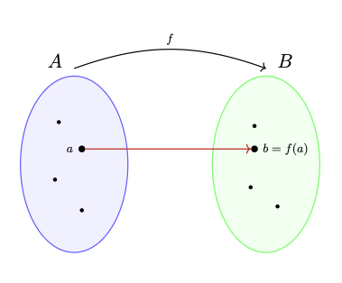
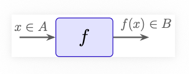
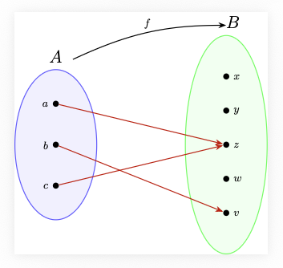
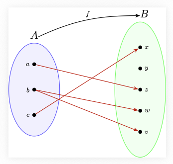
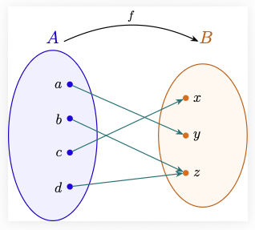
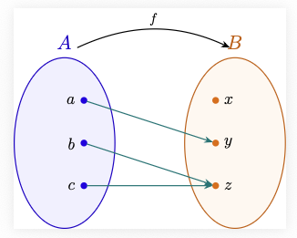
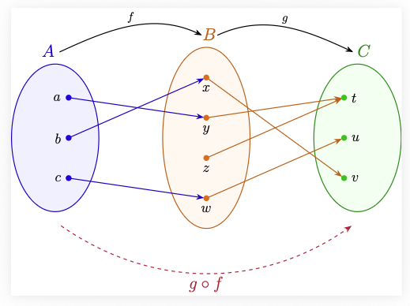
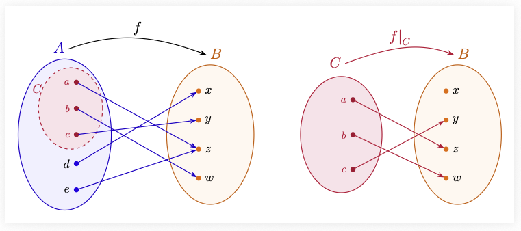
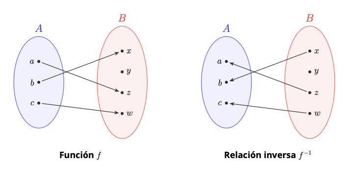
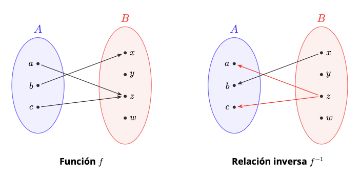

Todo el cálculo diferencial se desarrolla sobre el conjunto de los números reales $\mathbb{R}$. Las propiedades que definen este conjunto, son las que permiten definir formalmente el concepto de límite, que es la idea central para el desarrollo del cálculo diferencial.

## Los números naturales $\mathbb{N}$

La construcción de los números naturales $\mathbb{N}$ es el paso inicial en la construcción de los números reales. Los naturales son el conjunto que usamos para contar, que generalmente escribimos como $\mathbb{N}=\{1,2, \dots, n, \dots\}$. A pesar de que estamos muy acostumbrados a usar el conjunto de los números naturales, para tener una formalización matemática de este conjunto, tocó esperar hasta el siglo XIX, cuando en el año 1889, el matemático italiano Giuseppe Peano introdujo un conjunto de axiomas conocidos como los **Axiomas de Peano**. Existen otras construcciones de los números naturales, como por ejemplo la construcción a partir de la teoría de conjuntos, desarrollada por Ernst Zermelo y Abraham Fraenkel.

Antes de introducir los axiomas de Peano, definamos el concepto de función.

### Funciones

De manera informal, una función es una regla de asignación entre dos conjuntos, un conjunto de salida $A$ y un conjunto de llegada $B$, que a cada elemento del conjunto $A$ le asigna un único elemento del conjunto $B$.

Una manera de representar las funciones es mediante un diagrama de flechas, como muestra la siguiente figura:



Otra forma de representar una función, es como una caja negra, con una entrada y una salida, donde al introducir en la caja un elemento $x$ del conjunto $A$, se produce una única salida $f(x)$ del conjunto $B$, como se muestra en la siguiente figura:



#### Ejemplo de función

Consideremos un conjunto con tres elementos $A=\{a, b, c\}$ y un conjunto con cinco elementos $B=\{x,y,z,w,v\}$. La asignación $a \mapsto z$, $b \mapsto v$ y $c \mapsto z$ es un ejemplo de una función $f$ representada gráficamente como:



#### Ejemplo de alguien que no es una función

Con los mismos conjuntos del ejemplo anterior, la figura



no representa una función, ya que al elemento $b$ **no** se le está asignando un único elemento del conjunto $B$, sino que se le están asignando dos elementos distintos, $v$ y $w$. 

#### Definición formal de función

Recordemos que si $A$ y $B$ son dos conjuntos, el producto cartesiano $A \times B$ se define como  $$A \times B = \{(a,b) : a \in A, b \in B\}.$$

De manera formal, una función de un conjunto $A$ a un conjunto $B$, es un subconjunto $F \subseteq A \times B$ tal que:

1. Para cada elemento $a \in A$, existe un elemento $b \in B$ tal que $(a,b) \in F$. (Todo elemento de $A$ está relacionado con algún elemento de $B$).

2. Si $(a,b) \in F$ y $(a,c) \in F$, entonces $b=c$. (Los elementos de $A$ están relacionados con un único elemento de $B$).

Veamos que esta definición formal coincide con la noción informal anterior. Si $F \subseteq A \times B$ es una función, la condición $(a,b) \in F$ la vamos a escribir como $b=f(a)$, y a la función $F \subseteq A \times B$ la representaremos por $f: A \rightarrow B$. Con esta notación, 1) se convierte en: para todo $a \in A$ existe $b \in B$ tal que $b=f(a)$, es decir, a cada elemento de $A$ le corresponde un elemento de $B$, y la condición 2) se traduce en: si $f(a)=b$ y $f(a)=c$ entonces $b=c$, lo que garantiza que a cada elemento de $A$ le corresponde un único elemento de $B$.

#### Ejemplo interactivo de función

En el siguiente ejemplo interactivo, al decidir la asignación de flechas que a cada elemento del conjunto $A$ lo apareja con un único elemento del conjunto $B$, se está construyendo una función $f: A \rightarrow B$, que en la parte de abajo es representada de manera formal como un subconjunto de $A \times B$.

::: {#interactivo-funcion}
```{=html}
<div style="font-family: sans-serif; max-width: 500px; margin: 10px auto; padding: 20px; border: 1px solid #e2e8f0; border-radius: 8px; background: #fff; box-shadow: 0 4px 6px rgba(0,0,0,0.05);">
  <p style="text-align: center; font-size: 15px; color: #4a5568; margin-top: 0;">
    Haz clic en un círculo del <b>Conjunto A</b> y luego en uno del <b>Conjunto B</b> para trazar la flecha.
  </p>
  
  <div style="text-align: center; margin-bottom: 15px;">
    <button onclick="reiniciar()" style="padding: 6px 16px; cursor: pointer; border: 1px solid #cbd5e0; background: #edf2f7; border-radius: 6px; font-weight: bold; color: #4a5568;">↻ Borrar flechas</button>
  </div>

  <!-- Lienzo donde se dibuja el gráfico -->
  <svg id="lienzo-funcion" width="100%" height="320" viewBox="0 0 400 320" style="background: #f8fafc; border-radius: 6px; border: 1px solid #edf2f7;"></svg>

  <!-- Contenedor para mostrar el conjunto de parejas ordenadas -->
  <div id="texto-conjunto" style="text-align: center; font-size: 18px; font-family: 'Courier New', monospace; font-weight: bold; margin-top: 15px; padding: 10px; background: #edf2f7; border-radius: 6px; color: #2d3748;">
    f = { }
  </div>
</div>

<script>
const elementosA = ['a', 'b', 'c', 'd'];
const elementosB = ['x', 'y', 'z', 'w'];
const yA = { a: 50, b: 120, c: 190, d: 260 };
const yB = { x: 50, y: 120, z: 190, w: 260 };

let selA = null;
let selB = null;
let funcion = {};

function dibujarSVG() {
  const svg = document.getElementById('lienzo-funcion');
  if (!svg) return;

  let html = `
    <defs>
      <marker id="punta-flecha" viewBox="0 0 10 10" refX="28" refY="5" markerWidth="6" markerHeight="6" orient="auto">
        <path d="M 0 0 L 10 5 L 0 10 z" fill="#2b6cb0"/>
      </marker>
    </defs>
    <text x="100" y="20" text-anchor="middle" font-weight="bold" fill="#2d3748">Conjunto A</text>
    <text x="300" y="20" text-anchor="middle" font-weight="bold" fill="#2d3748">Conjunto B</text>
  `;

  // Trazar flechas
  for (const [a, b] of Object.entries(funcion)) {
    html += `<line x1="100" y1="${yA[a]}" x2="300" y2="${yB[b]}" stroke="#2b6cb0" stroke-width="2.5" marker-end="url(#punta-flecha)"/>`;
  }

  // Círculos del Conjunto A
  elementosA.forEach(nodo => {
    const seleccionado = (selA === nodo);
    const relleno = seleccionado ? "#bee3f8" : "#ebf8ff";
    const grosor = seleccionado ? "3" : "2";
    html += `<circle cx="100" cy="${yA[nodo]}" r="18" fill="${relleno}" stroke="#3182ce" stroke-width="${grosor}" style="cursor: pointer; transition: 0.2s;" onclick="clicEnA('${nodo}')"/>`;
    html += `<text x="100" y="${yA[nodo]+5}" text-anchor="middle" font-weight="bold" fill="#2b6cb0" style="pointer-events: none;">${nodo}</text>`;
  });

  // Círculos del Conjunto B
  elementosB.forEach(nodo => {
    const seleccionado = (selB === nodo);
    const relleno = seleccionado ? "#fbd38d" : "#feebc8";
    const grosor = seleccionado ? "3" : "2";
    html += `<circle cx="300" cy="${yB[nodo]}" r="18" fill="${relleno}" stroke="#dd6b20" stroke-width="${grosor}" style="cursor: pointer; transition: 0.2s;" onclick="clicEnB('${nodo}')"/>`;
    html += `<text x="300" y="${yB[nodo]+5}" text-anchor="middle" font-weight="bold" fill="#c05621" style="pointer-events: none;">${nodo}</text>`;
  });

  svg.innerHTML = html;
  actualizarTextoConjunto();
}

// Función para construir y mostrar el conjunto en notación matemática
function actualizarTextoConjunto() {
  const contenedor = document.getElementById('texto-conjunto');
  if (!contenedor) return;

  const parejas = [];
  elementosA.forEach(a => {
    if (funcion[a]) {
      parejas.push(`(${a}, ${funcion[a]})`);
    }
  });

  if (parejas.length === 0) {
    contenedor.innerHTML = 'f = { }';
  } else {
    contenedor.innerHTML = `f = { ${parejas.join(', ')} }`;
  }
}

window.clicEnA = function(nodo) {
  selA = (selA === nodo) ? null : nodo;
  comprobarEmparejamiento();
  dibujarSVG();
};

window.clicEnB = function(nodo) {
  selB = (selB === nodo) ? null : nodo;
  comprobarEmparejamiento();
  dibujarSVG();
};

function comprobarEmparejamiento() {
  if (selA !== null && selB !== null) {
    funcion[selA] = selB;
    selA = null;
    selB = null;
  }
}

window.reiniciar = function() {
  funcion = {};
  selA = null;
  selB = null;
  dibujarSVG();
};

document.addEventListener("DOMContentLoaded", dibujarSVG);
dibujarSVG();
</script>
```
Ejemplo interactivo de función. 
:::

#### Notación para las funciones

De ahora en adelante, denotaremos a una función $F \subseteq A \times B$ como $f: A \rightarrow B$ donde para cada $a \in A$ denotaremos por $f(a)$ al único elemento del conjunto $B$ tal que $(a,f(a)) \in F$.
El conjunto $A$ recibe el nombre de conjunto de salida o dominio de la función $f$, y el conjunto $B$ recibe el nombre de conjunto de llegada o codominio de la función $f$.


#### Otros ejemplos de funciones

1) Supongamos que $A \subseteq B$ es un subconjunto. Definimos la función **inclusión** $i: A \rightarrow B$, como la función que a cada elemento $a \in A$ le asigna el mismo elemento $a \in B$, es decir, $i(a)=a$ para todo $a \in A$.
Si vemos esta función como un subconjunto de $A \times B$, tenemos que el subconjunto correspondiente es $\{(a,a): a \in A\} \subseteq A \times B$, que claramente satisface las dos condiciones de la definición formal de función.

2) Supongamos que tenemos dos conjuntos $A$ y $B$. Definimos las funciones proyecciones $\pi_{1}: A \times B \rightarrow A$ y $\pi_{2}: A \times B \rightarrow B$ como $\pi_{1}(a,b)=a$ y $\pi_{2}(a,b)=b$ para todo $(a,b) \in A \times B$. Los respectivos conjuntos correspondientes a estas funciones son $$\{((a,b),a): (a,b) \in A \times B\} \subseteq (A \times B) \times A$$ y $$\{((a,b),b): (a,b) \in A \times B\} \subseteq (A \times B) \times B,$$ que satisfacen las dos condiciones de la definición formal de función.

El siguiente diagrama ilustra una forma de representar las funciones proyecciones.

::: #funciones-proyeccion
```{=html}
<div style="text-align: center; margin: 20px 0;">
  <svg width="480" height="380" viewBox="0 0 480 380" style="background: #ffffff; border: 1px solid #e2e8f0; border-radius: 8px;">
    <defs>
      <marker id="flecha-proj" viewBox="0 0 10 10" refX="6" refY="5" markerWidth="5" markerHeight="5" orient="auto-start-reverse">
        <path d="M 0 0 L 10 5 L 0 10 z" fill="#e53e3e"/>
      </marker>
    </defs>

    <!-- Ejes principales sin flechas de x e y -->
    <line x1="60" y1="320" x2="440" y2="320" stroke="#cbd5e0" stroke-width="2"/>
    <line x1="60" y1="320" x2="60" y2="40" stroke="#cbd5e0" stroke-width="2"/>

    <!-- Segmento del Conjunto A y su etiqueta -->
    <line x1="130" y1="320" x2="370" y2="320" stroke="#3182ce" stroke-width="5"/>
    <text x="300" y="365" font-weight="bold" font-family="serif" font-size="20" fill="#3182ce" text-anchor="middle">A</text>

    <!-- Segmento del Conjunto B y su etiqueta -->
    <line x1="60" y1="260" x2="60" y2="100" stroke="#dd6b20" stroke-width="5"/>
    <text x="25" y="250" font-weight="bold" font-family="serif" font-size="20" fill="#dd6b20" text-anchor="middle">B</text>

    <!-- Rectángulo A x B -->
    <rect x="130" y="100" width="240" height="160" fill="#ebf8ff" fill-opacity="0.6" stroke="#3182ce" stroke-width="2" stroke-dasharray="4 4"/>
    <text x="400" y="125" font-family="serif" font-style="italic" font-size="16" fill="#2b6cb0">A × B</text>

    <!-- Líneas de Proyección -->
    <line x1="240" y1="180" x2="240" y2="320" stroke="#e53e3e" stroke-width="2" stroke-dasharray="5 3"/>
    <line x1="240" y1="180" x2="60" y2="180" stroke="#e53e3e" stroke-width="2" stroke-dasharray="5 3"/>

    <!-- Indicadores de Proyección -->
    <path d="M 240 220 L 240 235" stroke="#e53e3e" stroke-width="2" marker-end="url(#flecha-proj)"/>
    <text x="250" y="235" font-family="serif" font-size="16" fill="#e53e3e" font-weight="bold">π₁</text>

    <path d="M 160 180 L 145 180" stroke="#e53e3e" stroke-width="2" marker-end="url(#flecha-proj)"/>
    <text x="150" y="170" font-family="serif" font-size="16" fill="#e53e3e" font-weight="bold">π₂</text>

    <!-- Punto (a,b) -->
    <circle cx="240" cy="180" r="5" fill="#2b6cb0"/>
    <text x="250" y="175" font-family="serif" font-size="16" font-weight="bold" fill="#2d3748">(a, b)</text>

    <!-- Puntos proyectados a y b -->
    <circle cx="240" cy="320" r="5" fill="#e53e3e"/>
    <text x="240" y="340" font-family="serif" font-size="16" font-style="italic" font-weight="bold" fill="#e53e3e" text-anchor="middle">a</text>

    <circle cx="60" cy="180" r="5" fill="#e53e3e"/>
    <text x="48" y="185" font-family="serif" font-size="16" font-style="italic" font-weight="bold" fill="#e53e3e" text-anchor="end">b</text>
  </svg>
</div>
```
Funciones proyecciones
:::

#### ¿Cuándo dos funciones son iguales?

Formalmente, dos funciones de $A$ a $B$ son iguales, si definen el mismo subconjunto de $A \times B$. Con nuestra nueva notación, dos funciones $f: A \rightarrow B$ y $g: C \rightarrow D$ son iguales, si $A=C$, $B=D$ y $f(a)=g(a)$ para todo $a \in A$.

#### Pregunta

En [ejemplo interactivo de función](#interactivo-funcion), ¿cuántas funciones distintas se pueden construir?  

#### Funciones sobreyectivas e inyectivas

Observe que en la definición de función $f:A \rightarrow B$, se permite que elementos del conjunto $B$ no estén relacionados con ningún elemento del conjunto $A$, es decir, puede existir un elemento $b \in B$ para el cual no existe ningún $a \in A$ tal que $b=f(a)$, o de manera equivalente, tal que $(a,b) \notin F \subseteq A \times B$. 

Por ejemplo, en la función


los elementos $x,y,w \in B$ no están relacionados con ningún elemento del conjunto $A$, es decir, no existen elementos en $A$ que se relacionen con $x$, $y$ o $w$.

**Función sobreyectiva:** Una función $f: A \rightarrow B$ es sobreyectiva si todos los elementos de $B$ quedan relacionados con elementos de $A$, es decir, si para cada $b \in B$ existe un $a \in A$ tal que $f(a) = b$.

Por ejemplo, la función



es sobreyectiva, ya que todos los elementos del conjunto $B$ están relacionados con algún elemento del conjunto $A$.

#### Pregunta

¿Es posible construir una función sobreyectiva $f: \{a,b,c\} \rightarrow \{x,y,z,w\}$?

Esta pregunta es equivalente al siguiente problema: 

::: {#interactivo-principio-del-palomar}
```{=html}
<div style="font-family: system-ui, -apple-system, sans-serif; max-width: 650px; margin: 20px auto; padding: 25px; border: 1px solid #e2e8f0; border-radius: 12px; background: #ffffff; box-shadow: 0 10px 15px -3px rgba(0,0,0,0.1);">

  <h3 style="text-align: center; color: #1e293b; margin-top: 0; margin-bottom: 6px;">Intente introducir las letras x,y,z,w en las cajas, sin colocar más de una letra en cada caja</h3>
  <p style="text-align: center; color: #64748b; font-size: 14px; margin-bottom: 20px;">
    <b>Arrastra</b> cada letra a una caja. Cada letra solo puede usarse <b>una sola vez</b> (se deshabilita al ser asignada, pero reaparece si la borras).
  </p>

  <!-- Paleta de Letras -->
  <div style="background: #f1f5f9; border: 1px solid #cbd5e1; border-radius: 10px; padding: 15px; text-align: center; margin-bottom: 20px;">
    <span style="font-size: 13px; font-weight: bold; color: #475569; display: block; margin-bottom: 10px; text-transform: uppercase; letter-spacing: 0.5px;">
      Paleta de Letras Disponibles
    </span>
    
    <div style="display: flex; justify-content: center; gap: 15px;">
      <div id="paleta-x" draggable="true" ondragstart="drag(event, 'x')" style="width: 44px; height: 44px; line-height: 44px; background: #0284c7; color: white; border-radius: 8px; font-weight: bold; font-size: 20px; cursor: grab; user-select: none; transition: all 0.2s ease; box-shadow: 0 2px 4px rgba(0,0,0,0.15);">x</div>
      <div id="paleta-y" draggable="true" ondragstart="drag(event, 'y')" style="width: 44px; height: 44px; line-height: 44px; background: #0284c7; color: white; border-radius: 8px; font-weight: bold; font-size: 20px; cursor: grab; user-select: none; transition: all 0.2s ease; box-shadow: 0 2px 4px rgba(0,0,0,0.15);">y</div>
      <div id="paleta-z" draggable="true" ondragstart="drag(event, 'z')" style="width: 44px; height: 44px; line-height: 44px; background: #0284c7; color: white; border-radius: 8px; font-weight: bold; font-size: 20px; cursor: grab; user-select: none; transition: all 0.2s ease; box-shadow: 0 2px 4px rgba(0,0,0,0.15);">z</div>
      <div id="paleta-w" draggable="true" ondragstart="drag(event, 'w')" style="width: 44px; height: 44px; line-height: 44px; background: #0284c7; color: white; border-radius: 8px; font-weight: bold; font-size: 20px; cursor: grab; user-select: none; transition: all 0.2s ease; box-shadow: 0 2px 4px rgba(0,0,0,0.15);">w</div>
    </div>
  </div>

  <!-- Botón de vaciado global -->
  <div style="text-align: center; margin-bottom: 20px;">
    <button onclick="vaciarTodo()" style="padding: 6px 14px; background: #ffffff; border: 1px solid #cbd5e1; border-radius: 6px; color: #475569; font-weight: bold; cursor: pointer; font-size: 13px;">
      ↻ Restablecer todas las letras
    </button>
  </div>

  <!-- Cajas Receptoras -->
  <div style="display: grid; grid-template-columns: repeat(3, 1fr); gap: 15px; margin-bottom: 25px;">
    
    <!-- Caja a -->
    <div ondragover="allowDrop(event)" ondragenter="dragHighlight(this)" ondragleave="dragUnhighlight(this)" ondrop="drop(event, 'a', this)"
         style="border: 2px dashed #3b82f6; border-radius: 10px; background: #eff6ff; padding: 12px; text-align: center; display: flex; flex-direction: column; justify-content: space-between; transition: 0.2s;">
      <div style="font-weight: 800; font-size: 18px; color: #1d4ed8; margin-bottom: 8px; pointer-events: none;">CAJA a</div>
      
      <div id="box-a" style="min-height: 70px; padding: 6px; background: #ffffff; border: 1px solid #cbd5e1; border-radius: 6px; display: flex; flex-wrap: wrap; gap: 4px; align-items: center; justify-content: center; margin-bottom: 10px; pointer-events: none;">
        <span style="color: #94a3b8; font-size: 13px; font-style: italic;">Soltar aquí</span>
      </div>

      <button onclick="vaciarCaja('a')" style="padding: 4px; background: #fee2e2; color: #dc2626; border: 1px solid #fca5a5; border-radius: 4px; font-size: 12px; font-weight: bold; cursor: pointer;">Borrar a</button>
    </div>

    <!-- Caja b -->
    <div ondragover="allowDrop(event)" ondragenter="dragHighlight(this)" ondragleave="dragUnhighlight(this)" ondrop="drop(event, 'b', this)"
         style="border: 2px dashed #3b82f6; border-radius: 10px; background: #eff6ff; padding: 12px; text-align: center; display: flex; flex-direction: column; justify-content: space-between; transition: 0.2s;">
      <div style="font-weight: 800; font-size: 18px; color: #1d4ed8; margin-bottom: 8px; pointer-events: none;">CAJA b</div>
      
      <div id="box-b" style="min-height: 70px; padding: 6px; background: #ffffff; border: 1px solid #cbd5e1; border-radius: 6px; display: flex; flex-wrap: wrap; gap: 4px; align-items: center; justify-content: center; margin-bottom: 10px; pointer-events: none;">
        <span style="color: #94a3b8; font-size: 13px; font-style: italic;">Soltar aquí</span>
      </div>

      <button onclick="vaciarCaja('b')" style="padding: 4px; background: #fee2e2; color: #dc2626; border: 1px solid #fca5a5; border-radius: 4px; font-size: 12px; font-weight: bold; cursor: pointer;">Borrar b</button>
    </div>

    <!-- Caja c -->
    <div ondragover="allowDrop(event)" ondragenter="dragHighlight(this)" ondragleave="dragUnhighlight(this)" ondrop="drop(event, 'c', this)"
         style="border: 2px dashed #3b82f6; border-radius: 10px; background: #eff6ff; padding: 12px; text-align: center; display: flex; flex-direction: column; justify-content: space-between; transition: 0.2s;">
      <div style="font-weight: 800; font-size: 18px; color: #1d4ed8; margin-bottom: 8px; pointer-events: none;">CAJA c</div>
      
      <div id="box-c" style="min-height: 70px; padding: 6px; background: #ffffff; border: 1px solid #cbd5e1; border-radius: 6px; display: flex; flex-wrap: wrap; gap: 4px; align-items: center; justify-content: center; margin-bottom: 10px; pointer-events: none;">
        <span style="color: #94a3b8; font-size: 13px; font-style: italic;">Soltar aquí</span>
      </div>

      <button onclick="vaciarCaja('c')" style="padding: 4px; background: #fee2e2; color: #dc2626; border: 1px solid #fca5a5; border-radius: 4px; font-size: 12px; font-weight: bold; cursor: pointer;">Borrar c</button>
    </div>

  </div>

  <!-- Estado / Notación Matemática -->
  <div style="background: #f8fafc; border: 1px solid #e2e8f0; border-radius: 8px; padding: 15px; text-align: center;">
    <div style="font-size: 12px; font-weight: bold; text-transform: uppercase; letter-spacing: 0.5px; color: #64748b; margin-bottom: 6px;">Representación del Contenido</div>
    <div id="resumen-conjuntos" style="font-family: 'Courier New', monospace; font-size: 16px; font-weight: bold; color: #0f172a;">
      a ↦ ∅, &nbsp; b ↦ ∅, &nbsp; c ↦ ∅
    </div>
  </div>

</div>

<script>
const estadoCajas = { a: [], b: [], c: [] };
const todasLasLetras = ['x', 'y', 'z', 'w'];

// Determina qué letras ya han sido usadas en alguna caja
function obtenerUsadas() {
  const usadas = new Set();
  Object.values(estadoCajas).forEach(lista => lista.forEach(item => usadas.add(item)));
  return usadas;
}

// Eventos de arrastre
function drag(ev, letra) {
  const usadas = obtenerUsadas();
  if (usadas.has(letra)) {
    ev.preventDefault();
    return;
  }
  ev.dataTransfer.setData("text/plain", letra);
}

function allowDrop(ev) {
  ev.preventDefault();
}

function dragHighlight(elem) {
  elem.style.background = "#dbeafe";
  elem.style.borderColor = "#2563eb";
}

function dragUnhighlight(elem) {
  elem.style.background = "#eff6ff";
  elem.style.borderColor = "#3b82f6";
}

function drop(ev, caja, elem) {
  ev.preventDefault();
  dragUnhighlight(elem);
  const letra = ev.dataTransfer.getData("text/plain");
  const usadas = obtenerUsadas();

  // Permite insertar la letra solo si existe y aún no se ha usado
  if (letra && !usadas.has(letra)) {
    estadoCajas[caja].push(letra);
    render();
  }
}

// Eliminación y vaciado
function eliminarElemento(caja, index) {
  estadoCajas[caja].splice(index, 1);
  render();
}

function vaciarCaja(caja) {
  estadoCajas[caja] = [];
  render();
}

function vaciarTodo() {
  estadoCajas.a = [];
  estadoCajas.b = [];
  estadoCajas.c = [];
  render();
}

// Renderizado de interfaz
function render() {
  const usadas = obtenerUsadas();

  // 1. Actualiza el estado visual de la paleta
  todasLasLetras.forEach(letra => {
    const elemPaleta = document.getElementById(`paleta-${letra}`);
    if (elemPaleta) {
      if (usadas.has(letra)) {
        elemPaleta.setAttribute("draggable", "false");
        elemPaleta.style.opacity = "0.25";
        elemPaleta.style.cursor = "not-allowed";
        elemPaleta.style.filter = "grayscale(100%)";
        elemPaleta.style.boxShadow = "none";
        elemPaleta.title = "Esta letra ya fue asignada";
      } else {
        elemPaleta.setAttribute("draggable", "true");
        elemPaleta.style.opacity = "1";
        elemPaleta.style.cursor = "grab";
        elemPaleta.style.filter = "none";
        elemPaleta.style.boxShadow = "0 2px 4px rgba(0,0,0,0.15)";
        elemPaleta.title = "Arrastra esta letra a una caja";
      }
    }
  });

  // 2. Actualiza el contenido visual de las cajas
  ['a', 'b', 'c'].forEach(caja => {
    const container = document.getElementById(`box-${caja}`);
    if (!container) return;
    
    const items = estadoCajas[caja];
    
    if (items.length === 0) {
      container.innerHTML = `<span style="color: #94a3b8; font-size: 13px; font-style: italic;">Soltar aquí</span>`;
    } else {
      let html = '';
      items.forEach((item, idx) => {
        html += `
          <span onclick="eliminarElemento('${caja}', ${idx})" 
                title="Haz clic para quitar y devolver a la paleta"
                style="background: #0284c7; color: white; padding: 3px 8px; border-radius: 12px; font-weight: bold; font-size: 14px; cursor: pointer; display: inline-flex; align-items: center; gap: 4px; pointer-events: auto;">
            ${item} <small style="font-size: 10px; opacity: 0.8;">✕</small>
          </span>`;
      });
      container.innerHTML = html;
    }
  });

  // 3. Notación matemática en tiempo real
  const resumenElem = document.getElementById('resumen-conjuntos');
  if (resumenElem) {
    const texto = ['a', 'b', 'c'].map(c => {
      const elems = estadoCajas[c];
      const strContent = elems.length > 0 ? `{ ${elems.join(', ')} }` : '∅';
      return `${c} ↦ ${strContent}`;
    }).join(', &nbsp; ');
    resumenElem.innerHTML = texto;
  }
}

document.addEventListener("DOMContentLoaded", render);
render();
</script>
```
Principio del palomar
:::

El problema anterior es un ejemplo del **Principio del Palomar**, que establece que si hay más palomas que huecos en el palomar y se quieren guardar todas las palomas en los huecos, obligatoriamente en alguno de los huecos del palomar se tendrán que ubicar por lo menos dos palomas.

#### Ejemplos de funciones sobreyectivas

1) Si $A$ es un conjunto, definimos la función identidad $\textrm{id}_{A}: A \rightarrow A$ que a cada elemento $a \in A$ le asigna el mismo elemento $a \in A$, es decir, $\textrm{id}_{A}(a)=a$. Esta función como subconjunto de $A \times A$ corresponde a $F=\{(a,a)~ :~ a \in A\}$.
Esta función es claramente sobreyectiva, ya que todo elemento del conjunto de llegada $a \in A$ está relacionado con el mismo elemento $a \in A$ del conjunto de salida.

2) Si $A$ y $B$ son conjuntos, las funciones proyecciones $\pi_{1}: A \times B \rightarrow A$ y $\pi_{2}: A \times B \rightarrow B$ definidas como $\pi_{1}(a,b)=a$ y $\pi_{2}(a,b)=b$ para todo $(a,b) \in A \times B$, son sobreyectivas.
Como se puede ver en el siguiente gráfico, un elemento $a \in A$ está relacionado con todos los elementos de la linea roja vertical continua por medio de la función $\pi_{1}$, y un elemento $b \in B$ está relacionado con todos los elementos de la linea azul horizontal continua por medio de la función $\pi_{2}$.

:::{#sobreyectividad-proyecciones}
```{=html}
<div style="text-align: center; margin: 20px 0;">
  <svg width="480" height="380" viewBox="0 0 480 380" style="background: #ffffff; border: 1px solid #e2e8f0; border-radius: 8px;">
    <defs>
      <marker id="flecha-proj" viewBox="0 0 10 10" refX="6" refY="5" markerWidth="5" markerHeight="5" orient="auto-start-reverse">
        <path d="M 0 0 L 10 5 L 0 10 z" fill="#e53e3e"/>
      </marker>
    </defs>

    <!-- Ejes principales -->
    <line x1="60" y1="320" x2="440" y2="320" stroke="#cbd5e0" stroke-width="2"/>
    <line x1="60" y1="320" x2="60" y2="40" stroke="#cbd5e0" stroke-width="2"/>

    <!-- Segmento del Conjunto A y su etiqueta -->
    <line x1="130" y1="320" x2="370" y2="320" stroke="#3182ce" stroke-width="5"/>
    <text x="250" y="365" font-weight="bold" font-family="serif" font-size="20" fill="#3182ce" text-anchor="middle">A</text>

    <!-- Segmento del Conjunto B y su etiqueta -->
    <line x1="60" y1="260" x2="60" y2="100" stroke="#dd6b20" stroke-width="5"/>
    <text x="25" y="185" font-weight="bold" font-family="serif" font-size="20" fill="#dd6b20" text-anchor="middle">B</text>

    <!-- Rectángulo A x B -->
    <rect x="130" y="100" width="240" height="160" fill="#ebf8ff" fill-opacity="0.6" stroke="#3182ce" stroke-width="2" stroke-dasharray="4 4"/>
    <text x="330" y="125" font-family="serif" font-style="italic" font-size="16" fill="#2b6cb0">A × B</text>

    <!-- LÍNEA VERTICAL ROJA CONTINUA (Restringida al recuadro A x B) -->
    <line x1="240" y1="100" x2="240" y2="260" stroke="#e53e3e" stroke-width="2"/>

    <!-- LÍNEA HORIZONTAL AZUL CONTINUA (Restringida al recuadro A x B) -->
    <line x1="130" y1="180" x2="370" y2="180" stroke="#2b6cb0" stroke-width="2"/>

    <!-- Líneas punteadas de proyección desde A x B hacia los ejes -->
    <line x1="240" y1="260" x2="240" y2="320" stroke="#e53e3e" stroke-width="1.5" stroke-dasharray="4 3"/>
    <line x1="130" y1="180" x2="60" y2="180" stroke="#2b6cb0" stroke-width="1.5" stroke-dasharray="4 3"/>

    

    
    <!-- Punto (a,b) -->
    <circle cx="240" cy="180" r="6" fill="#2d3748"/>
    <text x="250" y="170" font-family="serif" font-size="16" font-weight="bold" fill="#2d3748">(a, b)</text>

    <!-- Punto proyectado a en el eje X -->
    <circle cx="240" cy="320" r="5" fill="#e53e3e"/>
    <text x="240" y="340" font-family="serif" font-size="16" font-style="italic" font-weight="bold" fill="#e53e3e" text-anchor="middle">a</text>

    <!-- Punto proyectado b en el eje Y -->
    <circle cx="60" cy="180" r="5" fill="#2b6cb0"/>
    <text x="48" y="185" font-family="serif" font-size="16" font-style="italic" font-weight="bold" fill="#2b6cb0" text-anchor="end">b</text>
  </svg>
</div>
```
Sobreyectividad de las funciones proyecciones
:::

#### Ejemplo interactivo de función sobreyectiva

:::{#construyendo-funcion-sobreyectiva}
```{=html}
<div id="app-sobreyectiva-v3" style="font-family: system-ui, -apple-system, sans-serif; max-width: 520px; margin: 10px auto; padding: 20px; border: 1px solid #e2e8f0; border-radius: 8px; background: #fff; box-shadow: 0 4px 6px rgba(0,0,0,0.05);">
  <p style="text-align: center; font-size: 15px; color: #4a5568; margin-top: 0;">
    Haz clic en un elemento del <b>Conjunto A</b> y luego en uno del <b>Conjunto B</b> para asignar la función, de tal manera que quede sobreyectiva.
  </p>
  
  <div style="text-align: center; margin-bottom: 15px;">
    <button id="btn-reiniciar-sob3" style="padding: 6px 16px; cursor: pointer; border: 1px solid #cbd5e0; background: #edf2f7; border-radius: 6px; font-weight: bold; color: #4a5568;">↻ Borrar flechas</button>
  </div>

  <div style="width: 100%; min-height: 340px; position: relative;">
    <svg id="lienzo-sobreyectiva-v3" width="100%" height="340" viewBox="0 0 400 340" style="background: #f8fafc; border-radius: 6px; border: 1px solid #edf2f7; display: block; touch-action: manipulation;"></svg>
  </div>

  <div id="texto-conjunto-v3" style="text-align: center; font-size: 16px; font-family: 'Courier New', monospace; font-weight: bold; margin-top: 15px; padding: 10px; background: #edf2f7; border-radius: 6px; color: #2d3748;">
    f = { }
  </div>

  <div id="panel-sobreyectiva-v3" style="margin-top: 10px; padding: 12px; border-radius: 6px; text-align: center; font-weight: bold; font-size: 14px; background: #fef3c7; color: #92400e; border: 1px solid #fde68a;">
    Asigna flechas desde los 4 elementos del Conjunto A.
  </div>
</div>

<script>
(function() {
  function iniciarModulo() {
    const root = document.getElementById('app-sobreyectiva-v3');
    if (!root) return;

    const svg = root.querySelector('#lienzo-sobreyectiva-v3');
    const txtConjunto = root.querySelector('#texto-conjunto-v3');
    const panelSob = root.querySelector('#panel-sobreyectiva-v3');
    const btnReiniciar = root.querySelector('#btn-reiniciar-sob3');

    if (!svg) return;

    const elemA = ['a', 'b', 'c', 'd'];
    const elemB = ['x', 'y', 'z'];
    const yA = { a: 70, b: 135, c: 200, d: 265 };
    const yB = { x: 95, y: 167, z: 239 };

    let selA = null;
    let selB = null;
    let funcion = {};

    function render() {
      let html = `
        <defs>
          <marker id="punta-flecha-v3" viewBox="0 0 10 10" refX="28" refY="5" markerWidth="6" markerHeight="6" orient="auto">
            <path d="M 0 0 L 10 5 L 0 10 z" fill="#2b6cb0"/>
          </marker>
        </defs>

        <!-- Conjunto A (4 elementos) -->
        <ellipse cx="100" cy="167" rx="55" ry="125" fill="#ebf8ff" stroke="#3182ce" stroke-width="2" stroke-dasharray="5 4"/>
        <text x="100" y="25" text-anchor="middle" font-weight="bold" font-size="16" fill="#2b6cb0">Conjunto A</text>

        <!-- Conjunto B (3 elementos) -->
        <ellipse cx="300" cy="167" rx="55" ry="110" fill="#fffaf0" stroke="#dd6b20" stroke-width="2" stroke-dasharray="5 4"/>
        <text x="300" y="25" text-anchor="middle" font-weight="bold" font-size="16" fill="#c05621">Conjunto B</text>
      `;

      // Trazado de flechas
      for (const [a, b] of Object.entries(funcion)) {
        if (b) {
          html += `<line x1="100" y1="${yA[a]}" x2="300" y2="${yB[b]}" stroke="#2b6cb0" stroke-width="2.5" marker-end="url(#punta-flecha-v3)"/>`;
        }
      }

      // Nodos A
      elemA.forEach(nodo => {
        const esSel = (selA === nodo);
        const fill = esSel ? "#bee3f8" : "#ffffff";
        const strokeW = esSel ? "3" : "2";
        html += `<g data-grupo="A" data-nodo="${nodo}" style="cursor: pointer;">
          <circle cx="100" cy="${yA[nodo]}" r="18" fill="${fill}" stroke="#3182ce" stroke-width="${strokeW}"/>
          <text x="100" y="${yA[nodo]+5}" text-anchor="middle" font-weight="bold" fill="#2b6cb0" style="pointer-events: none;">${nodo}</text>
        </g>`;
      });

      // Nodos B
      elemB.forEach(nodo => {
        const esSel = (selB === nodo);
        const fill = esSel ? "#fbd38d" : "#ffffff";
        const strokeW = esSel ? "3" : "2";
        html += `<g data-grupo="B" data-nodo="${nodo}" style="cursor: pointer;">
          <circle cx="300" cy="${yB[nodo]}" r="18" fill="${fill}" stroke="#dd6b20" stroke-width="${strokeW}"/>
          <text x="300" y="${yB[nodo]+5}" text-anchor="middle" font-weight="bold" fill="#c05621" style="pointer-events: none;">${nodo}</text>
        </g>`;
      });

      svg.innerHTML = html;
      actualizarEstado();
    }

    function actualizarEstado() {
      const parejas = [];
      elemA.forEach(a => {
        if (funcion[a]) parejas.push(`(${a}, ${funcion[a]})`);
      });

      txtConjunto.innerHTML = parejas.length ? `f = { ${parejas.join(', ')} }` : 'f = { }';

      const asignados = Object.keys(funcion).length;
      if (asignados < elemA.length) {
        panelSob.style.cssText = "margin-top: 10px; padding: 12px; border-radius: 6px; text-align: center; font-weight: bold; font-size: 14px; background: #fef3c7; color: #92400e; border: 1px solid #fde68a;";
        panelSob.innerHTML = `⚠️ Función incompleta: asigna los ${elemA.length - asignados} elemento(s) faltantes de A.`;
        return;
      }

      const imagenes = new Set(Object.values(funcion));
      if (imagenes.size === elemB.length) {
        panelSob.style.cssText = "margin-top: 10px; padding: 12px; border-radius: 6px; text-align: center; font-weight: bold; font-size: 14px; background: #dcfce7; color: #166534; border: 1px solid #86efac;";
        panelSob.innerHTML = "✅ ES SOBREYECTIVA: Todo elemento del Conjunto B posee al menos una preimagen (Im(f) = B).";
      } else {
        const noAlcanzados = elemB.filter(b => !imagenes.has(b));
        panelSob.style.cssText = "margin-top: 10px; padding: 12px; border-radius: 6px; text-align: center; font-weight: bold; font-size: 14px; background: #fee2e2; color: #991b1b; border: 1px solid #fca5a5;";
        panelSob.innerHTML = `❌ NO ES SOBREYECTIVA: Quedaron sin recibir flecha: { ${noAlcanzados.join(', ')} }.`;
      }
    }

    // Delegación de eventos
    svg.addEventListener('click', (e) => {
      const targetGroup = e.target.closest('[data-grupo]');
      if (!targetGroup) return;

      const grupo = targetGroup.getAttribute('data-grupo');
      const nodo = targetGroup.getAttribute('data-nodo');

      if (grupo === 'A') {
        selA = (selA === nodo) ? null : nodo;
      } else if (grupo === 'B') {
        selB = (selB === nodo) ? null : nodo;
      }

      if (selA && selB) {
        funcion[selA] = selB;
        selA = null;
        selB = null;
      }

      render();
    });

    btnReiniciar.addEventListener('click', () => {
      funcion = {};
      selA = null;
      selB = null;
      render();
    });

    render();
  }

  if (document.readyState === 'complete' || document.readyState === 'interactive') {
    setTimeout(iniciarModulo, 10);
  } else {
    document.addEventListener('DOMContentLoaded', iniciarModulo);
  }
})();
</script>
```
Construyendo una función sobreyectiva
:::

#### Pregunta

¿Cuántas funciones sobreyectivas distintas se pueden construir en [Construyendo una función sobreyectiva](#construyendo-funcion-sobreyectiva) ?

**Ayuda:** Encuentre cuántas funciones que no sean sobreyectivas se pueden construir y réstelas del total de funciones posibles.

**Imagen de una función:** Dada una función $f:A \rightarrow B$ definimos su imagen que denotaremos $\textrm{im}(f) \subseteq B$ como el conjunto de todos los elementos de $B$ que están relacionados con algún elemento de $A$, es decir, $\textrm{im}(f)=\{b \in B~ :~ \textrm{existe}~ a \in A~ \textrm{con}~ f(a)=b\}$.

Una función $f: A \rightarrow B$ es sobreyectiva si y solo si $\textrm{im}(f)=B$.

#### Funciones inyectivas

En la definición de función $f:A \rightarrow B$, sabemos que cada elemento de $A$ tiene que estar conectado con un único elemento de $B$, pero en la definición de función se permite que dos elementos distintos del conjunto $A$ estén relacionados con el mismo elemento del conjunto $B$, es decir, puede existir un elemento $b \in B$ para el cual existen dos elementos distintos $a_{1}, a_{2} \in A$ tal que $b=f(a_{1})=f(a_{2})$, o de manera equivalente, tal que $(a_{1},b), (a_{2},b) \in F \subseteq A \times B$.

Por ejemplo, en la función del siguiente gráfico, 



los elementos $b$ y $c$ se relacionan con el mismo elemento $z \in B$, es decir, $f(b)=z=f(c)$.

Uno función es **inyectiva** si no ocurre lo anterior, es decir:

**Función inyectiva:** Decimos que una función $f: A \rightarrow B$ es inyectiva si para cada elemento $b \in B$ existe a lo sumo un elemento $a \in A$ tal que $f(a) = b$, es decir, no existen dos elementos distintos de $A$ que se relacionen con el mismo elemento de $B$. De manera equivalente, $f(a_1) = f(a_2)$ implica $a_1 = a_2$ (la única forma que de hayan dos flechas llegando un mismo elemento, es que sean la misma flecha). 

Del gráfico [Sobreyectividad de las funciones proyecciones](#sobreyectividad-proyecciones), podemos ver que las funciones $\pi_{1}: A \times B \rightarrow A$ y $\pi_{2}: A \times B \rightarrow B$ no son inyectivas, ya que dado $a \in A$ todos los elementos de la línea roja vertical continua se relacionan con el mismo elemento $a \in A$, y dado $b \in B$ todos los elementos de la línea azul horizontal continua se relacionan con el mismo elemento $b \in B$.

#### Ejemplos de funciones inyectivas

1) Si $A$ es un conjunto, la función identidad $\textrm{id}_{A}: A \rightarrow A$ que a cada elemento $a \in A$ le asigna el mismo elemento $a \in A$, es decir, $\textrm{id}_{A}(a)=a$ para todo $a \in A$, es una función inyectiva.

2) Si $A$ y $B$ son conjunto y fijamos un elemento $b_{0} \in B$, entonces la función $f: A \rightarrow A \times B$ definida como $f(a)=(a,b_{0})$ para todo $a \in A$, es inyectiva, ya que si $f(a_1)=f(a_2)$, entonces $(a_1,b_{0})=(a_2,b_{0})$, lo que implica $a_1=a_2$.


#### Ejemplo interactivo de función inyectiva

:::{#construyendo-funcion-inyectiva}
```{=html}
<div id="app-inyectiva-v1" style="font-family: system-ui, -apple-system, sans-serif; max-width: 520px; margin: 10px auto; padding: 20px; border: 1px solid #e2e8f0; border-radius: 8px; background: #fff; box-shadow: 0 4px 6px rgba(0,0,0,0.05);">
  <p style="text-align: center; font-size: 15px; color: #4a5568; margin-top: 0;">
    Haz clic en un elemento del <b>Conjunto A</b> y luego en uno del <b>Conjunto B</b> para definir la función, de tal manera que sea inyectiva.
  </p>
  
  <div style="text-align: center; margin-bottom: 15px;">
    <button id="btn-reiniciar-iny1" style="padding: 6px 16px; cursor: pointer; border: 1px solid #cbd5e0; background: #edf2f7; border-radius: 6px; font-weight: bold; color: #4a5568;">↻ Borrar flechas</button>
  </div>

  <div style="width: 100%; min-height: 340px; position: relative;">
    <svg id="lienzo-inyectiva-v1" width="100%" height="340" viewBox="0 0 400 340" style="background: #f8fafc; border-radius: 6px; border: 1px solid #edf2f7; display: block; touch-action: manipulation;"></svg>
  </div>

  <div id="texto-conjunto-iny1" style="text-align: center; font-size: 16px; font-family: 'Courier New', monospace; font-weight: bold; margin-top: 15px; padding: 10px; background: #edf2f7; border-radius: 6px; color: #2d3748;">
    f = { }
  </div>

  <div id="panel-inyectiva-v1" style="margin-top: 10px; padding: 12px; border-radius: 6px; text-align: center; font-weight: bold; font-size: 14px; background: #fef3c7; color: #92400e; border: 1px solid #fde68a;">
    Asigna flechas desde los 3 elementos del Conjunto A.
  </div>
</div>

<script>
(function() {
  function iniciarModulo() {
    const root = document.getElementById('app-inyectiva-v1');
    if (!root) return;

    const svg = root.querySelector('#lienzo-inyectiva-v1');
    const txtConjunto = root.querySelector('#texto-conjunto-iny1');
    const panelIny = root.querySelector('#panel-inyectiva-v1');
    const btnReiniciar = root.querySelector('#btn-reiniciar-iny1');

    if (!svg) return;

    const elemA = ['a', 'b', 'c'];
    const elemB = ['x', 'y', 'z', 'w'];
    const yA = { a: 95, b: 167, c: 239 };
    const yB = { x: 70, y: 135, z: 200, w: 265 };

    let selA = null;
    let selB = null;
    let funcion = {};

    function render() {
      let html = `
        <defs>
          <marker id="punta-flecha-iny1" viewBox="0 0 10 10" refX="28" refY="5" markerWidth="6" markerHeight="6" orient="auto">
            <path d="M 0 0 L 10 5 L 0 10 z" fill="#2b6cb0"/>
          </marker>
        </defs>

        <!-- Conjunto A (3 elementos) -->
        <ellipse cx="100" cy="167" rx="55" ry="110" fill="#ebf8ff" stroke="#3182ce" stroke-width="2" stroke-dasharray="5 4"/>
        <text x="100" y="25" text-anchor="middle" font-weight="bold" font-size="16" fill="#2b6cb0">Conjunto A</text>

        <!-- Conjunto B (4 elementos) -->
        <ellipse cx="300" cy="167" rx="55" ry="125" fill="#fffaf0" stroke="#dd6b20" stroke-width="2" stroke-dasharray="5 4"/>
        <text x="300" y="25" text-anchor="middle" font-weight="bold" font-size="16" fill="#c05621">Conjunto B</text>
      `;

      // Trazado de flechas
      for (const [a, b] of Object.entries(funcion)) {
        if (b) {
          html += `<line x1="100" y1="${yA[a]}" x2="300" y2="${yB[b]}" stroke="#2b6cb0" stroke-width="2.5" marker-end="url(#punta-flecha-iny1)"/>`;
        }
      }

      // Nodos A
      elemA.forEach(nodo => {
        const esSel = (selA === nodo);
        const fill = esSel ? "#bee3f8" : "#ffffff";
        const strokeW = esSel ? "3" : "2";
        html += `<g data-grupo="A" data-nodo="${nodo}" style="cursor: pointer;">
          <circle cx="100" cy="${yA[nodo]}" r="18" fill="${fill}" stroke="#3182ce" stroke-width="${strokeW}"/>
          <text x="100" y="${yA[nodo]+5}" text-anchor="middle" font-weight="bold" fill="#2b6cb0" style="pointer-events: none;">${nodo}</text>
        </g>`;
      });

      // Nodos B
      elemB.forEach(nodo => {
        const esSel = (selB === nodo);
        const fill = esSel ? "#fbd38d" : "#ffffff";
        const strokeW = esSel ? "3" : "2";
        html += `<g data-grupo="B" data-nodo="${nodo}" style="cursor: pointer;">
          <circle cx="300" cy="${yB[nodo]}" r="18" fill="${fill}" stroke="#dd6b20" stroke-width="${strokeW}"/>
          <text x="300" y="${yB[nodo]+5}" text-anchor="middle" font-weight="bold" fill="#c05621" style="pointer-events: none;">${nodo}</text>
        </g>`;
      });

      svg.innerHTML = html;
      actualizarEstado();
    }

    function actualizarEstado() {
      const parejas = [];
      elemA.forEach(a => {
        if (funcion[a]) parejas.push(`(${a}, ${funcion[a]})`);
      });

      txtConjunto.innerHTML = parejas.length ? `f = { ${parejas.join(', ')} }` : 'f = { }';

      const asignados = Object.keys(funcion).length;
      if (asignados < elemA.length) {
        panelIny.style.cssText = "margin-top: 10px; padding: 12px; border-radius: 6px; text-align: center; font-weight: bold; font-size: 14px; background: #fef3c7; color: #92400e; border: 1px solid #fde68a;";
        panelIny.innerHTML = `⚠️ Función incompleta: asigna los ${elemA.length - asignados} elemento(s) faltantes de A.`;
        return;
      }

      const valoresB = Object.values(funcion);
      const imagenesUnicas = new Set(valoresB);

      if (imagenesUnicas.size === elemA.length) {
        panelIny.style.cssText = "margin-top: 10px; padding: 12px; border-radius: 6px; text-align: center; font-weight: bold; font-size: 14px; background: #dcfce7; color: #166534; border: 1px solid #86efac;";
        panelIny.innerHTML = "✅ ES INYECTIVA: Cada elemento de A tiene una imagen distinta en B (ningún elemento de B recibe más de una flecha).";
      } else {
        const conteo = {};
        valoresB.forEach(val => conteo[val] = (conteo[val] || 0) + 1);
        const repetidos = Object.keys(conteo).filter(k => conteo[k] > 1);

        panelIny.style.cssText = "margin-top: 10px; padding: 12px; border-radius: 6px; text-align: center; font-weight: bold; font-size: 14px; background: #fee2e2; color: #991b1b; border: 1px solid #fca5a5;";
        panelIny.innerHTML = `❌ NO ES INYECTIVA: El elemento { ${repetidos.join(', ')} } de B recibe más de una flecha (imágenes duplicadas).`;
      }
    }

    // Delegación de eventos
    svg.addEventListener('click', (e) => {
      const targetGroup = e.target.closest('[data-grupo]');
      if (!targetGroup) return;

      const grupo = targetGroup.getAttribute('data-grupo');
      const nodo = targetGroup.getAttribute('data-nodo');

      if (grupo === 'A') {
        selA = (selA === nodo) ? null : nodo;
      } else if (grupo === 'B') {
        selB = (selB === nodo) ? null : nodo;
      }

      if (selA && selB) {
        funcion[selA] = selB;
        selA = null;
        selB = null;
      }

      render();
    });

    btnReiniciar.addEventListener('click', () => {
      funcion = {};
      selA = null;
      selB = null;
      render();
    });

    render();
  }

  if (document.readyState === 'complete' || document.readyState === 'interactive') {
    setTimeout(iniciarModulo, 10);
  } else {
    document.addEventListener('DOMContentLoaded', iniciarModulo);
  }
})();
</script>
```
Construyendo una función inyectiva
:::

#### Pregunta

¿Cuántas funciones inyectivas distintas se pueden construir en [Construyendo una función inyectiva](#construyendo-funcion-inyectiva)?

#### Funciones biyectivas

Una función $f: A \rightarrow B$ es **biyectiva** si es inyectiva y sobreyectiva.

Por ejemplo la función identidad $\textrm{id}_{A}: A \rightarrow A$ es biyectiva, ya que es inyectiva y sobreyectiva.

#### Pregunta

¿Es posible construir una función biyectiva en [Construyendo una función sobreyectiva](#construyendo-funcion-sobreyectiva) o en [Construyendo una función inyectiva](#construyendo-funcion-inyectiva)? 

#### Ejemplo interactivo de función biyectiva

:::{#construyendo-funcion-biyectiva}
```{=html}
<div id="app-biyectiva-v1" style="font-family: system-ui, -apple-system, sans-serif; max-width: 520px; margin: 10px auto; padding: 20px; border: 1px solid #e2e8f0; border-radius: 8px; background: #fff; box-shadow: 0 4px 6px rgba(0,0,0,0.05);">
  <p style="text-align: center; font-size: 15px; color: #4a5568; margin-top: 0;">
    Haz clic en un elemento del <b>Conjunto A</b> y luego en uno del <b>Conjunto B</b> para definir la función, de tal manera que sea biyectiva
  </p>
  
  <div style="text-align: center; margin-bottom: 15px;">
    <button id="btn-reiniciar-biy1" style="padding: 6px 16px; cursor: pointer; border: 1px solid #cbd5e0; background: #edf2f7; border-radius: 6px; font-weight: bold; color: #4a5568;">↻ Borrar flechas</button>
  </div>

  <div style="width: 100%; min-height: 340px; position: relative;">
    <svg id="lienzo-biyectiva-v1" width="100%" height="340" viewBox="0 0 400 340" style="background: #f8fafc; border-radius: 6px; border: 1px solid #edf2f7; display: block; touch-action: manipulation;"></svg>
  </div>

  <div id="texto-conjunto-biy1" style="text-align: center; font-size: 16px; font-family: 'Courier New', monospace; font-weight: bold; margin-top: 15px; padding: 10px; background: #edf2f7; border-radius: 6px; color: #2d3748;">
    f = { }
  </div>

  <div id="panel-biyectiva-v1" style="margin-top: 10px; padding: 12px; border-radius: 6px; text-align: center; font-weight: bold; font-size: 14px; background: #fef3c7; color: #92400e; border: 1px solid #fde68a;">
    Asigna flechas desde los 4 elementos del Conjunto A.
  </div>
</div>

<script>
(function() {
  function iniciarModulo() {
    const root = document.getElementById('app-biyectiva-v1');
    if (!root) return;

    const svg = root.querySelector('#lienzo-biyectiva-v1');
    const txtConjunto = root.querySelector('#texto-conjunto-biy1');
    const panelBiy = root.querySelector('#panel-biyectiva-v1');
    const btnReiniciar = root.querySelector('#btn-reiniciar-biy1');

    if (!svg) return;

    const elemA = ['a', 'b', 'c', 'd'];
    const elemB = ['x', 'y', 'z', 'w'];
    const yA = { a: 70, b: 135, c: 200, d: 265 };
    const yB = { x: 70, y: 135, z: 200, w: 265 };

    let selA = null;
    let selB = null;
    let funcion = {};

    function render() {
      let html = `
        <defs>
          <marker id="punta-flecha-biy1" viewBox="0 0 10 10" refX="28" refY="5" markerWidth="6" markerHeight="6" orient="auto">
            <path d="M 0 0 L 10 5 L 0 10 z" fill="#2b6cb0"/>
          </marker>
        </defs>

        <!-- Conjunto A (4 elementos) -->
        <ellipse cx="100" cy="167" rx="55" ry="125" fill="#ebf8ff" stroke="#3182ce" stroke-width="2" stroke-dasharray="5 4"/>
        <text x="100" y="25" text-anchor="middle" font-weight="bold" font-size="16" fill="#2b6cb0">Conjunto A</text>

        <!-- Conjunto B (4 elementos) -->
        <ellipse cx="300" cy="167" rx="55" ry="125" fill="#fffaf0" stroke="#dd6b20" stroke-width="2" stroke-dasharray="5 4"/>
        <text x="300" y="25" text-anchor="middle" font-weight="bold" font-size="16" fill="#c05621">Conjunto B</text>
      `;

      // Trazado de flechas
      for (const [a, b] of Object.entries(funcion)) {
        if (b) {
          html += `<line x1="100" y1="${yA[a]}" x2="300" y2="${yB[b]}" stroke="#2b6cb0" stroke-width="2.5" marker-end="url(#punta-flecha-biy1)"/>`;
        }
      }

      // Nodos A
      elemA.forEach(nodo => {
        const esSel = (selA === nodo);
        const fill = esSel ? "#bee3f8" : "#ffffff";
        const strokeW = esSel ? "3" : "2";
        html += `<g data-grupo="A" data-nodo="${nodo}" style="cursor: pointer;">
          <circle cx="100" cy="${yA[nodo]}" r="18" fill="${fill}" stroke="#3182ce" stroke-width="${strokeW}"/>
          <text x="100" y="${yA[nodo]+5}" text-anchor="middle" font-weight="bold" fill="#2b6cb0" style="pointer-events: none;">${nodo}</text>
        </g>`;
      });

      // Nodos B
      elemB.forEach(nodo => {
        const esSel = (selB === nodo);
        const fill = esSel ? "#fbd38d" : "#ffffff";
        const strokeW = esSel ? "3" : "2";
        html += `<g data-grupo="B" data-nodo="${nodo}" style="cursor: pointer;">
          <circle cx="300" cy="${yB[nodo]}" r="18" fill="${fill}" stroke="#dd6b20" stroke-width="${strokeW}"/>
          <text x="300" y="${yB[nodo]+5}" text-anchor="middle" font-weight="bold" fill="#c05621" style="pointer-events: none;">${nodo}</text>
        </g>`;
      });

      svg.innerHTML = html;
      actualizarEstado();
    }

    function actualizarEstado() {
      const parejas = [];
      elemA.forEach(a => {
        if (funcion[a]) parejas.push(`(${a}, ${funcion[a]})`);
      });

      txtConjunto.innerHTML = parejas.length ? `f = { ${parejas.join(', ')} }` : 'f = { }';

      const asignados = Object.keys(funcion).length;
      if (asignados < elemA.length) {
        panelBiy.style.cssText = "margin-top: 10px; padding: 12px; border-radius: 6px; text-align: center; font-weight: bold; font-size: 14px; background: #fef3c7; color: #92400e; border: 1px solid #fde68a;";
        panelBiy.innerHTML = `⚠️ Función incompleta: asigna los ${elemA.length - asignados} elemento(s) faltantes de A.`;
        return;
      }

      const imagenes = new Set(Object.values(funcion));

      if (imagenes.size === elemB.length) {
        panelBiy.style.cssText = "margin-top: 10px; padding: 12px; border-radius: 6px; text-align: center; font-weight: bold; font-size: 14px; background: #dcfce7; color: #166534; border: 1px solid #86efac;";
        panelBiy.innerHTML = "✅ ES BIYECTIVA: Es inyectiva y sobreyectiva a la vez (correspondencia uno a uno perfecta).";
      } else {
        const noAlcanzados = elemB.filter(b => !imagenes.has(b));
        panelBiy.style.cssText = "margin-top: 10px; padding: 12px; border-radius: 6px; text-align: center; font-weight: bold; font-size: 14px; background: #fee2e2; color: #991b1b; border: 1px solid #fca5a5;";
        panelBiy.innerHTML = `❌ NO ES BIYECTIVA: Hay elementos de B repetidos o sin cubrir (faltaron: { ${noAlcanzados.join(', ')} }).`;
      }
    }

    // Delegación de eventos
    svg.addEventListener('click', (e) => {
      const targetGroup = e.target.closest('[data-grupo]');
      if (!targetGroup) return;

      const grupo = targetGroup.getAttribute('data-grupo');
      const nodo = targetGroup.getAttribute('data-nodo');

      if (grupo === 'A') {
        selA = (selA === nodo) ? null : nodo;
      } else if (grupo === 'B') {
        selB = (selB === nodo) ? null : nodo;
      }

      if (selA && selB) {
        funcion[selA] = selB;
        selA = null;
        selB = null;
      }

      render();
    });

    btnReiniciar.addEventListener('click', () => {
      funcion = {};
      selA = null;
      selB = null;
      render();
    });

    render();
  }

  if (document.readyState === 'complete' || document.readyState === 'interactive') {
    setTimeout(iniciarModulo, 10);
  } else {
    document.addEventListener('DOMContentLoaded', iniciarModulo);
  }
})();
</script>
```
Construyendo una función biyectiva
:::

#### Pregunta

¿Cuántas funciones biyectivas distintas se pueden construir en [Construyendo una función biyectiva](#construyendo-funcion-biyectiva)?

#### Composición de funciones

En algunos casos, bajo ciertas condiciones, es posible construir una función a partir de dos funciones dadas. Si tenemos por ejemplo una función $f: A \rightarrow B$ y $g: B \rightarrow C$, a un elemento $a \in A$ le corresponde un único elemento $f(a) \in B$ por ser $f$ una función, pero como $g$ también es función, a este elemento $f(a) \in B$ le corresponde un único elemento $g(f(a)) \in C$. Lo anterior nos permite asignarle a cada elemento $a \in A$ un único elemento $g(f(a)) \in C$. Lo anterior es la definción de la compuesta o composición de dos funciones.

**Composición de funciones:** Dadas dos funciones $f:A \rightarrow B$ y $g:B \rightarrow C$, definimos la compuesta de $g$ con $f$ que denotaremos por $g \circ f: A \rightarrow C$, como $g \circ f(a)=g(f(a))$.

Por ejemplo, en el gráfico 

 

se muestran las funciones $f$ y $g$. Al hacer la composición de $g$ con $f$ obtenemos la función $g \circ f$, que envía: $\begin{equation*}\begin{aligned} a \mapsto g(f(a))=g(y)=t\\
b \mapsto g(f(b))=g(x)=v \\
c \mapsto g(f(c))=g(w)=u.  \end{aligned}\end{equation*}$

#### Ejemplo interactivo de composición de funciones 

```{=html}
<div id="app-composicion-aleatoria-v2" style="font-family: system-ui, -apple-system, sans-serif; max-width: 880px; margin: 15px auto; padding: 22px; border: 1px solid #e2e8f0; border-radius: 12px; background: #ffffff; box-shadow: 0 4px 6px rgba(0,0,0,0.05);">

  <h3 style="text-align: center; color: #1e293b; margin-top: 0; margin-bottom: 6px;">Composición de Funciones</h3>
  <p style="text-align: center; font-size: 14px; color: #64748b; margin-bottom: 18px;">
    Dadas las funciones f y g, determine cómo queda definida la función compuesta g ∘ f.
  </p>

  <!-- Botón Generador -->
  <div style="text-align: center; margin-bottom: 20px;">
    <button id="btn-generar-aleatorias-v2" style="padding: 8px 18px; cursor: pointer; border: 1px solid #2563eb; background: #3b82f6; color: white; border-radius: 6px; font-weight: bold; font-size: 14px; box-shadow: 0 2px 4px rgba(37,99,235,0.2);">
      🎲 Generar Nuevas Funciones f y g
    </button>
  </div>

  <!-- DIAGRAMA DE LAS FUNCIONES GENERADAS f y g CON FLECHAS SUPERIORES -->
  <div style="background: #f8fafc; border: 1px solid #edf2f7; border-radius: 10px; padding: 15px; margin-bottom: 25px; text-align: center;">
    <div style="font-weight: bold; color: #334155; margin-bottom: 10px; font-size: 15px;">
      1. Funciones Dadas: f y g
    </div>
    
    <div style="position: relative; width: 100%; min-height: 300px; overflow-x: auto;">
      <svg id="svg-funciones-dadas-v2" width="100%" height="300" viewBox="0 0 620 300" style="display: block; margin: 0 auto;"></svg>
    </div>

    <!-- Muestra analítica de f y g -->
    <div style="display: flex; gap: 12px; justify-content: center; flex-wrap: wrap; margin-top: 10px;">
      <div id="txt-f-dada-v2" style="font-family: 'Courier New', monospace; font-size: 13px; font-weight: bold; padding: 6px 12px; background: #eff6ff; border: 1px solid #bfdbfe; border-radius: 6px; color: #1e40af;">
        f = { }
      </div>
      <div id="txt-g-dada-v2" style="font-family: 'Courier New', monospace; font-size: 13px; font-weight: bold; padding: 6px 12px; background: #fff7ed; border: 1px solid #fed7aa; border-radius: 6px; color: #9a3412;">
        g = { }
      </div>
    </div>
  </div>

  <!-- DIAGRAMA INTERACTIVO PARA LA COMPUESTA g o f -->
  <div style="background: #f8fafc; border: 1px solid #edf2f7; border-radius: 10px; padding: 18px; text-align: center;">
    <div style="font-weight: bold; color: #6b21a8; margin-bottom: 6px; font-size: 16px;">
      2. Construye la compuesta de g con f 
    

    <!-- Indicador de acción -->
    <div id="guia-usuario-v2" style="font-size: 13px; font-weight: bold; padding: 6px 12px; border-radius: 6px; background: #f1f5f9; color: #475569; margin: 0 auto 15px auto; max-width: 450px;">
      Selecciona un elemento del Conjunto A y luego uno del conjunto C para definir su imagen.
    </div>

    <div style="position: relative; width: 100%; min-height: 290px;">
      <svg id="svg-compuesta-interactiva-v2" width="100%" height="290" viewBox="0 0 420 290" style="display: block; margin: 0 auto; touch-action: manipulation;"></svg>
    </div>

    <!-- Expresión matemática del usuario -->
    <div id="txt-g-of-user-v2" style="font-family: 'Courier New', monospace; font-size: 15px; font-weight: bold; margin-top: 12px; padding: 8px; background: #ffffff; border: 1px solid #cbd5e1; border-radius: 6px; color: #0f172a; display: inline-block; min-width: 250px;">
      g ∘ f = { }
    </div>

    <!-- Panel de verificación de respuesta -->
    <div id="panel-verificacion-v2" style="margin-top: 12px; padding: 10px; border-radius: 6px; font-weight: bold; font-size: 14px; background: #fef3c7; color: #92400e; border: 1px solid #fde68a;">
      ⚠️ Completa las imágenes para los 3 elementos de A.
    </div>
  </div>

</div>

<script>
(function() {
  function iniciarModuloComposicionV2() {
    const root = document.getElementById('app-composicion-aleatoria-v2');
    if (!root) return;

    const svgDadas = root.querySelector('#svg-funciones-dadas-v2');
    const svgCompuesta = root.querySelector('#svg-compuesta-interactiva-v2');
    const txtFdada = root.querySelector('#txt-f-dada-v2');
    const txtGdada = root.querySelector('#txt-g-dada-v2');
    const txtGofUser = root.querySelector('#txt-g-of-user-v2');
    const panelVerif = root.querySelector('#panel-verificacion-v2');
    const guiaUser = root.querySelector('#guia-usuario-v2');
    const btnGenerar = root.querySelector('#btn-generar-aleatorias-v2');

    if (!svgDadas || !svgCompuesta) return;

    const elemA = ['a', 'b', 'c'];
    const elemB = ['x', 'y', 'z', 'w'];
    const elemC = ['t', 'u', 'v'];

    // Coordenadas Y para lienzo de 300px
    const yA = { a: 110, b: 175, c: 240 };
    const yB = { x: 90, y: 145, z: 205, w: 260 };
    const yC = { t: 110, u: 175, v: 240 };

    let f = {};
    let g = {};
    let userGof = {};
    let selA = null;

    function generarAleatorias() {
      f = {};
      elemA.forEach(a => {
        f[a] = elemB[Math.floor(Math.random() * elemB.length)];
      });

      g = {};
      elemB.forEach(b => {
        g[b] = elemC[Math.floor(Math.random() * elemC.length)];
      });

      userGof = {};
      selA = null;
      renderTodo();
    }

    // Dibujar Diagrama A -> B -> C con flechas superiores f y g
    function renderDadas() {
      let html = `
        <defs>
          <marker id="arrow-f-v2" viewBox="0 0 10 10" refX="26" refY="5" markerWidth="5" markerHeight="5" orient="auto">
            <path d="M 0 0 L 10 5 L 0 10 z" fill="#2563eb"/>
          </marker>
          <marker id="arrow-g-v2" viewBox="0 0 10 10" refX="26" refY="5" markerWidth="5" markerHeight="5" orient="auto">
            <path d="M 0 0 L 10 5 L 0 10 z" fill="#ea580c"/>
          </marker>
          <marker id="arrow-top-f" viewBox="0 0 10 10" refX="6" refY="5" markerWidth="6" markerHeight="6" orient="auto">
            <path d="M 0 0 L 10 5 L 0 10 z" fill="#2563eb"/>
          </marker>
          <marker id="arrow-top-g" viewBox="0 0 10 10" refX="6" refY="5" markerWidth="6" markerHeight="6" orient="auto">
            <path d="M 0 0 L 10 5 L 0 10 z" fill="#ea580c"/>
          </marker>
        </defs>

        <!-- FLECHAS SUPERIORES ENTRE CONJUNTOS (f y g) -->
        <path d="M 110,50 Q 200,15 290,50" fill="none" stroke="#2563eb" stroke-width="2.5" marker-end="url(#arrow-top-f)"/>
        <text x="200" y="24" text-anchor="middle" font-weight="bold" font-size="18" fill="#2563eb">f</text>

        <path d="M 330,50 Q 420,15 510,50" fill="none" stroke="#ea580c" stroke-width="2.5" marker-end="url(#arrow-top-g)"/>
        <text x="420" y="24" text-anchor="middle" font-weight="bold" font-size="18" fill="#ea580c">g</text>

        <!-- Óvalo A -->
        <ellipse cx="90" cy="175" rx="48" ry="95" fill="#ebf8ff" stroke="#3182ce" stroke-width="2" stroke-dasharray="5 4"/>
        <text x="90" y="66" text-anchor="middle" font-weight="bold" font-size="15" fill="#2b6cb0">A</text>

        <!-- Óvalo B -->
        <ellipse cx="310" cy="175" rx="48" ry="110" fill="#fffaf0" stroke="#dd6b20" stroke-width="2" stroke-dasharray="5 4"/>
        <text x="310" y="52" text-anchor="middle" font-weight="bold" font-size="15" fill="#c05621">B</text>

        <!-- Óvalo C -->
        <ellipse cx="530" cy="175" rx="48" ry="95" fill="#f0fdf4" stroke="#16a34a" stroke-width="2" stroke-dasharray="5 4"/>
        <text x="530" y="66" text-anchor="middle" font-weight="bold" font-size="15" fill="#15803d">C</text>
      `;

      // Flechas f: A -> B
      for (const [a, b] of Object.entries(f)) {
        html += `<line x1="90" y1="${yA[a]}" x2="310" y2="${yB[b]}" stroke="#2563eb" stroke-width="2" marker-end="url(#arrow-f-v2)"/>`;
      }

      // Flechas g: B -> C
      for (const [b, c] of Object.entries(g)) {
        html += `<line x1="310" y1="${yB[b]}" x2="530" y2="${yC[c]}" stroke="#ea580c" stroke-width="2" marker-end="url(#arrow-g-v2)"/>`;
      }

      // Nodos A
      elemA.forEach(nodo => {
        html += `<g>
          <circle cx="90" cy="${yA[nodo]}" r="16" fill="#ffffff" stroke="#3182ce" stroke-width="2"/>
          <text x="90" y="${yA[nodo]+5}" text-anchor="middle" font-weight="bold" font-size="14" fill="#1e40af">${nodo}</text>
        </g>`;
      });

      // Nodos B
      elemB.forEach(nodo => {
        html += `<g>
          <circle cx="310" cy="${yB[nodo]}" r="16" fill="#ffffff" stroke="#dd6b20" stroke-width="2"/>
          <text x="310" y="${yB[nodo]+5}" text-anchor="middle" font-weight="bold" font-size="14" fill="#92400e">${nodo}</text>
        </g>`;
      });

      // Nodos C
      elemC.forEach(nodo => {
        html += `<g>
          <circle cx="530" cy="${yC[nodo]}" r="16" fill="#ffffff" stroke="#16a34a" stroke-width="2"/>
          <text x="530" y="${yC[nodo]+5}" text-anchor="middle" font-weight="bold" font-size="14" fill="#14532d">${nodo}</text>
        </g>`;
      });

      svgDadas.innerHTML = html;

      // Texto de f y g
      const strF = elemA.map(a => `(${a}, ${f[a]})`).join(', ');
      const strG = elemB.map(b => `(${b}, ${g[b]})`).join(', ');
      txtFdada.innerHTML = `f = { ${strF} }`;
      txtGdada.innerHTML = `g = { ${strG} }`;
    }

    // Dibujar Diagrama Interactivo A -> C con flecha superior g o f
    function renderCompuesta() {
      let html = `
        <defs>
          <marker id="arrow-gof-v2" viewBox="0 0 10 10" refX="28" refY="5" markerWidth="6" markerHeight="6" orient="auto">
            <path d="M 0 0 L 10 5 L 0 10 z" fill="#9333ea"/>
          </marker>
          <marker id="arrow-top-gof" viewBox="0 0 10 10" refX="6" refY="5" markerWidth="6" markerHeight="6" orient="auto">
            <path d="M 0 0 L 10 5 L 0 10 z" fill="#9333ea"/>
          </marker>
        </defs>

        <!-- FLECHA SUPERIOR g o f -->
        <path d="M 120,50 Q 210,15 300,50" fill="none" stroke="#9333ea" stroke-width="2.5" stroke-dasharray="5 4" marker-end="url(#arrow-top-gof)"/>
        <text x="210" y="24" text-anchor="middle" font-weight="bold" font-size="18" fill="#9333ea">g ∘ f</text>

        <!-- Óvalo A -->
        <ellipse cx="100" cy="175" rx="55" ry="95" fill="#ebf8ff" stroke="#3182ce" stroke-width="2" stroke-dasharray="5 4"/>
        <text x="100" y="66" text-anchor="middle" font-weight="bold" font-size="15" fill="#2b6cb0">A</text>

        <!-- Óvalo C -->
        <ellipse cx="320" cy="175" rx="55" ry="95" fill="#f0fdf4" stroke="#16a34a" stroke-width="2" stroke-dasharray="5 4"/>
        <text x="320" y="66" text-anchor="middle" font-weight="bold" font-size="15" fill="#15803d">C</text>
      `;

      // Flechas g o f (Usuario)
      for (const [a, c] of Object.entries(userGof)) {
        if (c) {
          html += `<line x1="100" y1="${yA[a]}" x2="320" y2="${yC[c]}" stroke="#9333ea" stroke-width="2.5" marker-end="url(#arrow-gof-v2)"/>`;
        }
      }

      // Nodos A
      elemA.forEach(nodo => {
        const esSel = (selA === nodo);
        const fill = esSel ? "#c084fc" : (userGof[nodo] ? "#f3e8ff" : "#ffffff");
        const strokeColor = esSel ? "#6b21a8" : "#9333ea";
        const strokeW = esSel ? "3.5" : "2";

        html += `<g data-grupo="A" data-nodo="${nodo}" style="cursor: pointer;">
          <circle cx="100" cy="${yA[nodo]}" r="25" fill="transparent"/>
          <circle cx="100" cy="${yA[nodo]}" r="18" fill="${fill}" stroke="${strokeColor}" stroke-width="${strokeW}"/>
          <text x="100" y="${yA[nodo]+5}" text-anchor="middle" font-weight="bold" font-size="15" fill="#581c87" style="pointer-events: none;">${nodo}</text>
        </g>`;
      });

      // Nodos C
      elemC.forEach(nodo => {
        html += `<g data-grupo="C" data-nodo="${nodo}" style="cursor: pointer;">
          <circle cx="320" cy="${yC[nodo]}" r="25" fill="transparent"/>
          <circle cx="320" cy="${yC[nodo]}" r="18" fill="#ffffff" stroke="#16a34a" stroke-width="2"/>
          <text x="320" y="${yC[nodo]+5}" text-anchor="middle" font-weight="bold" font-size="15" fill="#14532d" style="pointer-events: none;">${nodo}</text>
        </g>`;
      });

      svgCompuesta.innerHTML = html;
      evaluarRespuesta();
    }

    function evaluarRespuesta() {
      if (selA) {
        guiaUser.style.background = "#f3e8ff";
        guiaUser.style.color = "#6b21a8";
        guiaUser.innerHTML = `👉 Seleccionaste <b>'${selA}'</b>. Ahora haz clic en su imagen en C (t, u o v).`;
      } else {
        guiaUser.style.background = "#f1f5f9";
        guiaUser.style.color = "#475569";
        guiaUser.innerHTML = `Haz clic en un elemento del Conjunto A para luego asignar su imagen.`;
      }

      const parejas = [];
      elemA.forEach(a => {
        if (userGof[a]) parejas.push(`(${a}, ${userGof[a]})`);
      });
      txtGofUser.innerHTML = parejas.length ? `g ∘ f = { ${parejas.join(', ')} }` : 'g ∘ f = { }';

      const asignados = Object.keys(userGof).length;
      if (asignados < elemA.length) {
        panelVerif.style.cssText = "margin-top: 12px; padding: 10px; border-radius: 6px; font-weight: bold; font-size: 14px; background: #fef3c7; color: #92400e; border: 1px solid #fde68a;";
        panelVerif.innerHTML = `⚠️ Asignación incompleta: faltan ${elemA.length - asignados} elemento(s) de A.`;
        return;
      }

      let esCorrecto = true;
      elemA.forEach(a => {
        const imagenF = f[a];
        const imagenGofCorrecta = g[imagenF];
        const imagenUser = userGof[a];

        if (imagenUser !== imagenGofCorrecta) {
          esCorrecto = false;
        }
      });

      if (esCorrecto) {
        panelVerif.style.cssText = "margin-top: 12px; padding: 10px; border-radius: 6px; font-weight: bold; font-size: 14px; background: #dcfce7; color: #166534; border: 1px solid #86efac;";
        panelVerif.innerHTML = `✅ ¡CORRECTO! Has definido g ∘ f adecuadamente.`;
      } else {
        panelVerif.style.cssText = "margin-top: 12px; padding: 10px; border-radius: 6px; font-weight: bold; font-size: 13px; background: #fee2e2; color: #991b1b; border: 1px solid #fca5a5;";
        panelVerif.innerHTML = `❌ INCORRECTO. Recuerda rastrear las flechas: $a \\xrightarrow{f} f(a) \\xrightarrow{g} g(f(a))$.`;
      }
    }

    function renderTodo() {
      renderDadas();
      renderCompuesta();
    }

    svgCompuesta.addEventListener('click', (e) => {
      const targetGroup = e.target.closest('[data-grupo]');
      if (!targetGroup) return;

      const grupo = targetGroup.getAttribute('data-grupo');
      const nodo = targetGroup.getAttribute('data-nodo');

      if (grupo === 'A') {
        selA = (selA === nodo) ? null : nodo;
      } else if (grupo === 'C') {
        if (selA) {
          userGof[selA] = nodo;
          selA = null;
        } else {
          guiaUser.style.background = "#fee2e2";
          guiaUser.style.color = "#991b1b";
          guiaUser.innerHTML = `⚠️ Primero debes hacer clic en un elemento de A (a, b o c).`;
          return;
        }
      }

      renderCompuesta();
    });

    btnGenerar.addEventListener('click', generarAleatorias);

    generarAleatorias();
  }

  if (document.readyState === 'complete' || document.readyState === 'interactive') {
    setTimeout(iniciarModuloComposicionV2, 50);
  } else {
    document.addEventListener('DOMContentLoaded', iniciarModuloComposicionV2);
  }
})();
</script>
```

#### Observación: 
Al tener dos funciones $f: A \rightarrow B$ y $g: B \rightarrow C$, lo que hace que tenga sentido la definición de $g \circ f$, es que el codominio de $f$ coincide con el dominio de $g$.
Tenga en cuenta que la notación $g \circ f$ quiere decir que primero se aplica la función $f$ y luego la función $g$, es decir, se lee de derecha a izquierda.
Si tenemos funciones $f: A \rightarrow B$ y $g: B \rightarrow C$, tenemos entonces la nueva función $g \circ f: A \rightarrow C$. Sin embargo, para que $f \circ g$ tenga sentido es necesario que $A=C$. Por lo tanto, si tenemos funciones $f: A \rightarrow B$ y $g: B \rightarrow A$, con la composición de funciones obtenemos las funciones $g \circ f: A \rightarrow A$ y $f \circ g: B \rightarrow B$.

#### Ejemplo interactivo de compuesta de funciones

```{=html}
<div id="app-composicion-horizontal" style="font-family: system-ui, -apple-system, sans-serif; max-width: 960px; margin: 15px auto; padding: 20px; border: 1px solid #e2e8f0; border-radius: 12px; background: #ffffff; box-shadow: 0 4px 6px rgba(0,0,0,0.05); box-sizing: border-box;">

  <h3 style="text-align: center; color: #1e293b; margin-top: 0; margin-bottom: 6px;">Compuestas entre dos  funciones</h3>
  <p style="text-align: center; font-size: 14px; color: #64748b; margin-bottom: 16px;">
    Define la función <b>f: A → B</b> (izquierda) y la función <b>g: B → A</b> (derecha).<br>
    En la parte de abajo encontrará las respectivas funciones <b>g ∘ f: A → A</b> y <b>f ∘ g: B → B</b>.
  </p>

  <!-- Botón de Borrado -->
  <div style="text-align: center; margin-bottom: 16px;">
    <button id="btn-borrar-horiz" style="padding: 8px 18px; cursor: pointer; border: 1px solid #fca5a5; background: #fee2e2; color: #dc2626; border-radius: 6px; font-weight: bold; font-size: 13px; transition: 0.2s;">
      🗑️ Borrar definición de f y g
    </button>
  </div>

  <!-- SECCIÓN 1: DEFINICIÓN PARALELA (f: A -> B y g: B -> A) -->
  <div style="background: #f8fafc; border: 1px solid #edf2f7; border-radius: 10px; padding: 14px; margin-bottom: 20px;">
    
    <div id="guia-horiz" style="font-size: 13px; font-weight: bold; text-align: center; color: #334155; background: #f1f5f9; padding: 8px; border-radius: 6px; margin-bottom: 12px;">
      <b>Defina la función f</b> &nbsp;|&nbsp; <b>Defina la función g</b>
    </div>

    <div style="position: relative; width: 100%; min-height: 250px; overflow-x: auto;">
      <svg id="svg-def-horiz" width="100%" height="250" viewBox="0 0 760 250" style="display: block; margin: 0 auto; touch-action: manipulation;"></svg>
    </div>

    <!-- Muestra matemática de las definiciones -->
    <div style="display: flex; gap: 15px; justify-content: center; flex-wrap: wrap; margin-top: 10px;">
      <div id="txt-def-f-horiz" style="font-family: 'Courier New', monospace; font-size: 13px; font-weight: bold; padding: 6px 14px; background: #eff6ff; border: 1px solid #bfdbfe; border-radius: 6px; color: #1e40af;">
        f = { }
      </div>
      <div id="txt-def-g-horiz" style="font-family: 'Courier New', monospace; font-size: 13px; font-weight: bold; padding: 6px 14px; background: #fff7ed; border: 1px solid #fed7aa; border-radius: 6px; color: #9a3412;">
        g = { }
      </div>
    </div>

  </div>

  <!-- SECCIÓN 2: DIAGRAMAS COMPUESTOS LADO A LADO EN FILA ÚNICA -->
  <h4 style="text-align: center; color: #334155; margin-top: 10px; margin-bottom: 15px; border-top: 1px solid #e2e8f0; padding-top: 16px;">
    Funciones Compuestas Resultantes
  </h4>

  <div style="display: flex; flex-direction: row; gap: 12px; width: 100%; box-sizing: border-box;">
    
    <!-- LADO IZQUIERDO: Compuesta (g o f): A -> A -->
    <div style="flex: 1; min-width: 0; background: #faf5ff; border: 1px solid #f3e8ff; border-radius: 10px; padding: 12px; text-align: center; box-sizing: border-box;">
      <div style="font-weight: bold; color: #7e22ce; margin-bottom: 4px; font-size: 14px;">g ∘ f: A → A</div>
      <div style="font-size: 11px; color: #6b21a8; margin-bottom: 8px;"></div>
      
      <div style="position: relative; width: 100%; min-height: 220px;">
        <svg id="svg-gof-horiz" width="100%" height="220" viewBox="0 0 340 220" style="display: block; margin: 0 auto;"></svg>
      </div>

      <div id="txt-gof-horiz" style="font-family: 'Courier New', monospace; font-size: 12px; font-weight: bold; margin-top: 8px; padding: 6px; background: #ffffff; border: 1px solid #d8b4fe; border-radius: 6px; color: #581c87; word-break: break-word;">
        g ∘ f = { }
      </div>
    </div>

    <!-- LADO DERECHO: Compuesta (f o g): B -> B -->
    <div style="flex: 1; min-width: 0; background: #f0fdf4; border: 1px solid #dcfce7; border-radius: 10px; padding: 12px; text-align: center; box-sizing: border-box;">
      <div style="font-weight: bold; color: #15803d; margin-bottom: 4px; font-size: 14px;">f ∘ g: B → B</div>
      <div style="font-size: 11px; color: #166534; margin-bottom: 8px;"></div>
      
      <div style="position: relative; width: 100%; min-height: 220px;">
        <svg id="svg-fog-horiz" width="100%" height="220" viewBox="0 0 340 220" style="display: block; margin: 0 auto;"></svg>
      </div>

      <div id="txt-fog-horiz" style="font-family: 'Courier New', monospace; font-size: 12px; font-weight: bold; margin-top: 8px; padding: 6px; background: #ffffff; border: 1px solid #86efac; border-radius: 6px; color: #14532d; word-break: break-word;">
        f ∘ g = { }
      </div>
    </div>

  </div>

</div>

<script>
(function() {
  function iniciarModuloHorizontal() {
    const root = document.getElementById('app-composicion-horizontal');
    if (!root) return;

    const svgDef = root.querySelector('#svg-def-horiz');
    const svgGof = root.querySelector('#svg-gof-horiz');
    const svgFog = root.querySelector('#svg-fog-horiz');

    const txtF = root.querySelector('#txt-def-f-horiz');
    const txtG = root.querySelector('#txt-def-g-horiz');
    const txtGof = root.querySelector('#txt-gof-horiz');
    const txtFog = root.querySelector('#txt-fog-horiz');

    const guia = root.querySelector('#guia-horiz');
    const btnBorrar = root.querySelector('#btn-borrar-horiz');

    if (!svgDef || !svgGof || !svgFog) return;

    const elemA = ['a', 'b', 'c'];
    const elemB = ['x', 'y', 'z', 'w'];

    // Coordenadas Y para diagrama superior
    const yA = { a: 85, b: 145, c: 205 };
    const yB = { x: 70, y: 120, z: 170, w: 220 };

    // Coordenadas Y optimizadas para diagramas compuestas de 220px
    const yA_comp = { a: 65, b: 115, c: 165 };
    const yB_comp = { x: 50, y: 95, z: 140, w: 185 };

    // Estado inicial de las funciones
    let f = { a: 'x', b: 'y', c: 'z' };
    let g = { x: 'a', y: 'b', z: 'c', w: 'a' };

    let selA1 = null;
    let selB2 = null;

    // --- 1. RENDER DIAGRAMAS DE DEFINICIÓN (A -> B  y  B -> A) ---
    function renderDefiniciones() {
      let html = `
        <defs>
          <marker id="m-f-h" viewBox="0 0 10 10" refX="26" refY="5" markerWidth="5" markerHeight="5" orient="auto">
            <path d="M 0 0 L 10 5 L 0 10 z" fill="#2563eb"/>
          </marker>
          <marker id="m-g-h" viewBox="0 0 10 10" refX="26" refY="5" markerWidth="5" markerHeight="5" orient="auto">
            <path d="M 0 0 L 10 5 L 0 10 z" fill="#ea580c"/>
          </marker>
          <marker id="arrow-top-f-h" viewBox="0 0 10 10" refX="6" refY="5" markerWidth="6" markerHeight="6" orient="auto">
            <path d="M 0 0 L 10 5 L 0 10 z" fill="#2563eb"/>
          </marker>
          <marker id="arrow-top-g-h" viewBox="0 0 10 10" refX="6" refY="5" markerWidth="6" markerHeight="6" orient="auto">
            <path d="M 0 0 L 10 5 L 0 10 z" fill="#ea580c"/>
          </marker>
        </defs>

        <path d="M 100,38 Q 185,10 270,38" fill="none" stroke="#2563eb" stroke-width="2.5" marker-end="url(#arrow-top-f-h)"/>
        <text x="185" y="18" text-anchor="middle" font-weight="bold" font-size="16" fill="#2563eb">f: A → B</text>

        <path d="M 490,38 Q 575,10 660,38" fill="none" stroke="#ea580c" stroke-width="2.5" marker-end="url(#arrow-top-g-h)"/>
        <text x="575" y="18" text-anchor="middle" font-weight="bold" font-size="16" fill="#ea580c">g: B → A</text>

        <line x1="380" y1="30" x2="380" y2="240" stroke="#cbd5e1" stroke-width="1.5" stroke-dasharray="4 4"/>

        <!-- Conjuntos A1, B1, B2, A2 -->
        <ellipse cx="90" cy="145" rx="46" ry="85" fill="#ebf8ff" stroke="#3182ce" stroke-width="2" stroke-dasharray="4 3"/>
        <text x="90" y="48" text-anchor="middle" font-weight="bold" font-size="14" fill="#2b6cb0">A</text>

        <ellipse cx="280" cy="145" rx="46" ry="100" fill="#fffaf0" stroke="#dd6b20" stroke-width="2" stroke-dasharray="4 3"/>
        <text x="280" y="34" text-anchor="middle" font-weight="bold" font-size="14" fill="#c05621">B</text>

        <ellipse cx="480" cy="145" rx="46" ry="100" fill="#fffaf0" stroke="#dd6b20" stroke-width="2" stroke-dasharray="4 3"/>
        <text x="480" y="34" text-anchor="middle" font-weight="bold" font-size="14" fill="#c05621">B</text>

        <ellipse cx="670" cy="145" rx="46" ry="85" fill="#ebf8ff" stroke="#3182ce" stroke-width="2" stroke-dasharray="4 3"/>
        <text x="670" y="48" text-anchor="middle" font-weight="bold" font-size="14" fill="#2b6cb0">A</text>
      `;

      // Flechas f: A1 -> B1
      for (const [a, b] of Object.entries(f)) {
        if (b) {
          html += `<line x1="90" y1="${yA[a]}" x2="280" y2="${yB[b]}" stroke="#2563eb" stroke-width="2" marker-end="url(#m-f-h)"/>`;
        }
      }

      // Flechas g: B2 -> A2
      for (const [b, a] of Object.entries(g)) {
        if (a) {
          html += `<line x1="480" y1="${yB[b]}" x2="670" y2="${yA[a]}" stroke="#ea580c" stroke-width="2" marker-end="url(#m-g-h)"/>`;
        }
      }

      // Nodos A1
      elemA.forEach(nodo => {
        const esSel = (selA1 === nodo);
        const fill = esSel ? "#93c5fd" : (f[nodo] ? "#dbeafe" : "#ffffff");
        html += `<g data-target="A1" data-nodo="${nodo}" style="cursor: pointer;">
          <circle cx="90" cy="${yA[nodo]}" r="24" fill="transparent"/>
          <circle cx="90" cy="${yA[nodo]}" r="16" fill="${fill}" stroke="#2563eb" stroke-width="${esSel ? '3.5' : '2'}"/>
          <text x="90" y="${yA[nodo]+5}" text-anchor="middle" font-weight="bold" font-size="14" fill="#1e40af" style="pointer-events: none;">${nodo}</text>
        </g>`;
      });

      // Nodos B1
      elemB.forEach(nodo => {
        html += `<g data-target="B1" data-nodo="${nodo}" style="cursor: pointer;">
          <circle cx="280" cy="${yB[nodo]}" r="24" fill="transparent"/>
          <circle cx="280" cy="${yB[nodo]}" r="16" fill="#ffffff" stroke="#ea580c" stroke-width="2"/>
          <text x="280" y="${yB[nodo]+5}" text-anchor="middle" font-weight="bold" font-size="14" fill="#9a3412" style="pointer-events: none;">${nodo}</text>
        </g>`;
      });

      // Nodos B2
      elemB.forEach(nodo => {
        const esSel = (selB2 === nodo);
        const fill = esSel ? "#fed7aa" : (g[nodo] ? "#ffedd5" : "#ffffff");
        html += `<g data-target="B2" data-nodo="${nodo}" style="cursor: pointer;">
          <circle cx="480" cy="${yB[nodo]}" r="24" fill="transparent"/>
          <circle cx="480" cy="${yB[nodo]}" r="16" fill="${fill}" stroke="#ea580c" stroke-width="${esSel ? '3.5' : '2'}"/>
          <text x="480" y="${yB[nodo]+5}" text-anchor="middle" font-weight="bold" font-size="14" fill="#9a3412" style="pointer-events: none;">${nodo}</text>
        </g>`;
      });

      // Nodos A2
      elemA.forEach(nodo => {
        html += `<g data-target="A2" data-nodo="${nodo}" style="cursor: pointer;">
          <circle cx="670" cy="${yA[nodo]}" r="24" fill="transparent"/>
          <circle cx="670" cy="${yA[nodo]}" r="16" fill="#ffffff" stroke="#2563eb" stroke-width="2"/>
          <text x="670" y="${yA[nodo]+5}" text-anchor="middle" font-weight="bold" font-size="14" fill="#1e40af" style="pointer-events: none;">${nodo}</text>
        </g>`;
      });

      svgDef.innerHTML = html;

      if (selA1) {
        guia.style.background = "#dbeafe";
        guia.style.color = "#1e40af";
        guia.innerHTML = `Asignando <b>f('${selA1}')</b>: haz clic en un elemento de B (Codominio f).`;
      } else if (selB2) {
        guia.style.background = "#ffedd5";
        guia.style.color = "#9a3412";
        guia.innerHTML = `Asignando <b>g('${selB2}')</b>: haz clic en un elemento de A (Codominio g).`;
      } else {
        guia.style.background = "#f1f5f9";
        guia.style.color = "#334155";
        guia.innerHTML = `<b> &nbsp;|&nbsp; <b>`;
      }

      const strF = elemA.filter(a => f[a]).map(a => `(${a}, ${f[a]})`).join(', ');
      const strG = elemB.filter(b => g[b]).map(b => `(${b}, ${g[b]})`).join(', ');

      txtF.innerHTML = strF ? `f = { ${strF} }` : `f = { }`;
      txtG.innerHTML = strG ? `g = { ${strG} }` : `g = { }`;
    }

    // --- 2. RENDER COMPUESTA (g o f): A -> A ---
    function renderGofDirecta() {
      let html = `
        <defs>
          <marker id="m-gof-dir-h" viewBox="0 0 10 10" refX="24" refY="5" markerWidth="5" markerHeight="5" orient="auto">
            <path d="M 0 0 L 10 5 L 0 10 z" fill="#7e22ce"/>
          </marker>
        </defs>

        <ellipse cx="65" cy="115" rx="42" ry="75" fill="#ebf8ff" stroke="#3182ce" stroke-width="2" stroke-dasharray="4 3"/>
        <text x="65" y="22" text-anchor="middle" font-weight="bold" font-size="13" fill="#2b6cb0">A</text>

        <ellipse cx="275" cy="115" rx="42" ry="75" fill="#faf5ff" stroke="#9333ea" stroke-width="2" stroke-dasharray="4 3"/>
        <text x="275" y="22" text-anchor="middle" font-weight="bold" font-size="13" fill="#6b21a8">A</text>
      `;

      const parejas = [];

      elemA.forEach(a => {
        const destB = f[a];
        if (destB) {
          const destA = g[destB];
          if (destA) {
            html += `<line x1="65" y1="${yA_comp[a]}" x2="275" y2="${yA_comp[destA]}" stroke="#7e22ce" stroke-width="2.2" marker-end="url(#m-gof-dir-h)"/>`;
            parejas.push(`(${a}, ${destA})`);
          }
        }
      });

      elemA.forEach(nodo => {
        html += `<circle cx="65" cy="${yA_comp[nodo]}" r="15" fill="#ffffff" stroke="#2563eb" stroke-width="2"/>
                 <text x="65" y="${yA_comp[nodo]+4}" text-anchor="middle" font-weight="bold" font-size="13" fill="#1e40af">${nodo}</text>`;
      });

      elemA.forEach(nodo => {
        html += `<circle cx="275" cy="${yA_comp[nodo]}" r="15" fill="#ffffff" stroke="#9333ea" stroke-width="2"/>
                 <text x="275" y="${yA_comp[nodo]+4}" text-anchor="middle" font-weight="bold" font-size="13" fill="#6b21a8">${nodo}</text>`;
      });

      svgGof.innerHTML = html;
      txtGof.innerHTML = parejas.length ? `g ∘ f = { ${parejas.join(', ')} }` : 'g ∘ f = { }';
    }

    // --- 3. RENDER COMPUESTA (f o g): B -> B ---
    function renderFogDirecta() {
      let html = `
        <defs>
          <marker id="m-fog-dir-h" viewBox="0 0 10 10" refX="24" refY="5" markerWidth="5" markerHeight="5" orient="auto">
            <path d="M 0 0 L 10 5 L 0 10 z" fill="#15803d"/>
          </marker>
        </defs>

        <ellipse cx="65" cy="115" rx="42" ry="85" fill="#fffaf0" stroke="#dd6b20" stroke-width="2" stroke-dasharray="4 3"/>
        <text x="65" y="16" text-anchor="middle" font-weight="bold" font-size="13" fill="#c05621">B</text>

        <ellipse cx="275" cy="115" rx="42" ry="85" fill="#f0fdf4" stroke="#16a34a" stroke-width="2" stroke-dasharray="4 3"/>
        <text x="275" y="16" text-anchor="middle" font-weight="bold" font-size="13" fill="#15803d">B</text>
      `;

      const parejas = [];

      elemB.forEach(b => {
        const destA = g[b];
        if (destA) {
          const destB = f[destA];
          if (destB) {
            html += `<line x1="65" y1="${yB_comp[b]}" x2="275" y2="${yB_comp[destB]}" stroke="#15803d" stroke-width="2.2" marker-end="url(#m-fog-dir-h)"/>`;
            parejas.push(`(${b}, ${destB})`);
          }
        }
      });

      elemB.forEach(nodo => {
        html += `<circle cx="65" cy="${yB_comp[nodo]}" r="15" fill="#ffffff" stroke="#ea580c" stroke-width="2"/>
                 <text x="65" y="${yB_comp[nodo]+4}" text-anchor="middle" font-weight="bold" font-size="13" fill="#9a3412">${nodo}</text>`;
      });

      elemB.forEach(nodo => {
        html += `<circle cx="275" cy="${yB_comp[nodo]}" r="15" fill="#ffffff" stroke="#16a34a" stroke-width="2"/>
                 <text x="275" y="${yB_comp[nodo]+4}" text-anchor="middle" font-weight="bold" font-size="13" fill="#15803d">${nodo}</text>`;
      });

      svgFog.innerHTML = html;
      txtFog.innerHTML = parejas.length ? `f ∘ g = { ${parejas.join(', ')} }` : 'f ∘ g = { }';
    }

    function actualizarTodo() {
      renderDefiniciones();
      renderGofDirecta();
      renderFogDirecta();
    }

    // Eventos
    svgDef.addEventListener('click', (e) => {
      const gElem = e.target.closest('[data-target]');
      if (!gElem) return;

      const target = gElem.getAttribute('data-target');
      const nodo = gElem.getAttribute('data-nodo');

      if (target === 'A1') {
        selA1 = (selA1 === nodo) ? null : nodo;
        selB2 = null;
      } else if (target === 'B1' && selA1) {
        f[selA1] = nodo;
        selA1 = null;
      } else if (target === 'B2') {
        selB2 = (selB2 === nodo) ? null : nodo;
        selA1 = null;
      } else if (target === 'A2' && selB2) {
        g[selB2] = nodo;
        selB2 = null;
      }

      actualizarTodo();
    });

    btnBorrar.addEventListener('click', () => {
      f = {};
      g = {};
      selA1 = null;
      selB2 = null;
      actualizarTodo();
    });

    actualizarTodo();
  }

  if (document.readyState === 'complete' || document.readyState === 'interactive') {
    setTimeout(iniciarModuloHorizontal, 50);
  } else {
    document.addEventListener('DOMContentLoaded', iniciarModuloHorizontal);
  }
})();
</script>
```


#### Restricción de una función

Supongamos que tenemos una función $f: A \rightarrow B$ y que $C \subseteq A$ es un subconjunto. La función $f$ induce una función $f|_{C}: C \rightarrow B$ que llamaremos la restricción de $f$ al subconjunto $C$, definida como $f|_{C}(x)=f(x)$ si $x \in C$.

Si $F \subseteq A \times B$ es el conjunto que define a la función $f$, el conjunto que define a $f|_{C}$ es $\{(x,y) \in F ~ :~ x \in C\}$. 



#### Inversa de una función con respecto a la composición

Una propiedad importante de las funciones inyectivas, es que al invertir la dirección de las flechas, se obtiene una función. Si $f: A \rightarrow B$ es una función inyectiva, al reversar las flechas se obtiene una función $f^{-1}: \textrm{im}(f) \rightarrow A$.

En la siguiente figura se muestra una función inyectiva junto con el gráfico que se obtiene al reversar las flechas.



Observe que en la figura anterior, el gráfico de la derecha produce una función cuando se restringe a la imagen de $f$, es decir, al conjunto $\textrm{im}(f)=\{x,z,w\}$. Esta función será denotada como $f^{-1}: \textrm{im}(f) \rightarrow A$.

**Definición formal de inversa:**
Si $f: A \rightarrow B$ es una función inyectiva, definimos la función $f^{-1}: \textrm{im}(f) \rightarrow A$ como $f^{-1}(b)=a$ si $f(a)=b$, es decir, para cada $b \in \textrm{im}(f)$ se tiene que $b=f(a)$ para algún $a \in A$, lo que nos permite definir $b \mapsto a$ (invertir la flecha), y por la inyectividad de $f$ este $a$ es único, lo que garantiza que $f^{-1}$ es una función.

Observe que $f^{-1}$ corresponde al subconjunto $\{(b,a) \in \textrm{im}(f) \times A ~ : ~ f(a)=b\}$ o de manera equivalente, si $F \subseteq A \times B$ es el conjunto que define a la función $f$, el conjunto que define a $f^{-1}$ es $\{(b,a) \in B \times A ~ :~ (a,b) \in F\}$.

Si una función $f$ no es inyectiva entonces al invertir el sentido de las flechas (mirar el gráfico de derecha a izquierda) no es función, o de manera equivalente, como $f$ no es inyectiva entonces existen $a_1, a_2 \in A$ con $a_1 \neq a_2$ tales que $f(a_1)=b=f(a_2)$, lo que implica que al invertir las flechas $b \mapsto a_{1}$ y $b \mapsto a_{2}$ y por lo tanto $f^{-1}$ no es función.

Por ejemplo, en la siguiente figura se muestra una función $f$ que no es inyectiva, y en el gráfico de la derecha se puede observar que si se mira de derecha a izquierda hay dos flechas que salen de un mismo punto, lo que implica que no define una función.



Cuando $f: A \rightarrow B$ es un función biyectiva, la sobreyectivida implica que $\textrm{im}(f)=B$ y la inyectividad garantiza la existencia de la función $f^{-1}: B \rightarrow A$ que se obtiene reversando las flechas, o de manera explícita, $f^{-1}(b)=a$ donde $f(a)=b$.

Tiene sentido entonces hablar de las composiciones $f \circ f^{-1}: B \rightarrow B$ y $f^{-1} \circ f: A \rightarrow A$.  Por definición, $f \circ f^{-1}(b)=f(f^{-1}(b))=f(a)$ donde $f(a)=b$, es decir, $f \circ f^{-1}=\textrm{id}_B$, y $f^{-1} \circ f(a)=f^{-1}(f(a))$ pero $f^{-1}(f(a))=x$ si $f(x)=f(a)$ que por inyectividad se tiene solo cuando $x=a$, es decir, $f^{-1}(f(a))=a$, por lo tanto $f^{-1} \circ f=\textrm{id}_A$. 

En resumen, si $f: A \rightarrow B$ es biyectiva la función $f^{-1}: B \rightarrow A$ es tal que  $f \circ f^{-1}=\textrm{id}_B$ y $f^{-1} \circ f=\textrm{id}_A$.  

#### Pregunta

Si $f: A \rightarrow B$ es una función biyectiva, ¿Existe una función $g: B \rightarrow A$ diferente de la función $f^{-1}$ tal que $f \circ g=\textrm{id}_B$ y $g \circ f=\textrm{id}_A$?.

**Ayuda:**
Use que la composición de funciones es asociativa, es decir, si $f: A \rightarrow B$, $g: B \rightarrow C$ y $h: C \rightarrow D$ son funciones, entonces $h \circ (g \circ f)=(h \circ g) \circ f$.

#### Ejemplo interactivo de la inversa de una función

```{=html}
<div id="app-biyectiva-inversa" style="font-family: system-ui, -apple-system, sans-serif; max-width: 900px; margin: 15px auto; padding: 20px; border: 1px solid #e2e8f0; border-radius: 12px; background: #ffffff; box-shadow: 0 4px 6px rgba(0,0,0,0.05); box-sizing: border-box;">

  <h3 style="text-align: center; color: #1e293b; margin-top: 0; margin-bottom: 6px;">Función Biyectiva y su Inversa</h3>
  <p style="text-align: center; font-size: 14px; color: #64748b; margin-bottom: 16px;">
    Define la función <b>f: A → B</b> haciendo clic en un elemento de <b>A</b> y luego en uno de <b>B</b>.<br>
    Si la función resulta ser inyectiva (y por tanto biyectiva), se mostrará su inversa y las composiciones.
  </p>

  <div style="text-align: center; margin-bottom: 16px; display: flex; flex-direction: column; align-items: center; gap: 10px;">
    <div id="estado-mensaje" style="padding: 8px 16px; border-radius: 6px; font-size: 14px; font-weight: bold; background: #f1f5f9; color: #334155; border: 1px solid #cbd5e1;">
      Esperando definición... Haz clic en un elemento de A.
    </div>
    <button id="btn-borrar-f" style="padding: 8px 18px; cursor: pointer; border: 1px solid #fca5a5; background: #fee2e2; color: #dc2626; border-radius: 6px; font-weight: bold; font-size: 13px; transition: 0.2s;">
      🗑️ Reiniciar Función
    </button>
  </div>

  <div style="display: flex; flex-wrap: wrap; gap: 15px; justify-content: center; margin-bottom: 20px;">
    <div style="flex: 1; min-width: 300px; max-width: 420px; background: #f8fafc; border: 1px solid #edf2f7; border-radius: 10px; padding: 10px; text-align: center;">
      <div style="font-weight: bold; color: #1d4ed8; margin-bottom: 8px;">f: A → B</div>
      <div style="position: relative; width: 100%; height: 260px;">
        <svg id="svg-f-main" width="100%" height="260" viewBox="0 0 340 260" style="display: block; margin: 0 auto; touch-action: manipulation;"></svg>
      </div>
      <div id="txt-def-f" style="font-family: 'Courier New', monospace; font-size: 13px; font-weight: bold; margin-top: 10px; color: #1e40af;">f = { }</div>
    </div>

    <div id="panel-inversa" style="flex: 1; min-width: 300px; max-width: 420px; background: #fff7ed; border: 1px solid #ffedd5; border-radius: 10px; padding: 10px; text-align: center; opacity: 0.3; pointer-events: none; transition: 0.3s;">
      <div style="font-weight: bold; color: #c2410c; margin-bottom: 8px;">f⁻¹: B → A</div>
      <div style="position: relative; width: 100%; height: 260px;">
        <svg id="svg-f-inv" width="100%" height="260" viewBox="0 0 340 260" style="display: block; margin: 0 auto;"></svg>
      </div>
      <div id="txt-def-inv" style="font-family: 'Courier New', monospace; font-size: 13px; font-weight: bold; margin-top: 10px; color: #9a3412;">f⁻¹ = { }</div>
    </div>
  </div>

  <div id="panel-composiciones" style="display: none; border-top: 2px dashed #cbd5e1; padding-top: 20px;">
    <h4 style="text-align: center; color: #334155; margin-top: 0; margin-bottom: 15px;">Composiciones (Identidad)</h4>
    <div style="display: flex; flex-wrap: wrap; gap: 15px; justify-content: center;">
      <div style="flex: 1; min-width: 300px; max-width: 420px; background: #faf5ff; border: 1px solid #f3e8ff; border-radius: 10px; padding: 10px; text-align: center;">
        <div style="font-weight: bold; color: #7e22ce; margin-bottom: 8px;">f⁻¹ ∘ f: A → A &nbsp; (I<sub>A</sub>)</div>
        <svg id="svg-comp-a" width="100%" height="260" viewBox="0 0 340 260" style="display: block; margin: 0 auto;"></svg>
      </div>

      <div style="flex: 1; min-width: 300px; max-width: 420px; background: #f0fdf4; border: 1px solid #dcfce7; border-radius: 10px; padding: 10px; text-align: center;">
        <div style="font-weight: bold; color: #15803d; margin-bottom: 8px;">f ∘ f⁻¹: B → B &nbsp; (I<sub>B</sub>)</div>
        <svg id="svg-comp-b" width="100%" height="260" viewBox="0 0 340 260" style="display: block; margin: 0 auto;"></svg>
      </div>
    </div>
  </div>

</div>

<script>
(function() {
  function iniciarModuloBiyectivo() {
    var root = document.getElementById('app-biyectiva-inversa');
    if (!root) return;

    var svgF = root.querySelector('#svg-f-main');
    var svgInv = root.querySelector('#svg-f-inv');
    var svgCompA = root.querySelector('#svg-comp-a');
    var svgCompB = root.querySelector('#svg-comp-b');

    var txtF = root.querySelector('#txt-def-f');
    var txtInv = root.querySelector('#txt-def-inv');
    var msgEstado = root.querySelector('#estado-mensaje');
    
    var panelInversa = root.querySelector('#panel-inversa');
    var panelComps = root.querySelector('#panel-composiciones');
    var btnBorrar = root.querySelector('#btn-borrar-f');

    var elemA = ['a', 'b', 'c', 'd'];
    var elemB = ['x', 'y', 'z', 'w'];
    var yPos = { a: 45, b: 100, c: 155, d: 210, x: 45, y: 100, z: 155, w: 210 };

    var f = {};
    var selA = null;

    function evaluarFuncion() {
      var asignados = Object.keys(f).length;
      var imagenes = Object.values(f);
      var esInyectiva = new Set(imagenes).size === imagenes.length;

      if (asignados === 0) {
        msgEstado.innerHTML = "Haz clic en un elemento de <b>A</b> para iniciar.";
        msgEstado.style.background = "#f1f5f9"; msgEstado.style.color = "#334155";
        return { completa: false, biyectiva: false };
      }

      if (selA) {
        msgEstado.innerHTML = "Asignando imagen para <b>f('" + selA + "')</b>... haz clic en <b>B</b>.";
        msgEstado.style.background = "#dbeafe"; msgEstado.style.color = "#1e40af";
        return { completa: false, biyectiva: false };
      }

      if (asignados < 4) {
        msgEstado.innerHTML = "Faltan elementos por asignar. Continúa...";
        msgEstado.style.background = "#fef9c3"; msgEstado.style.color = "#854d0e";
        return { completa: false, biyectiva: false };
      }

      if (!esInyectiva) {
        msgEstado.innerHTML = "La función <b>NO es inyectiva</b>. Varios elementos van al mismo destino. No hay inversa.";
        msgEstado.style.background = "#fee2e2"; msgEstado.style.color = "#991b1b";
        return { completa: true, biyectiva: false };
      }

      msgEstado.innerHTML = "¡Excelente! La función es <b>Biyectiva</b>. Inversa y composiciones generadas.";
      msgEstado.style.background = "#dcfce7"; msgEstado.style.color = "#166534";
      return { completa: true, biyectiva: true };
    }

    function renderF() {
      var html = '<defs>' +
        '<marker id="arr-f" viewBox="0 0 10 10" refX="26" refY="5" markerWidth="5" markerHeight="5" orient="auto">' +
        '<path d="M 0 0 L 10 5 L 0 10 z" fill="#2563eb"/>' +
        '</marker>' +
        '</defs>' +
        '<ellipse cx="80" cy="127" rx="45" ry="115" fill="#ebf8ff" stroke="#3182ce" stroke-width="2" stroke-dasharray="4 3"/>' +
        '<text x="80" y="240" text-anchor="middle" font-weight="bold" font-size="14" fill="#2b6cb0">A</text>' +
        '<ellipse cx="260" cy="127" rx="45" ry="115" fill="#fffaf0" stroke="#dd6b20" stroke-width="2" stroke-dasharray="4 3"/>' +
        '<text x="260" y="240" text-anchor="middle" font-weight="bold" font-size="14" fill="#c05621">B</text>';

      elemA.forEach(function(a) {
        if (f[a]) {
          html += '<line x1="80" y1="' + yPos[a] + '" x2="260" y2="' + yPos[f[a]] + '" stroke="#2563eb" stroke-width="2" marker-end="url(#arr-f)"/>';
        }
      });

      elemA.forEach(function(nodo) {
        var esSel = (selA === nodo);
        var fill = esSel ? "#93c5fd" : (f[nodo] ? "#dbeafe" : "#ffffff");
        html += '<g data-target="A" data-nodo="' + nodo + '" style="cursor: pointer;">' +
          '<circle cx="80" cy="' + yPos[nodo] + '" r="20" fill="transparent"/>' +
          '<circle cx="80" cy="' + yPos[nodo] + '" r="14" fill="' + fill + '" stroke="#2563eb" stroke-width="' + (esSel ? '3' : '2') + '"/>' +
          '<text x="80" y="' + (yPos[nodo]+4) + '" text-anchor="middle" font-weight="bold" font-size="13" fill="#1e40af" style="pointer-events: none;">' + nodo + '</text>' +
          '</g>';
      });

      elemB.forEach(function(nodo) {
        var esDestino = Object.values(f).includes(nodo);
        html += '<g data-target="B" data-nodo="' + nodo + '" style="cursor: pointer;">' +
          '<circle cx="260" cy="' + yPos[nodo] + '" r="20" fill="transparent"/>' +
          '<circle cx="260" cy="' + yPos[nodo] + '" r="14" fill="' + (esDestino ? '#ffedd5' : '#ffffff') + '" stroke="#ea580c" stroke-width="2"/>' +
          '<text x="260" y="' + (yPos[nodo]+4) + '" text-anchor="middle" font-weight="bold" font-size="13" fill="#9a3412" style="pointer-events: none;">' + nodo + '</text>' +
          '</g>';
      });

      svgF.innerHTML = html;
      var strF = elemA.filter(function(a) { return f[a]; }).map(function(a) { return '(' + a + ', ' + f[a] + ')'; }).join(', ');
      txtF.innerHTML = strF ? 'f = { ' + strF + ' }' : 'f = { }';
    }

    function renderInversa() {
      var html = '<defs>' +
        '<marker id="arr-inv" viewBox="0 0 10 10" refX="26" refY="5" markerWidth="5" markerHeight="5" orient="auto">' +
        '<path d="M 0 0 L 10 5 L 0 10 z" fill="#ea580c"/>' +
        '</marker>' +
        '</defs>' +
        '<ellipse cx="80" cy="127" rx="45" ry="115" fill="#fffaf0" stroke="#dd6b20" stroke-width="2" stroke-dasharray="4 3"/>' +
        '<text x="80" y="240" text-anchor="middle" font-weight="bold" font-size="14" fill="#c05621">B</text>' +
        '<ellipse cx="260" cy="127" rx="45" ry="115" fill="#ebf8ff" stroke="#3182ce" stroke-width="2" stroke-dasharray="4 3"/>' +
        '<text x="260" y="240" text-anchor="middle" font-weight="bold" font-size="14" fill="#2b6cb0">A</text>';

      var parejas = [];
      elemA.forEach(function(a) {
        if (f[a]) {
          html += '<line x1="80" y1="' + yPos[f[a]] + '" x2="260" y2="' + yPos[a] + '" stroke="#ea580c" stroke-width="2" marker-end="url(#arr-inv)"/>';
          parejas.push('(' + f[a] + ', ' + a + ')');
        }
      });

      elemB.forEach(function(nodo) {
        html += '<circle cx="80" cy="' + yPos[nodo] + '" r="14" fill="#ffedd5" stroke="#ea580c" stroke-width="2"/>' +
                 '<text x="80" y="' + (yPos[nodo]+4) + '" text-anchor="middle" font-weight="bold" font-size="13" fill="#9a3412">' + nodo + '</text>';
      });
      elemA.forEach(function(nodo) {
        html += '<circle cx="260" cy="' + yPos[nodo] + '" r="14" fill="#dbeafe" stroke="#2563eb" stroke-width="2"/>' +
                 '<text x="260" y="' + (yPos[nodo]+4) + '" text-anchor="middle" font-weight="bold" font-size="13" fill="#1e40af">' + nodo + '</text>';
      });

      svgInv.innerHTML = html;
      txtInv.innerHTML = 'f⁻¹ = { ' + parejas.join(', ') + ' }';
    }

    function renderComposicionA() {
      var html = '<defs>' +
        '<marker id="arr-c1" viewBox="0 0 10 10" refX="26" refY="5" markerWidth="5" markerHeight="5" orient="auto">' +
        '<path d="M 0 0 L 10 5 L 0 10 z" fill="#7e22ce"/>' +
        '</marker>' +
        '</defs>' +
        '<ellipse cx="80" cy="127" rx="45" ry="115" fill="#ebf8ff" stroke="#3182ce" stroke-width="2" stroke-dasharray="4 3"/>' +
        '<text x="80" y="240" text-anchor="middle" font-weight="bold" font-size="14" fill="#2b6cb0">A</text>' +
        '<ellipse cx="260" cy="127" rx="45" ry="115" fill="#faf5ff" stroke="#9333ea" stroke-width="2" stroke-dasharray="4 3"/>' +
        '<text x="260" y="240" text-anchor="middle" font-weight="bold" font-size="14" fill="#6b21a8">A</text>';

      elemA.forEach(function(a) {
        html += '<line x1="80" y1="' + yPos[a] + '" x2="260" y2="' + yPos[a] + '" stroke="#7e22ce" stroke-width="2" marker-end="url(#arr-c1)"/>';
        html += '<circle cx="80" cy="' + yPos[a] + '" r="14" fill="#ffffff" stroke="#2563eb" stroke-width="2"/>' +
                 '<text x="80" y="' + (yPos[a]+4) + '" text-anchor="middle" font-weight="bold" font-size="13" fill="#1e40af">' + a + '</text>';
        html += '<circle cx="260" cy="' + yPos[a] + '" r="14" fill="#ffffff" stroke="#9333ea" stroke-width="2"/>' +
                 '<text x="260" y="' + (yPos[a]+4) + '" text-anchor="middle" font-weight="bold" font-size="13" fill="#6b21a8">' + a + '</text>';
      });
      svgCompA.innerHTML = html;
    }

    function renderComposicionB() {
      var html = '<defs>' +
        '<marker id="arr-c2" viewBox="0 0 10 10" refX="26" refY="5" markerWidth="5" markerHeight="5" orient="auto">' +
        '<path d="M 0 0 L 10 5 L 0 10 z" fill="#15803d"/>' +
        '</marker>' +
        '</defs>' +
        '<ellipse cx="80" cy="127" rx="45" ry="115" fill="#fffaf0" stroke="#dd6b20" stroke-width="2" stroke-dasharray="4 3"/>' +
        '<text x="80" y="240" text-anchor="middle" font-weight="bold" font-size="14" fill="#c05621">B</text>' +
        '<ellipse cx="260" cy="127" rx="45" ry="115" fill="#f0fdf4" stroke="#16a34a" stroke-width="2" stroke-dasharray="4 3"/>' +
        '<text x="260" y="240" text-anchor="middle" font-weight="bold" font-size="14" fill="#15803d">B</text>';

      elemB.forEach(function(b) {
        html += '<line x1="80" y1="' + yPos[b] + '" x2="260" y2="' + yPos[b] + '" stroke="#15803d" stroke-width="2" marker-end="url(#arr-c2)"/>';
        html += '<circle cx="80" cy="' + yPos[b] + '" r="14" fill="#ffffff" stroke="#ea580c" stroke-width="2"/>' +
                 '<text x="80" y="' + (yPos[b]+4) + '" text-anchor="middle" font-weight="bold" font-size="13" fill="#9a3412">' + b + '</text>';
        html += '<circle cx="260" cy="' + yPos[b] + '" r="14" fill="#ffffff" stroke="#16a34a" stroke-width="2"/>' +
                 '<text x="260" y="' + (yPos[b]+4) + '" text-anchor="middle" font-weight="bold" font-size="13" fill="#15803d">' + b + '</text>';
      });
      svgCompB.innerHTML = html;
    }

    function actualizarVistas() {
      renderF();
      var estado = evaluarFuncion();

      if (estado.biyectiva) {
        panelInversa.style.opacity = '1';
        panelComps.style.display = 'block';
        renderInversa();
        renderComposicionA();
        renderComposicionB();
      } else {
        panelInversa.style.opacity = '0.3';
        panelComps.style.display = 'none';
        svgInv.innerHTML = '';
        txtInv.innerHTML = 'f⁻¹ = { }';
      }
    }

    svgF.addEventListener('click', function(e) {
      var gElem = e.target.closest('[data-target]');
      if (!gElem) return;

      var target = gElem.getAttribute('data-target');
      var nodo = gElem.getAttribute('data-nodo');

      if (target === 'A') {
        selA = (selA === nodo) ? null : nodo;
      } else if (target === 'B' && selA) {
        f[selA] = nodo;
        selA = null;
      }
      actualizarVistas();
    });

    btnBorrar.addEventListener('click', function() {
      f = {};
      selA = null;
      actualizarVistas();
    });

    actualizarVistas();
  }

  if (document.readyState === 'complete' || document.readyState === 'interactive') {
    setTimeout(iniciarModuloBiyectivo, 100);
  } else {
    document.addEventListener('DOMContentLoaded', function() {
      setTimeout(iniciarModuloBiyectivo, 100);
    });
  }
})();
</script>
```
## Construcción de los números naturales

Como dijimos anteriormente, hay distintas formas de construir los números naturales, y una de ellas es a partir de los axiomas de Peano. Vamos a discutir la construcción del conjunto $\mathbb{N}$ a partir de los axiomas de Peano.

### Axiomas de Peano 

El conjunto de los números naturales que denotaremos por $\mathbb{N}$, se define como un conjunto que satisface los siguientes axiomas:

```{=tex}
\begin{enumerate}
  \item Existe un elemento $0 \in$ $\mathbb{N}$.
  \item Existe una función inyectiva $S: \mathbb{N} \rightarrow \mathbb{N}$, que llamaremos función sucesor.
  \item El elemento $0$ no pertenece a la imagen de la función $S$, es decir, $0 \notin \textrm{im}(S)$. Esto equivale a decir que $0$ no es sucesor de ningún número natural, ya que no existe $n \in \mathbb{N}$ tal que $0=S(n)$.
  \item \textbf{Principio de inducción:} Si $A \subseteq \mathbb{N}$ es un subconjunto tal que $0 \in A$ y si para todo $n \in \mathbb{N}$ se tiene que $n \in A$ implica que $S(n) \in A$, entonces $A = \mathbb{N}$.
\end{enumerate}
```